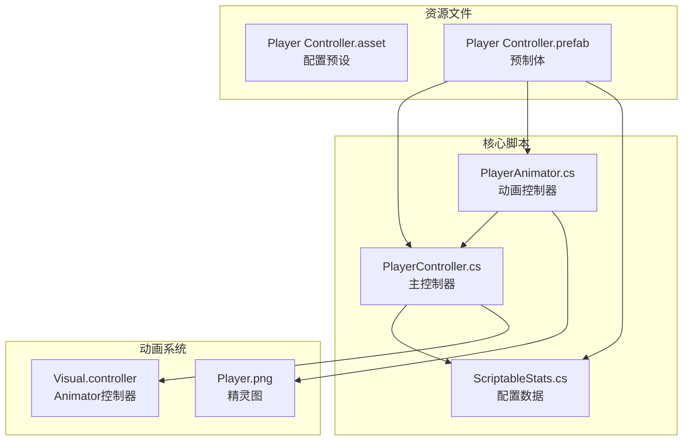
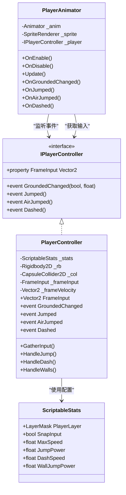
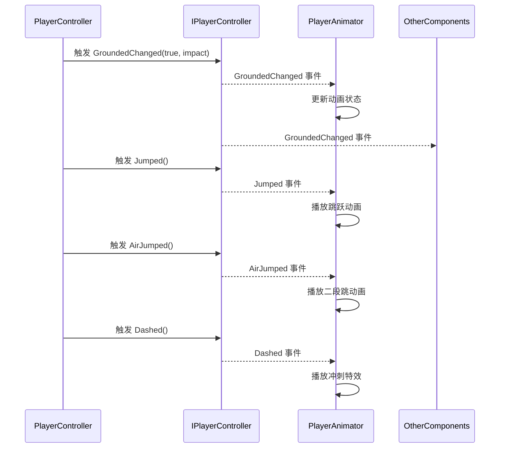
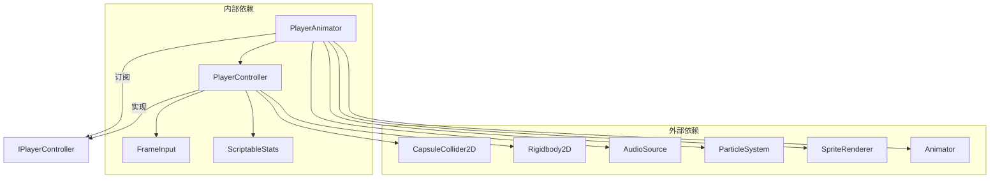

# API参考文档

<cite>
**本文档引用的文件**
- [PlayerController.cs](file://Tarodev 2D Controller/_Scripts/PlayerController.cs)
- [PlayerAnimator.cs](file://Tarodev 2D Controller/_Scripts/PlayerAnimator.cs)
- [ScriptableStats.cs](file://Tarodev 2D Controller/_Scripts/ScriptableStats.cs)
- [Player Controller.asset](file://Tarodev 2D Controller/Stat Presets/Player Controller.asset)
- [Player Controller.prefab](file://Tarodev 2D Controller/Prefabs/Player Controller.prefab)
</cite>

## 目录
1. [简介](#简介)
2. [项目结构](#项目结构)
3. [核心组件](#核心组件)
4. [架构概览](#架构概览)
5. [详细组件分析](#详细组件分析)
6. [依赖关系分析](#依赖关系分析)
7. [性能考虑](#性能考虑)
8. [故障排除指南](#故障排除指南)
9. [结论](#结论)

## 简介

Tarodev 2D Controller是一个高质量的免费2D平台游戏控制器，专为Unity开发设计。该控制器提供了完整的2D平台游戏所需的核心功能，包括跳跃、冲刺、墙面滑行和二段跳等特性。本文档详细介绍了控制器的API接口、事件系统、配置参数和使用方法。

## 项目结构

该项目采用模块化设计，主要包含以下核心组件：

**图表来源**
- [PlayerController.cs:1-50](file://Tarodev 2D Controller/_Scripts/PlayerController.cs#L1-L50)
- [PlayerAnimator.cs:1-50](file://Tarodev 2D Controller/_Scripts/PlayerAnimator.cs#L1-L50)
- [ScriptableStats.cs:1-50](file://Tarodev 2D Controller/_Scripts/ScriptableStats.cs#L1-L50)

**章节来源**
- [PlayerController.cs:1-50](file://Tarodev 2D Controller/_Scripts/PlayerController.cs#L1-L50)
- [PlayerAnimator.cs:1-50](file://Tarodev 2D Controller/_Scripts/PlayerAnimator.cs#L1-L50)
- [ScriptableStats.cs:1-50](file://Tarodev 2D Controller/_Scripts/ScriptableStats.cs#L1-L50)

## 核心组件

### PlayerController 主控制器

PlayerController是整个2D平台游戏控制器的核心，负责处理所有玩家输入、物理计算和状态管理。

**主要职责：**
- 处理玩家输入并生成FrameInput结构
- 管理碰撞检测和物理交互
- 控制跳跃、冲刺、墙面滑行等动作
- 触发相关事件供其他组件监听

**关键属性和方法：**
- `Vector2 FrameInput`: 当前帧的输入向量
- `event Action<bool, float> GroundedChanged`: 着地状态变化事件
- `event Action Jumped`: 跳跃事件
- `event Action AirJumped`: 空中跳跃事件
- `event Action Dashed`: 冲刺事件

**章节来源**
- [PlayerController.cs:27-373](file://Tarodev 2D Controller/_Scripts/PlayerController.cs#L27-L373)

### PlayerAnimator 动画控制器

PlayerAnimator负责将控制器的状态转换为视觉表现，包括动画播放、粒子效果和音效。

**主要功能：**
- 监听IPlayerController事件并更新动画状态
- 控制角色翻转和倾斜效果
- 管理各种特效粒子系统
- 播放脚步声等音效

**章节来源**
- [PlayerAnimator.cs:1-178](file://Tarodev 2D Controller/_Scripts/PlayerAnimator.cs#L1-L178)

### ScriptableStats 配置数据

ScriptableStats是一个ScriptableObject，存储了所有可调的游戏平衡参数。

**分类说明：**
- **层级设置**: 玩家角色的物理层配置
- **输入设置**: 输入处理和死区阈值
- **移动设置**: 基础移动参数
- **跳跃设置**: 跳跃物理参数
- **空中选项**: 空中能力配置
- **墙壁交互**: 墙面相关功能
- **冲刺设置**: 冲刺功能参数

**章节来源**
- [ScriptableStats.cs:1-97](file://Tarodev 2D Controller/_Scripts/ScriptableStats.cs#L1-L97)

## 架构概览

**图表来源**
- [PlayerController.cs:14-373](file://Tarodev 2D Controller/_Scripts/PlayerController.cs#L14-L373)
- [PlayerAnimator.cs:8-41](file://Tarodev 2D Controller/_Scripts/PlayerAnimator.cs#L8-L41)
- [ScriptableStats.cs:6-97](file://Tarodev 2D Controller/_Scripts/ScriptableStats.cs#L6-L97)

## 详细组件分析

### IPlayerController 接口详解

IPlayerController定义了控制器对外暴露的公共接口，采用事件驱动的设计模式。

**事件系统说明：**

**事件触发条件：**

1. **GroundedChanged 事件**
   - 触发时机：着地状态发生变化时
   - 参数：`(bool grounded, float impact)`
   - 影响：通知所有监听者当前的着地状态和着陆冲击力

2. **Jumped 事件**
   - 触发时机：成功执行地面跳跃时
   - 参数：无
   - 影响：播放跳跃动画和音效

3. **AirJumped 事件**
   - 触发时机：执行空中二段跳时
   - 参数：无
   - 影响：播放二段跳动画和特效

4. **Dashed 事件**
   - 触发时机：成功执行冲刺时
   - 参数：无
   - 影响：播放冲刺特效和音效

**章节来源**
- [PlayerController.cs:27-373](file://Tarodev 2D Controller/_Scripts/PlayerController.cs#L27-L373)
- [PlayerAnimator.cs:43-154](file://Tarodev 2D Controller/_Scripts/PlayerAnimator.cs#L43-L154)

### FrameInput 结构体

FrameInput是控制器在每一帧收集的输入数据结构，包含了所有必要的输入信息。

**字段定义：**

| 字段名 | 类型 | 描述 | 使用场景 |
|--------|------|------|----------|
| JumpDown | bool | 跳跃按键按下（仅一帧） | 检测跳跃输入的开始 |
| JumpHeld | bool | 跳跃按键被持续按住 | 检测跳跃输入的持续状态 |
| DashDown | bool | 冲刺按键按下（仅一帧） | 检测冲刺输入的开始 |
| Move | Vector2 | 方向输入向量 | 处理水平和垂直移动 |

**使用场景：**
- **输入处理**：在FixedUpdate中收集和处理
- **动作触发**：根据输入状态触发相应动作
- **动画控制**：提供给动画系统进行视觉反馈

**章节来源**
- [PlayerController.cs:356-362](file://Tarodev 2D Controller/_Scripts/PlayerController.cs#L356-L362)

### PlayerController 核心方法

**输入收集方法：**
- `GatherInput()`: 收集键盘和手柄输入，创建FrameInput实例
- 处理输入死区和数值规范化
- 设置跳跃和冲刺的消费标志

**物理处理方法：**
- `HandleJump()`: 处理跳跃逻辑，包括地面跳跃、二段跳和墙面跳跃
- `HandleDash()`: 处理冲刺逻辑，包括冷却管理和方向确定
- `HandleWalls()`: 处理墙面滑行和墙面跳跃
- `HandleDirection()`: 处理水平移动和方向控制
- `HandleGravity()`: 处理重力和下落逻辑

**章节来源**
- [PlayerController.cs:53-97](file://Tarodev 2D Controller/_Scripts/PlayerController.cs#L53-L97)
- [PlayerController.cs:198-242](file://Tarodev 2D Controller/_Scripts/PlayerController.cs#L198-L242)
- [PlayerController.cs:278-318](file://Tarodev 2D Controller/_Scripts/PlayerController.cs#L278-L318)

### PlayerAnimator 事件处理

PlayerAnimator通过订阅IPlayerController事件来实现动画同步：

**事件订阅：**
- 在启用时订阅所有控制器事件
- 在禁用时取消订阅以避免内存泄漏
- 根据事件状态更新动画参数

**动画控制：**
- `HandleSpriteFlip()`: 根据移动方向翻转角色
- `HandleIdleSpeed()`: 根据输入强度调整动画播放速度
- `HandleCharacterTilt()`: 根据移动方向添加倾斜效果

**特效管理：**
- 着陆时播放着陆特效和音效
- 跳跃时播放跳跃和发射特效
- 冲刺时播放冲刺特效和环形粒子

**章节来源**
- [PlayerAnimator.cs:43-61](file://Tarodev 2D Controller/_Scripts/PlayerAnimator.cs#L43-L61)
- [PlayerAnimator.cs:76-92](file://Tarodev 2D Controller/_Scripts/PlayerAnimator.cs#L76-L92)
- [PlayerAnimator.cs:108-154](file://Tarodev 2D Controller/_Scripts/PlayerAnimator.cs#L108-L154)

### ScriptableStats 配置参数详解

ScriptableStats提供了全面的游戏平衡配置，所有参数都带有详细的注释说明：

**输入设置：**
- `SnapInput`: 是否将输入值规范化为整数
- `VerticalDeadZoneThreshold`: 垂直输入死区阈值
- `HorizontalDeadZoneThreshold`: 水平输入死区阈值

**移动设置：**
- `MaxSpeed`: 最大移动速度
- `Acceleration`: 加速度
- `GroundDeceleration`: 地面减速度
- `AirDeceleration`: 空中减速度
- `GroundingForce`: 地面吸附力

**跳跃设置：**
- `JumpPower`: 跳跃初始速度
- `MaxFallSpeed`: 最大下落速度
- `FallAcceleration`: 下落加速度
- `JumpEndEarlyGravityModifier`: 提前松开重力修正

**空中选项：**
- `AirJumps`: 空中可使用的额外跳跃次数

**墙壁交互：**
- `WallDetectionDistance`: 墙壁检测距离
- `WallSlideSpeed`: 墙面滑行速度
- `WallStickTime`: 墙面抓握保持时间
- `WallJumpPower`: 墙面跳跃垂直速度
- `WallJumpHorizontalPower`: 墙面跳跃水平速度
- `WallJumpControlLockTime`: 墙面跳跃控制锁定时间

**冲刺设置：**
- `AllowGroundDash`: 是否允许地面冲刺
- `DashDuration`: 冲刺持续时间
- `DashSpeed`: 冲刺速度
- `DashCooldown`: 冲刺冷却时间

**章节来源**
- [ScriptableStats.cs:8-95](file://Tarodev 2D Controller/_Scripts/ScriptableStats.cs#L8-L95)

## 依赖关系分析

**图表来源**
- [PlayerController.cs:14-45](file://Tarodev 2D Controller/_Scripts/PlayerController.cs#L14-L45)
- [PlayerAnimator.cs:10-41](file://Tarodev 2D Controller/_Scripts/PlayerAnimator.cs#L10-L41)

**依赖关系说明：**
- PlayerController依赖Unity的物理组件（Rigidbody2D、CapsuleCollider2D）
- PlayerAnimator依赖Unity的动画和渲染组件
- 两者都依赖ScriptableStats提供的配置数据
- 通过IPlayerController接口实现松耦合的事件通信

**章节来源**
- [PlayerController.cs:13-45](file://Tarodev 2D Controller/_Scripts/PlayerController.cs#L13-L45)
- [PlayerAnimator.cs:10-41](file://Tarodev 2D Controller/_Scripts/PlayerAnimator.cs#L10-L41)

## 性能考虑

### 固定时间步优化
- 所有物理计算都在FixedUpdate中进行，确保稳定的帧率
- 使用Mathf.MoveTowards进行平滑的速度过渡，避免突变

### 内存管理
- 事件订阅在启用时添加，在禁用时移除，防止内存泄漏
- 使用结构体FrameInput减少垃圾回收压力

### 物理查询优化
- 临时关闭queriesStartInColliders以提高碰撞检测性能
- 合理使用Raycast和CapsuleCast进行精确检测

## 故障排除指南

### 常见问题及解决方案

**问题1：控制器没有响应输入**
- 检查PlayerController组件是否正确附加
- 确认ScriptableStats资产已正确分配
- 验证输入映射设置

**问题2：跳跃高度不符合预期**
- 调整ScriptableStats中的JumpPower参数
- 检查FallAcceleration和MaxFallSpeed设置
- 确认CoyoteTime和JumpBuffer配置

**问题3：动画不匹配**
- 确保PlayerAnimator正确订阅了所有事件
- 检查Animator控制器的参数设置
- 验证精灵图的翻转设置

**问题4：墙面交互异常**
- 调整WallDetectionDistance参数
- 检查WallSlideSpeed和WallStickTime设置
- 确认碰撞器尺寸与角色匹配

**章节来源**
- [PlayerController.cs:348-353](file://Tarodev 2D Controller/_Scripts/PlayerController.cs#L348-L353)
- [PlayerAnimator.cs:43-61](file://Tarodev 2D Controller/_Scripts/PlayerAnimator.cs#L43-L61)

## 结论

Tarodev 2D Controller提供了一个完整、可定制且高性能的2D平台游戏控制器解决方案。其基于事件驱动的设计模式使得组件间松耦合，易于扩展和维护。通过ScriptableStats系统，开发者可以轻松调整游戏平衡，满足不同游戏的需求。

该控制器的主要优势包括：
- 完整的2D平台游戏功能覆盖
- 清晰的API设计和事件系统
- 可配置的游戏平衡参数
- 良好的性能表现
- 易于集成和扩展

对于需要快速搭建2D平台游戏基础框架的开发者来说，这是一个优秀的选择。