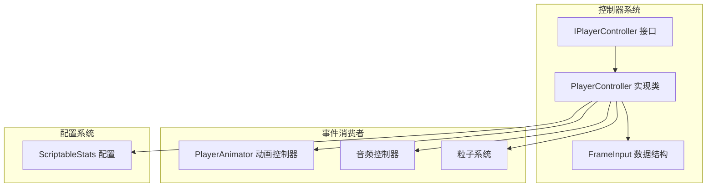
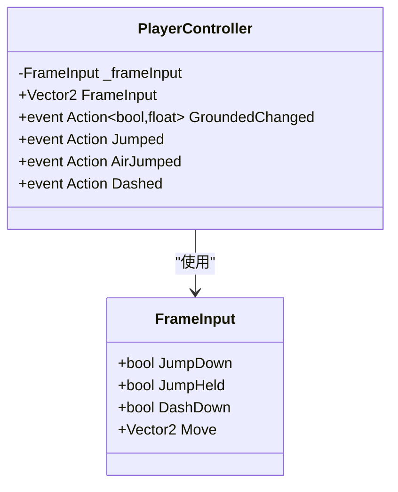
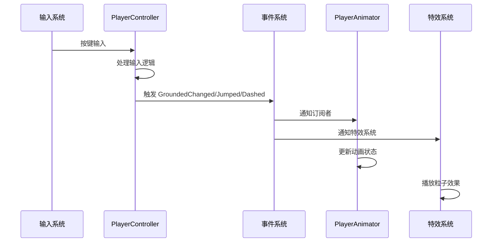
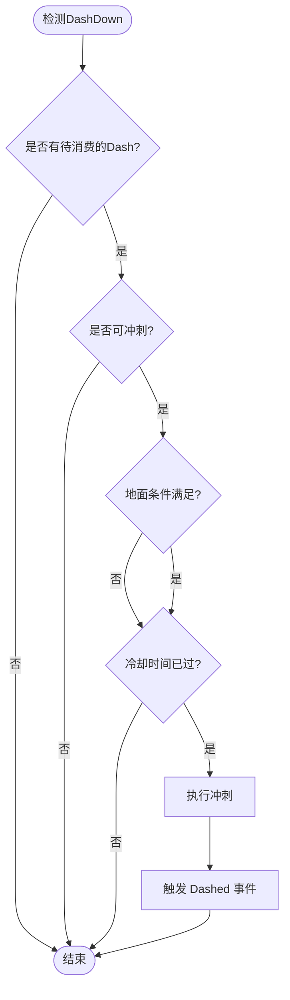
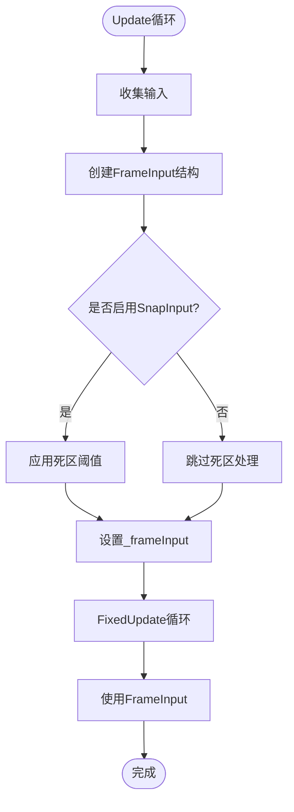
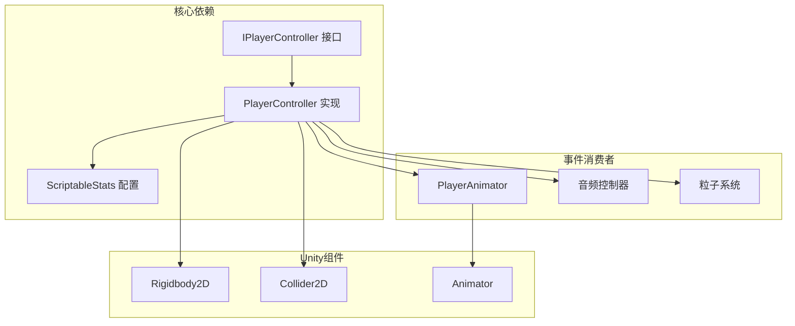
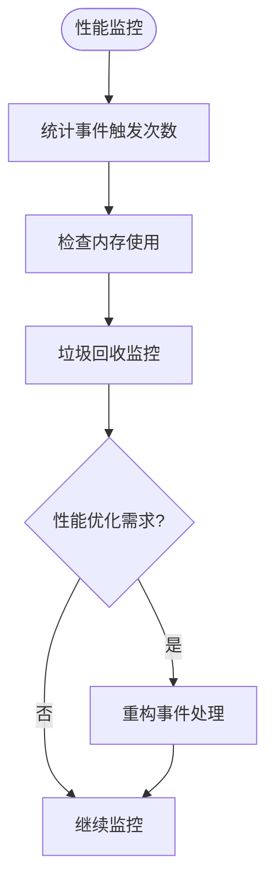

# IPlayerController接口API

<cite>
**本文档引用的文件**
- [PlayerController.cs](file://Tarodev 2D Controller/_Scripts/PlayerController.cs)
- [PlayerAnimator.cs](file://Tarodev 2D Controller/_Scripts/PlayerAnimator.cs)
- [ScriptableStats.cs](file://Tarodev 2D Controller/_Scripts/ScriptableStats.cs)
</cite>

## 目录
1. [简介](#简介)
2. [项目结构](#项目结构)
3. [核心组件](#核心组件)
4. [架构概览](#架构概览)
5. [详细组件分析](#详细组件分析)
6. [依赖关系分析](#依赖关系分析)
7. [性能考虑](#性能考虑)
8. [故障排除指南](#故障排除指南)
9. [结论](#结论)
10. [附录](#附录)

## 简介

IPlayerController接口是Tarodev 2D平台控制器系统的核心事件驱动接口，为2D平台游戏提供了完整的玩家控制抽象。该接口采用事件驱动架构，通过精心设计的事件系统实现了控制器与外部组件之间的松耦合通信。

该接口的主要设计目标是：
- 提供统一的玩家控制抽象
- 实现事件驱动的响应式编程模式
- 支持多种输入设备和控制方式
- 维护良好的代码解耦和可扩展性

## 项目结构

Tarodev 2D控制器系统采用模块化架构，主要包含以下关键组件：



**图表来源**
- [PlayerController.cs:364-372](file://Tarodev 2D Controller/_Scripts/PlayerController.cs#L364-L372)
- [PlayerController.cs:14](file://Tarodev 2D Controller/_Scripts/PlayerController.cs#L14-L14)
- [PlayerAnimator.cs:8](file://Tarodev 2D Controller/_Scripts/PlayerAnimator.cs#L8-L8)

**章节来源**
- [PlayerController.cs:1-374](file://Tarodev 2D Controller/_Scripts/PlayerController.cs#L1-L374)
- [PlayerAnimator.cs:1-178](file://Tarodev 2D Controller/_Scripts/PlayerAnimator.cs#L1-L178)

## 核心组件

### IPlayerController接口定义

IPlayerController接口定义了2D平台游戏控制器的完整事件驱动API，包含以下核心成员：

#### 事件成员

| 事件名称 | 委托类型 | 参数类型 | 触发时机 | 使用场景 |
|---------|---------|---------|---------|---------|
| GroundedChanged | `Action<bool, float>` | bool grounded, float impactVelocity | 角色着陆或离地时 | 地面状态反馈、着陆冲击效果 |
| Jumped | `Action` | 无 | 基础跳跃执行时 | 跳跃动画触发、音效播放 |
| AirJumped | `Action` | 无 | 空中二段跳执行时 | 二段跳动画触发、特殊音效 |
| Dashed | `Action` | 无 | 冲刺执行时 | 冲刺特效播放、音效触发 |

#### 属性成员

| 属性名称 | 类型 | 访问权限 | 描述 |
|---------|------|---------|------|
| FrameInput | `Vector2` | 只读 | 当前帧的移动输入向量 |

**章节来源**
- [PlayerController.cs:29-33](file://Tarodev 2D Controller/_Scripts/PlayerController.cs#L29-L33)
- [PlayerController.cs:364-372](file://Tarodev 2D Controller/_Scripts/PlayerController.cs#L364-L372)

### FrameInput数据结构

FrameInput是一个轻量级数据结构，用于封装单帧的输入信息：



**图表来源**
- [PlayerController.cs:356-362](file://Tarodev 2D Controller/_Scripts/PlayerController.cs#L356-L362)
- [PlayerController.cs:19](file://Tarodev 2D Controller/_Scripts/PlayerController.cs#L19-L19)

**章节来源**
- [PlayerController.cs:356-362](file://Tarodev 2D Controller/_Scripts/PlayerController.cs#L356-L362)

## 架构概览

### 事件驱动架构

IPlayerController采用事件驱动架构，实现了控制器与外部组件之间的松耦合通信：



**图表来源**
- [PlayerController.cs:132](file://Tarodev 2D Controller/_Scripts/PlayerController.cs#L132-L132)
- [PlayerController.cs:225](file://Tarodev 2D Controller/_Scripts/PlayerController.cs#L225-L225)
- [PlayerController.cs:312](file://Tarodev 2D Controller/_Scripts/PlayerController.cs#L312-L312)

### 设计模式应用

该接口体现了多种重要的设计模式：

1. **观察者模式**: 事件系统实现了典型的观察者模式
2. **策略模式**: 不同的事件处理器可以独立实现
3. **工厂模式**: 可以创建不同类型的控制器实现
4. **命令模式**: 事件作为命令对象传递状态信息

**章节来源**
- [PlayerController.cs:364-372](file://Tarodev 2D Controller/_Scripts/PlayerController.cs#L364-L372)

## 详细组件分析

### GroundedChanged事件详解

GroundedChanged事件是最复杂的事件，因为它需要传递两个重要参数：

#### 事件触发时机
- 角色从空中落到地面时
- 角色从地面离开时

#### 参数含义
- `bool grounded`: 当前的地面状态
- `float impactVelocity`: 着陆时的垂直速度（仅在着陆时有意义）

#### 实际应用场景
```mermaid
flowchart TD
Start([检测碰撞]) --> CheckGround{"是否着地?"}
CheckGround --> |是| TriggerLanding[触发 GroundedChanged(true, impact)]
CheckGround --> |否| TriggerLeave[触发 GroundedChanged(false, 0)]
TriggerLanding --> PlayLandEffect[播放着陆特效]
TriggerLeave --> StopMovingEffect[停止移动特效]
PlayLandEffect --> End([完成])
StopMovingEffect --> End
```

**图表来源**
- [PlayerController.cs:122](file://Tarodev 2D Controller/_Scripts/PlayerController.cs#L122-L122)
- [PlayerController.cs:135](file://Tarodev 2D Controller/_Scripts/PlayerController.cs#L135-L135)

**章节来源**
- [PlayerController.cs:122-140](file://Tarodev 2D Controller/_Scripts/PlayerController.cs#L122-L140)

### Jumped事件详解

Jumped事件用于通知基础跳跃的执行：

#### 触发条件
- 角色在地面或使用Coyote Time时执行跳跃
- 角色进行墙壁跳跃时

#### 典型用途
- 播放跳跃动画
- 播放跳跃音效
- 触发地面特效

**章节来源**
- [PlayerController.cs:204](file://Tarodev 2D Controller/_Scripts/PlayerController.cs#L204-L204)
- [PlayerController.cs:239](file://Tarodev 2D Controller/_Scripts/PlayerController.cs#L239-L239)

### AirJumped事件详解

AirJumped事件专门用于二段跳的触发通知：

#### 触发条件
- 角色在空中且还有剩余的二段跳次数时执行跳跃

#### 与Jumped的区别
- Jumped用于所有跳跃情况
- AirJumped仅用于二段跳及后续空中跳跃

**章节来源**
- [PlayerController.cs:206](file://Tarodev 2D Controller/_Scripts/PlayerController.cs#L206-L206)
- [PlayerController.cs:225](file://Tarodev 2D Controller/_Scripts/PlayerController.cs#L225-L225)

### Dashed事件详解

Dashed事件用于通知冲刺动作的执行：

#### 触发条件
- 角色满足冲刺条件时执行冲刺
- 冲刺冷却时间结束后允许新的冲刺

#### 冲刺条件检查流程


**图表来源**
- [PlayerController.cs:287](file://Tarodev 2D Controller/_Scripts/PlayerController.cs#L287-L287)
- [PlayerController.cs:312](file://Tarodev 2D Controller/_Scripts/PlayerController.cs#L312-L312)

**章节来源**
- [PlayerController.cs:287-318](file://Tarodev 2D Controller/_Scripts/PlayerController.cs#L287-L318)

### FrameInput属性详解

FrameInput属性提供了当前帧的移动输入向量，具有以下特性：

#### 只读特性
- 仅提供只读访问权限
- 通过内部的FrameInput结构体管理实际数据

#### 使用方式
- 通过`controller.FrameInput.x`获取水平输入
- 通过`controller.FrameInput.y`获取垂直输入
- 常用于动画控制和视觉反馈

#### 输入处理流程


**图表来源**
- [PlayerController.cs:53](file://Tarodev 2D Controller/_Scripts/PlayerController.cs#L53-L53)
- [PlayerController.cs:29](file://Tarodev 2D Controller/_Scripts/PlayerController.cs#L29-L29)

**章节来源**
- [PlayerController.cs:53-76](file://Tarodev 2D Controller/_Scripts/PlayerController.cs#L53-L76)
- [PlayerController.cs:29](file://Tarodev 2D Controller/_Scripts/PlayerController.cs#L29-L29)

## 依赖关系分析

### 组件间依赖关系



**图表来源**
- [PlayerController.cs:14](file://Tarodev 2D Controller/_Scripts/PlayerController.cs#L14-L14)
- [PlayerController.cs:16](file://Tarodev 2D Controller/_Scripts/PlayerController.cs#L16-L16)
- [PlayerAnimator.cs:10](file://Tarodev 2D Controller/_Scripts/PlayerAnimator.cs#L10-L10)

### 事件订阅模式

事件系统的订阅和取消订阅遵循标准的Unity模式：

#### 订阅模式
```csharp
// 在启用时订阅事件
_player.Jumped += OnJumped;
_player.AirJumped += OnAirJumped;
_player.Dashed += OnDashed;
_player.GroundedChanged += OnGroundedChanged;
```

#### 取消订阅模式
```csharp
// 在禁用时取消订阅
_player.Jumped -= OnJumped;
_player.AirJumped -= OnAirJumped;
_player.Dashed -= OnDashed;
_player.GroundedChanged -= OnGroundedChanged;
```

**章节来源**
- [PlayerAnimator.cs:43-61](file://Tarodev 2D Controller/_Scripts/PlayerAnimator.cs#L43-L61)

## 性能考虑

### 事件触发频率优化

1. **事件去抖动**: 使用布尔标志避免重复触发
2. **条件检查**: 在触发事件前进行充分的条件验证
3. **延迟处理**: 对于复杂的事件处理使用延迟机制

### 内存管理

1. **事件订阅生命周期**: 确保在适当的生命周期方法中进行订阅和取消订阅
2. **委托引用**: 避免循环引用导致的内存泄漏
3. **对象池**: 对于频繁创建的对象使用对象池模式

### 性能监控



## 故障排除指南

### 常见问题及解决方案

#### 事件未触发问题
**症状**: 订阅的事件回调没有被调用
**可能原因**:
- 事件订阅时机错误
- 控制器实例不存在
- 事件处理逻辑有异常

**解决方案**:
1. 确保在正确的生命周期方法中订阅事件
2. 检查控制器实例的有效性
3. 添加事件触发日志进行调试

#### 输入不响应问题
**症状**: FrameInput属性返回的值不符合预期
**可能原因**:
- 输入轴配置错误
- 死区阈值设置不当
- SnapInput功能影响

**解决方案**:
1. 检查Unity输入管理器配置
2. 调整死区阈值参数
3. 测试不同输入设备的兼容性

#### 性能问题
**症状**: 事件处理导致帧率下降
**可能原因**:
- 事件处理逻辑过于复杂
- 频繁的事件触发
- 内存泄漏

**解决方案**:
1. 优化事件处理算法复杂度
2. 实施事件节流机制
3. 定期进行内存分析

**章节来源**
- [PlayerController.cs:348-353](file://Tarodev 2D Controller/_Scripts/PlayerController.cs#L348-L353)

## 结论

IPlayerController接口成功实现了2D平台游戏控制器的事件驱动架构，具有以下优势：

1. **高度解耦**: 控制器与外部组件通过事件系统松散耦合
2. **可扩展性**: 新的功能可以通过添加新的事件处理器轻松实现
3. **可维护性**: 清晰的职责分离使得代码易于维护和测试
4. **灵活性**: 支持多种输入设备和控制方式

该接口的设计为2D平台游戏开发提供了坚实的基础，通过事件驱动的方式实现了功能的模块化和可组合性。

## 附录

### 最佳实践指南

#### 事件订阅最佳实践
1. 在`OnEnable`中订阅，在`OnDisable`中取消订阅
2. 使用弱引用避免循环引用
3. 为每个事件处理函数添加错误处理

#### 自定义控制器实现指南
```csharp
public class CustomPlayerController : MonoBehaviour, IPlayerController
{
    // 实现所有必需的接口成员
    public event Action<bool, float> GroundedChanged;
    public event Action Jumped;
    public event Action AirJumped;
    public event Action Dashed;
    
    public Vector2 FrameInput { get; private set; }
    
    // 实现自定义的输入处理逻辑
    private void Update()
    {
        // 自定义输入处理
        FrameInput = GetCustomInput();
    }
    
    // 实现自定义的物理处理逻辑
    private void FixedUpdate()
    {
        // 自定义物理模拟
    }
}
```

#### 扩展点建议
1. **输入系统扩展**: 支持手柄、VR控制器等
2. **动画系统集成**: 更丰富的动画状态机支持
3. **AI集成**: 为NPC提供相同的接口抽象
4. **网络同步**: 支持多人游戏的事件同步

### 集成示例

#### 基础集成步骤
1. 将PlayerController组件添加到玩家角色上
2. 创建ScriptableStats资源并分配给控制器
3. 在其他组件中通过GetComponent<IPlayerController>()获取接口引用
4. 订阅所需的事件并实现相应的处理逻辑

#### 高级集成场景
- **状态机集成**: 将事件集成到有限状态机中
- **音频系统**: 基于事件触发不同的音效
- **UI反馈**: 根据事件更新用户界面状态
- **数据分析**: 记录事件发生的时间和频率