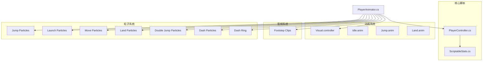
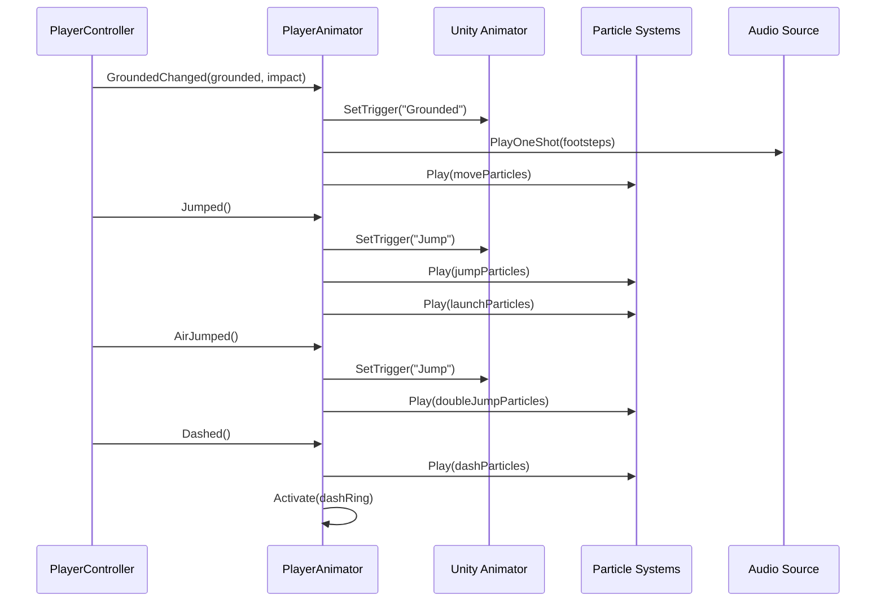
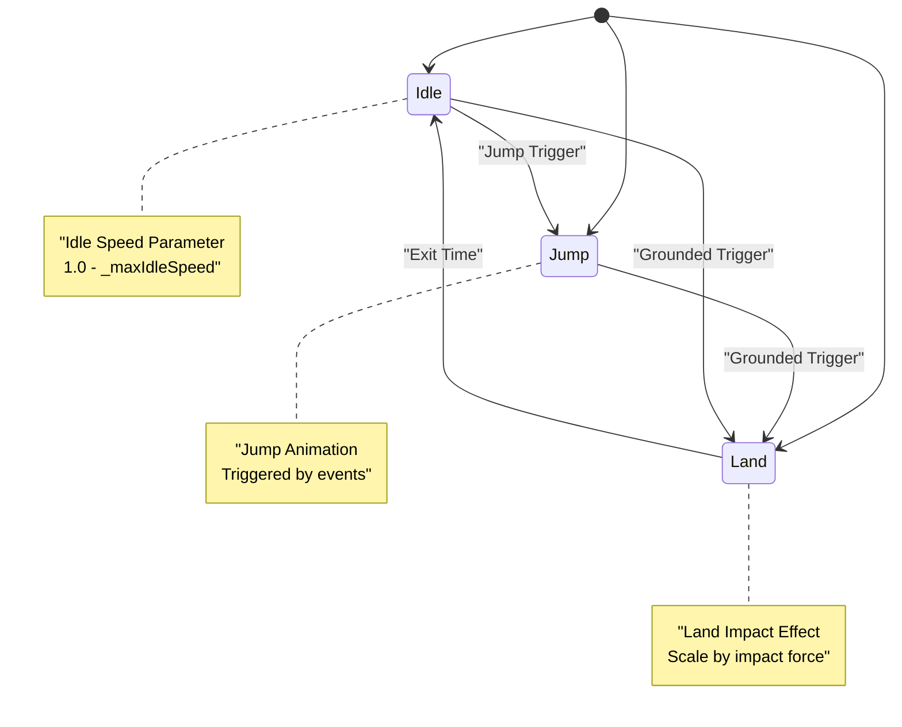
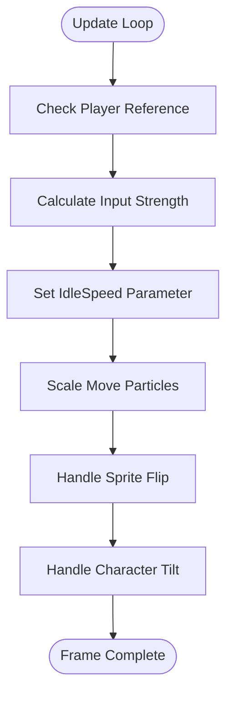
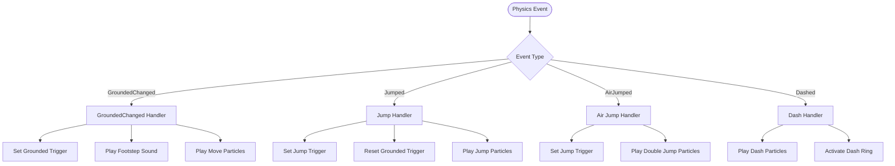
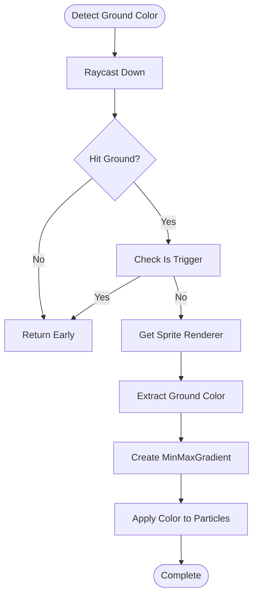
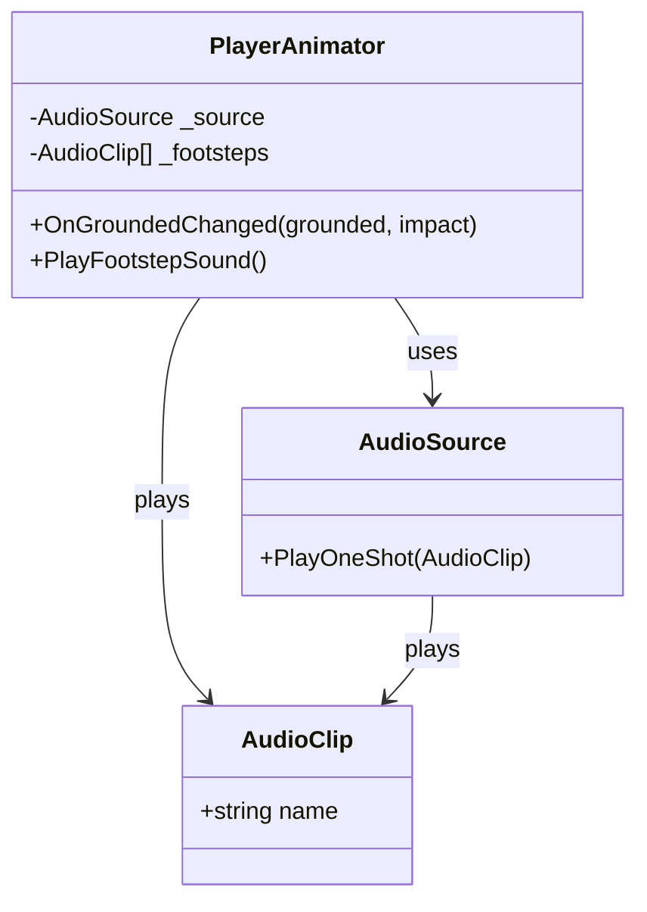
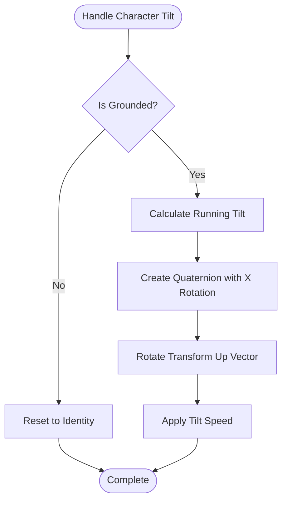
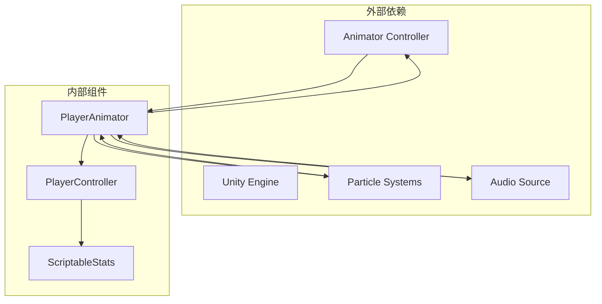
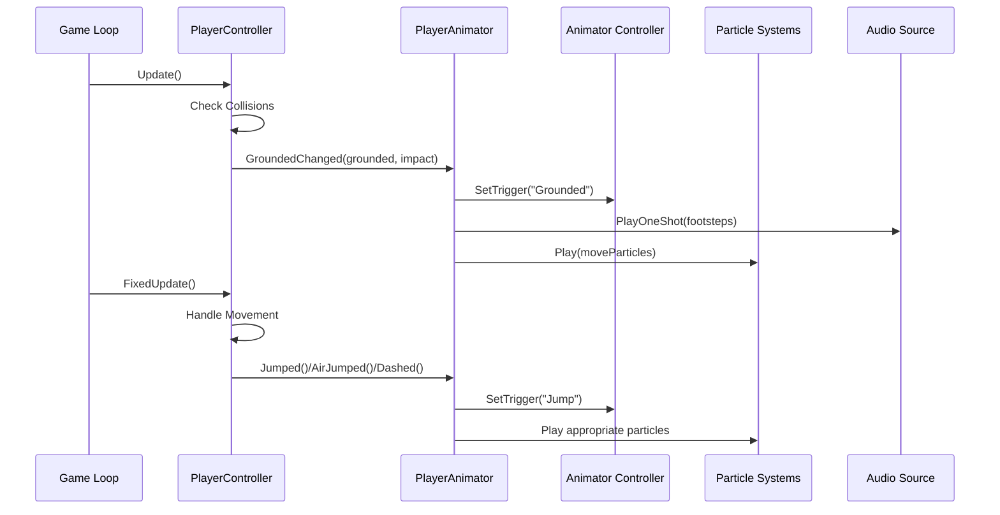

# PlayerAnimator类API

<cite>
**本文档引用的文件**
- [PlayerAnimator.cs](file://Tarodev%202D%20Controller/_Scripts/PlayerAnimator.cs)
- [PlayerController.cs](file://Tarodev%202D%20Controller/_Scripts/PlayerController.cs)
- [ScriptableStats.cs](file://Tarodev%202D%20Controller/_Scripts/ScriptableStats.cs)
- [Visual.controller](file://Tarodev%2D%202D%20Controller/Animation/Visual.controller)
</cite>

## 目录
1. [简介](#简介)
2. [项目结构](#项目结构)
3. [核心组件](#核心组件)
4. [架构概览](#架构概览)
5. [详细组件分析](#详细组件分析)
6. [依赖关系分析](#依赖关系分析)
7. [性能考虑](#性能考虑)
8. [故障排除指南](#故障排除指南)
9. [结论](#结论)

## 简介

PlayerAnimator类是Tarodev 2D控制器系统中的动画管理器，负责将物理状态变化转换为视觉动画效果。该类实现了与PlayerController的紧密协作，通过事件驱动的方式接收物理状态更新，并将其转换为动画指令、视觉效果和音效播放。

该类提供了完整的2D平台游戏动画解决方案，包括：
- 基于Unity Animator的状态机控制
- 实时物理状态驱动的动画参数设置
- 多种粒子效果系统集成
- 音效播放管理
- 角色倾斜和翻转效果
- 地面颜色检测和动态粒子色彩匹配

## 项目结构

Tarodev 2D控制器系统采用模块化设计，主要包含以下组件：

**图表来源**
- [PlayerAnimator.cs:1-178](file://Tarodev%202D%20Controller/_Scripts/PlayerAnimator.cs#L1-L178)
- [PlayerController.cs:1-374](file://Tarodev%202D%20Controller/_Scripts/PlayerController.cs#L1-L374)
- [Visual.controller:1-224](file://Tarodev%2D%202D%20Controller/Animation/Visual.controller#L1-L224)

**章节来源**
- [PlayerAnimator.cs:1-178](file://Tarodev%202D%20Controller/_Scripts/PlayerAnimator.cs#L1-L178)
- [PlayerController.cs:1-374](file://Tarodev%202D%20Controller/_Scripts/PlayerController.cs#L1-L374)

## 核心组件

### PlayerAnimator类概述

PlayerAnimator是一个继承自MonoBehaviour的动画管理器，主要职责包括：

1. **动画状态管理**：通过Unity Animator控制角色动画状态
2. **物理状态同步**：接收PlayerController的物理状态变化
3. **视觉效果控制**：管理粒子系统和音效播放
4. **实时参数调整**：根据输入和物理状态动态调整动画参数

### 主要公共接口

虽然PlayerAnimator类没有公开的公共方法，但通过事件系统与外部组件交互：

- **事件订阅**：通过Awake方法自动订阅PlayerController的事件
- **生命周期管理**：通过OnEnable和OnDisable管理事件订阅
- **状态查询**：通过FrameInput属性访问当前输入状态

**章节来源**
- [PlayerAnimator.cs:37-61](file://Tarodev%202D%20Controller/_Scripts/PlayerAnimator.cs#L37-L61)
- [PlayerController.cs:27-35](file://Tarodev%202D%20Controller/_Scripts/PlayerController.cs#L27-L35)

## 架构概览

PlayerAnimator与PlayerController采用事件驱动的协作模式：

**图表来源**
- [PlayerAnimator.cs:43-61](file://Tarodev%202D%20Controller/_Scripts/PlayerAnimator.cs#L43-L61)
- [PlayerAnimator.cs:94-154](file://Tarodev%202D%20Controller/_Scripts/PlayerAnimator.cs#L94-L154)
- [PlayerController.cs:132-140](file://Tarodev%202D%20Controller/_Scripts/PlayerController.cs#L132-L140)

### 动画状态机架构

**图表来源**
- [Visual.controller:129-224](file://Tarodev%2D%202D%20Controller/Animation/Visual.controller#L129-L224)

**章节来源**
- [Visual.controller:129-224](file://Tarodev%2D%202D%20Controller/Animation/Visual.controller#L129-L224)

## 详细组件分析

### 动画参数管理系统

PlayerAnimator通过Unity Animator的参数系统实现精确的动画控制：

#### 核心动画参数

| 参数名称 | 类型 | 默认值 | 描述 |
|---------|------|--------|------|
| Grounded | Trigger | 0 | 地面状态触发器 |
| Jump | Trigger | 0 | 跳跃状态触发器 |
| IdleSpeed | Float | 1.0 | 待机动画速度参数 |

#### 参数设置逻辑

**图表来源**
- [PlayerAnimator.cs:63-92](file://Tarodev%202D%20Controller/_Scripts/PlayerAnimator.cs#L63-L92)
- [PlayerAnimator.cs:81-86](file://Tarodev%202D%20Controller/_Scripts/PlayerAnimator.cs#L81-L86)

**章节来源**
- [PlayerAnimator.cs:81-92](file://Tarodev%202D%20Controller/_Scripts/PlayerAnimator.cs#L81-L92)

### 物理状态事件处理

PlayerAnimator通过事件系统接收物理状态变化：

#### 事件处理流程

**图表来源**
- [PlayerAnimator.cs:94-154](file://Tarodev%202D%20Controller/_Scripts/PlayerAnimator.cs#L94-L154)
- [PlayerAnimator.cs:108-128](file://Tarodev%202D%20Controller/_Scripts/PlayerAnimator.cs#L108-L128)

**章节来源**
- [PlayerAnimator.cs:94-154](file://Tarodev%202D%20Controller/_Scripts/PlayerAnimator.cs#L94-L154)

### 视觉效果控制系统

PlayerAnimator集成了多种粒子系统来增强视觉效果：

#### 粒子系统配置

| 粒子系统 | 用途 | 条件触发 |
|---------|------|----------|
| jumpParticles | 起跳特效 | 地面起跳时 |
| launchParticles | 起跳发射特效 | 地面起跳时 |
| moveParticles | 移动轨迹特效 | 地面移动时 |
| landParticles | 落地特效 | 着地时 |
| doubleJumpParticles | 二段跳特效 | 二段跳时 |
| dashParticles | 冲刺特效 | 冲刺时 |
| dashRing | 冲刺环特效 | 冲刺时 |

#### 地面颜色检测系统

**图表来源**
- [PlayerAnimator.cs:156-171](file://Tarodev%202D%20Controller/_Scripts/PlayerAnimator.cs#L156-L171)

**章节来源**
- [PlayerAnimator.cs:156-171](file://Tarodev%202D%20Controller/_Scripts/PlayerAnimator.cs#L156-L171)

### 音效播放管理

PlayerAnimator集成了AudioSource来管理音效播放：

#### 音效系统架构

**图表来源**
- [PlayerAnimator.cs:29-32](file://Tarodev%202D%20Controller/_Scripts/PlayerAnimator.cs#L29-L32)
- [PlayerAnimator.cs:118](file://Tarodev%202D%20Controller/_Scripts/PlayerAnimator.cs#L118)

**章节来源**
- [PlayerAnimator.cs:29-32](file://Tarodev%202D%20Controller/_Scripts/PlayerAnimator.cs#L29-L32)

### 角色倾斜和翻转系统

PlayerAnimator实现了动态的角色倾斜和翻转效果：

#### 角色倾斜算法

**图表来源**
- [PlayerAnimator.cs:88-92](file://Tarodev%202D%20Controller/_Scripts/PlayerAnimator.cs#L88-L92)

**章节来源**
- [PlayerAnimator.cs:88-92](file://Tarodev%202D%20Controller/_Scripts/PlayerAnimator.cs#L88-L92)

## 依赖关系分析

### 组件耦合关系

**图表来源**
- [PlayerAnimator.cs:10-32](file://Tarodev%202D%20Controller/_Scripts/PlayerAnimator.cs#L10-L32)
- [PlayerController.cs:16](file://Tarodev%202D%20Controller/_Scripts/PlayerController.cs#L16)

### 事件依赖链

**图表来源**
- [PlayerController.cs:47-97](file://Tarodev%202D%20Controller/_Scripts/PlayerController.cs#L47-L97)
- [PlayerAnimator.cs:43-61](file://Tarodev%202D%20Controller/_Scripts/PlayerAnimator.cs#L43-L61)

**章节来源**
- [PlayerController.cs:47-97](file://Tarodev%202D%20Controller/_Scripts/PlayerController.cs#L47-L97)

## 性能考虑

### 更新频率优化

PlayerAnimator在Update循环中执行所有动画逻辑，这提供了实时响应但需要考虑性能影响：

1. **Raycast调用**：地面颜色检测每帧执行一次
2. **Vector3操作**：旋转计算使用Time.deltaTime进行平滑插值
3. **事件订阅**：在启用/禁用时动态管理事件订阅

### 内存管理

- **静态哈希值**：使用静态readonly变量缓存Animator参数哈希
- **对象池化**：粒子系统使用Unity内置的播放/停止机制
- **事件卸载**：确保在OnDisable中正确卸载事件订阅

## 故障排除指南

### 常见问题及解决方案

#### 动画不响应问题

**症状**：角色动画不随物理状态变化而改变

**可能原因**：
1. PlayerController未正确设置IPlayerController接口
2. Animator组件未正确引用
3. 事件订阅失败

**解决方案**：
- 检查PlayerAnimator的Awake方法是否正确获取IPlayerController
- 确保Animator组件已正确赋值
- 验证事件订阅是否在OnEnable中执行

#### 粒子效果异常

**症状**：粒子效果不显示或显示异常

**可能原因**：
1. 粒子系统未正确引用
2. 地面颜色检测失败
3. 粒子系统未在地面时启动

**解决方案**：
- 检查所有粒子系统引用是否正确
- 验证Raycast检测逻辑
- 确保moveParticles在地面时正确启动

#### 音效播放问题

**症状**：脚步声不播放或播放异常

**可能原因**：
1. AudioSource组件缺失
2. 音效剪辑未正确赋值
3. 脚步声数组为空

**解决方案**：
- 确保AudioSource组件存在
- 检查footsteps数组是否正确赋值
- 验证随机选择逻辑

**章节来源**
- [PlayerAnimator.cs:37-41](file://Tarodev%202D%20Controller/_Scripts/PlayerAnimator.cs#L37-L41)
- [PlayerAnimator.cs:118](file://Tarodev%202D%20Controller/_Scripts/PlayerAnimator.cs#L118)

## 结论

PlayerAnimator类提供了一个完整且高效的2D平台游戏动画解决方案。通过事件驱动的设计模式，它成功地将物理状态变化转换为丰富的视觉和听觉反馈。

### 主要优势

1. **事件驱动架构**：通过事件系统实现松耦合的组件通信
2. **实时响应**：每帧更新确保动画与物理状态的精确同步
3. **模块化设计**：清晰分离动画、视觉效果和音效管理
4. **性能优化**：使用静态哈希值和高效的数据结构

### 扩展建议

1. **状态机扩展**：可以添加更多动画状态如滑行、攀爬等
2. **参数化配置**：增加更多可调节的动画参数
3. **动画混合**：实现更复杂的动画混合和过渡效果
4. **性能监控**：添加性能计数器和调试信息

该类为2D平台游戏开发提供了一个坚实的基础，开发者可以根据具体需求进行扩展和定制。