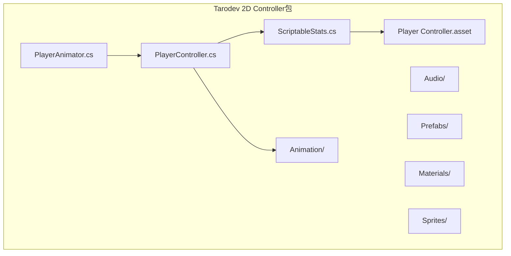
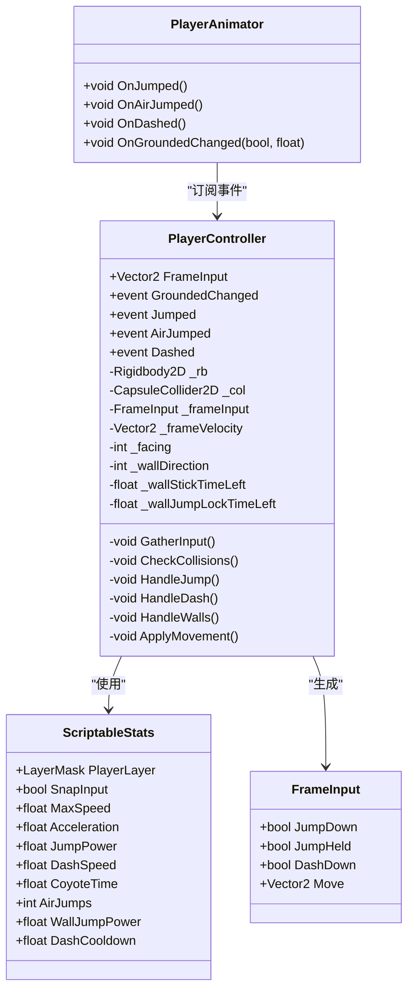
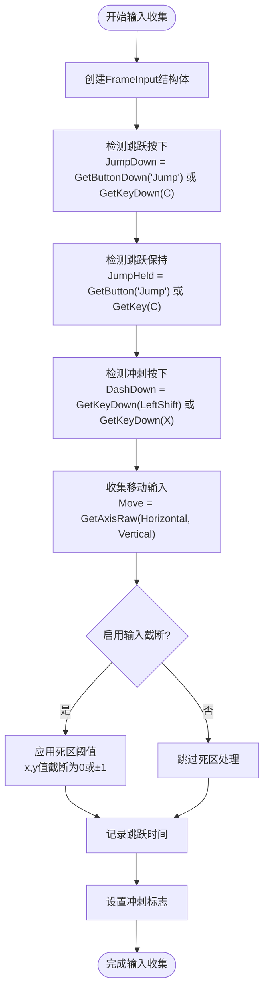
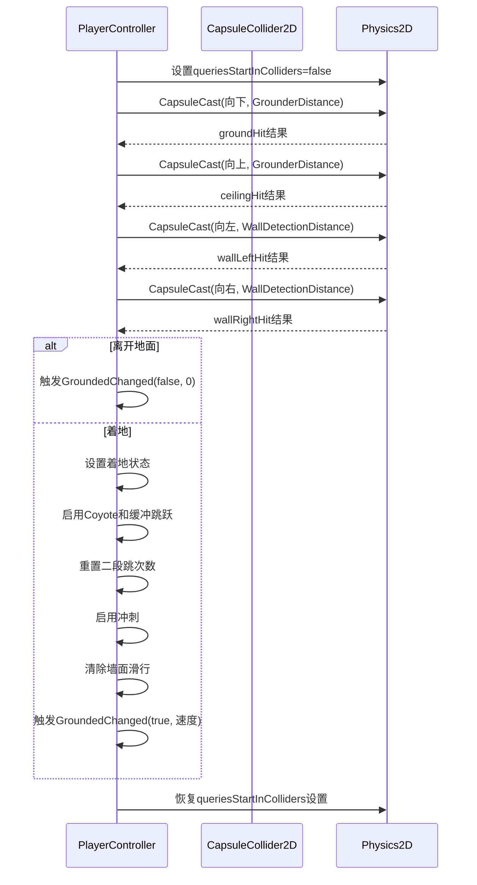
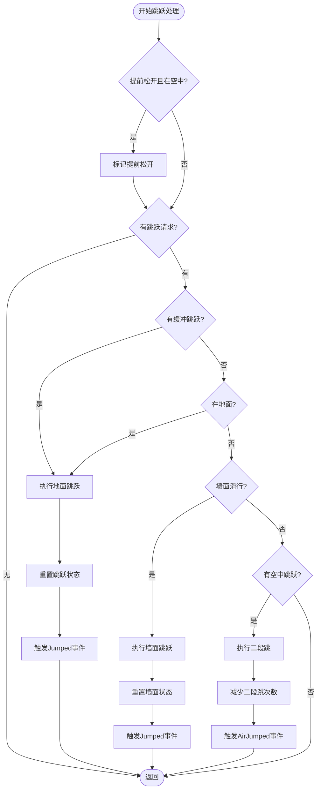
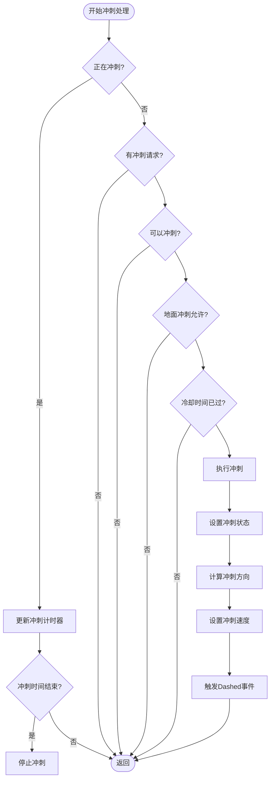
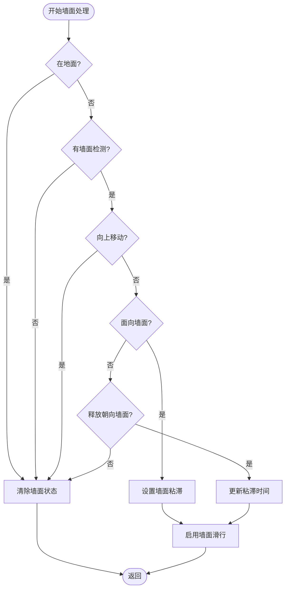
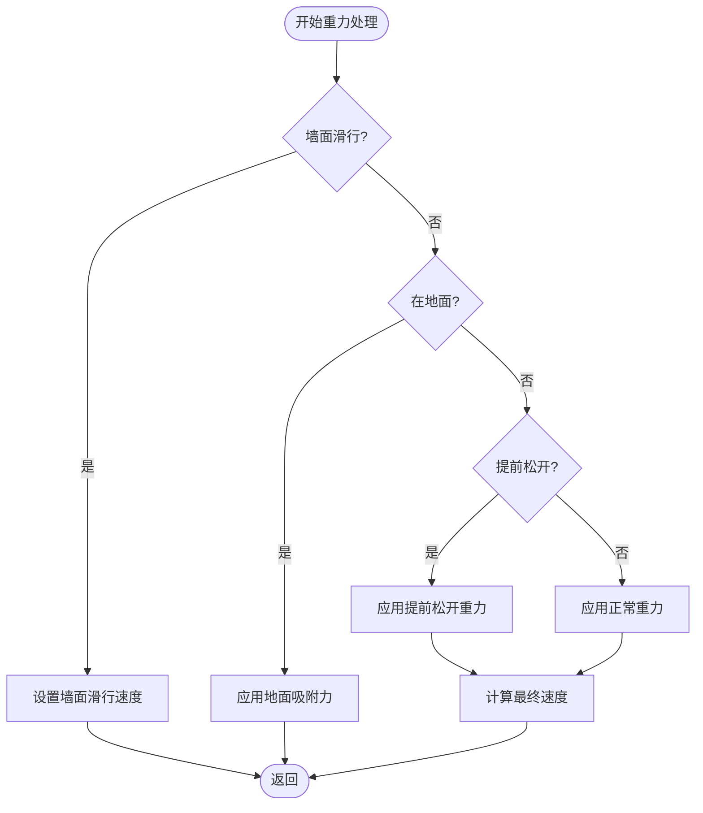
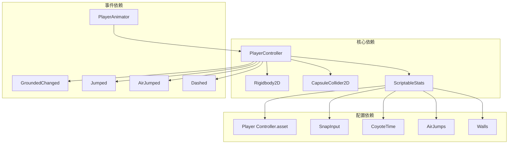

# PlayerController类API

<cite>
**本文档引用的文件**
- [PlayerController.cs](file://Tarodev 2D Controller/_Scripts/PlayerController.cs)
- [ScriptableStats.cs](file://Tarodev 2D Controller/_Scripts/ScriptableStats.cs)
- [PlayerAnimator.cs](file://Tarodev 2D Controller/_Scripts/PlayerAnimator.cs)
- [Player Controller.asset](file://Tarodev 2D Controller/Stat Presets/Player Controller.asset)
</cite>

## 目录
1. [简介](#简介)
2. [项目结构](#项目结构)
3. [核心组件](#核心组件)
4. [架构概览](#架构概览)
5. [详细组件分析](#详细组件分析)
6. [依赖关系分析](#依赖关系分析)
7. [性能考虑](#性能考虑)
8. [故障排除指南](#故障排除指南)
9. [结论](#结论)

## 简介

PlayerController是Tarodev 2D平台控制器的核心类，提供了完整的2D平台游戏角色控制功能。该控制器实现了复杂的物理模拟，包括跳跃系统、墙面滑行、冲刺机制、重力处理等高级特性。它采用帧输入系统和状态机设计，为开发者提供了高度可定制的角色控制解决方案。

## 项目结构

PlayerController位于Tarodev 2D Controller包中，与相关的动画控制器和统计配置文件共同构成完整的角色控制系统。

**图表来源**
- [PlayerController.cs:1-15](file://Tarodev 2D Controller/_Scripts/PlayerController.cs#L1-L15)
- [ScriptableStats.cs:1-10](file://Tarodev 2D Controller/_Scripts/ScriptableStats.cs#L1-L10)

**章节来源**
- [PlayerController.cs:1-15](file://Tarodev 2D Controller/_Scripts/PlayerController.cs#L1-L15)
- [ScriptableStats.cs:1-10](file://Tarodev 2D Controller/_Scripts/ScriptableStats.cs#L1-L10)

## 核心组件

### 公共接口和事件

PlayerController实现了IPlayerController接口，提供以下公共成员：

#### 属性
- **FrameInput**: 获取当前帧的输入向量，用于外部组件监控玩家输入状态

#### 事件
- **GroundedChanged**: 角色着地状态变化事件，参数为(着地状态bool, 影响速度float)
- **Jumped**: 地面跳跃事件
- **AirJumped**: 空中跳跃事件（二段跳）
- **Dashed**: 冲刺事件

#### 私有字段说明

| 字段名 | 类型 | 描述 | 影响 |
|--------|------|------|------|
| `_rb` | Rigidbody2D | 物理刚体组件 | 控制角色物理运动 |
| `_col` | CapsuleCollider2D | 胶囊碰撞器 | 碰撞检测和地面检测 |
| `_frameInput` | FrameInput | 当前帧输入结构体 | 输入处理和动作触发 |
| `_frameVelocity` | Vector2 | 当前帧速度 | 最终物理速度输出 |
| `_facing` | int | 面向方向（1或-1） | 角色朝向和动画控制 |
| `_wallDirection` | int | 墙面方向（1或-1） | 墙面交互判断 |
| `_wallStickTimeLeft` | float | 墙面粘滞剩余时间 | 墙面滑行控制 |
| `_wallJumpLockTimeLeft` | float | 墙面跳跃控制锁定时间 | 跳跃后输入限制 |

**章节来源**
- [PlayerController.cs:16-25](file://Tarodev 2D Controller/_Scripts/PlayerController.cs#L16-L25)
- [PlayerController.cs:29-34](file://Tarodev 2D Controller/_Scripts/PlayerController.cs#L29-L34)

## 架构概览

PlayerController采用分层架构设计，将输入处理、物理计算、碰撞检测等功能模块化：

**图表来源**
- [PlayerController.cs:14-373](file://Tarodev 2D Controller/_Scripts/PlayerController.cs#L14-L373)
- [ScriptableStats.cs:6-95](file://Tarodev 2D Controller/_Scripts/ScriptableStats.cs#L6-L95)
- [PlayerAnimator.cs:8-41](file://Tarodev 2D Controller/_Scripts/PlayerAnimator.cs#L8-L41)

## 详细组件分析

### 生命周期管理

#### Awake方法
初始化物理组件和缓存查询设置：
- 获取Rigidbody2D组件用于物理控制
- 获取CapsuleCollider2D组件用于碰撞检测
- 缓存Physics2D.queriesStartInColliders设置以优化性能

#### Update方法
每帧更新时间计数器并收集输入：
- 累加时间增量用于时机判断
- 调用GatherInput收集用户输入

#### FixedUpdate方法
物理更新循环，按固定时间间隔执行：
- 检查碰撞状态
- 处理冲刺冷却
- 执行各种动作处理
- 应用最终物理运动

**章节来源**
- [PlayerController.cs:39-97](file://Tarodev 2D Controller/_Scripts/PlayerController.cs#L39-L97)

### 输入收集系统

#### GatherInput方法
收集并处理用户输入，支持多种输入源：

**图表来源**
- [PlayerController.cs:53-76](file://Tarodev 2D Controller/_Scripts/PlayerController.cs#L53-L76)

**章节来源**
- [PlayerController.cs:53-76](file://Tarodev 2D Controller/_Scripts/PlayerController.cs#L53-L76)

### 碰撞检测系统

#### CheckCollisions方法
执行精确的地面和墙面检测：

**图表来源**
- [PlayerController.cs:107-143](file://Tarodev 2D Controller/_Scripts/PlayerController.cs#L107-L143)

**章节来源**
- [PlayerController.cs:107-143](file://Tarodev 2D Controller/_Scripts/PlayerController.cs#L107-L143)

### 跳跃系统

#### HandleJump方法
实现复杂的跳跃逻辑，支持多种跳跃类型：

**图表来源**
- [PlayerController.cs:198-241](file://Tarodev 2D Controller/_Scripts/PlayerController.cs#L198-L241)

**章节来源**
- [PlayerController.cs:186-241](file://Tarodev 2D Controller/_Scripts/PlayerController.cs#L186-L241)

### 冲刺系统

#### HandleDash方法
实现智能的冲刺机制：

**图表来源**
- [PlayerController.cs:278-318](file://Tarodev 2D Controller/_Scripts/PlayerController.cs#L278-L318)

**章节来源**
- [PlayerController.cs:270-320](file://Tarodev 2D Controller/_Scripts/PlayerController.cs#L270-L320)

### 墙面交互系统

#### HandleWalls方法
实现墙面滑行和墙面跳跃功能：

**图表来源**
- [PlayerController.cs:149-182](file://Tarodev 2D Controller/_Scripts/PlayerController.cs#L149-L182)

**章节来源**
- [PlayerController.cs:147-184](file://Tarodev 2D Controller/_Scripts/PlayerController.cs#L147-L184)

### 物理和重力系统

#### HandleGravity方法
实现复杂的重力和墙面滑行物理：

**图表来源**
- [PlayerController.cs:324-342](file://Tarodev 2D Controller/_Scripts/PlayerController.cs#L324-L342)

**章节来源**
- [PlayerController.cs:322-346](file://Tarodev 2D Controller/_Scripts/PlayerController.cs#L322-L346)

## 依赖关系分析

### 组件依赖图

**图表来源**
- [PlayerController.cs:16-19](file://Tarodev 2D Controller/_Scripts/PlayerController.cs#L16-L19)
- [PlayerController.cs:30-33](file://Tarodev 2D Controller/_Scripts/PlayerController.cs#L30-L33)
- [ScriptableStats.cs:6-95](file://Tarodev 2D Controller/_Scripts/ScriptableStats.cs#L6-L95)

### 事件系统详细说明

#### GroundedChanged事件
- **触发条件**: 角色着地状态发生变化时
- **回调参数**: (bool grounded, float impactSpeed)
- **使用场景**: 动画切换、音效播放、粒子效果

#### Jumped事件
- **触发条件**: 地面第一次跳跃或墙面跳跃时
- **回调参数**: 无
- **使用场景**: 跳跃动画触发、音效播放

#### AirJumped事件
- **触发条件**: 空中二段跳时
- **回调参数**: 无
- **使用场景**: 二段跳动画触发、特殊音效

#### Dashed事件
- **触发条件**: 成功执行冲刺时
- **回调参数**: 无
- **使用场景**: 冲刺特效播放、音效触发

**章节来源**
- [PlayerController.cs:30-33](file://Tarodev 2D Controller/_Scripts/PlayerController.cs#L30-L33)
- [PlayerAnimator.cs:43-61](file://Tarodev 2D Controller/_Scripts/PlayerAnimator.cs#L43-L61)

## 性能考虑

### 优化策略

1. **查询缓存**: 缓存Physics2D.queriesStartInColliders设置，避免重复设置
2. **固定更新**: 将物理计算放在FixedUpdate中，确保稳定性
3. **条件检查**: 使用早期返回优化不必要的计算
4. **结构体使用**: FrameInput使用struct减少GC分配

### 性能指标

- **更新频率**: 60 FPS（基于FixedUpdate默认频率）
- **内存分配**: 低（主要使用struct和缓存）
- **CPU占用**: 低至中等（取决于场景复杂度）

## 故障排除指南

### 常见问题

#### 角色无法着地
- 检查GrounderDistance设置是否过大
- 确认PlayerLayer正确设置
- 验证胶囊碰撞器尺寸

#### 跳跃高度异常
- 调整JumpPower和FallAcceleration
- 检查MaxFallSpeed设置
- 确认重力设置正确

#### 冲刺功能失效
- 检查AllowGroundDash设置
- 验证DashCooldown和DashDuration
- 确认DashSpeed设置合理

#### 墙面滑行问题
- 调整WallDetectionDistance
- 检查WallSlideSpeed设置
- 验证WallStickTime配置

**章节来源**
- [PlayerController.cs:348-353](file://Tarodev 2D Controller/_Scripts/PlayerController.cs#L348-L353)

## 结论

PlayerController是一个功能完整、高度可定制的2D平台游戏角色控制器。它通过模块化的架构设计，提供了丰富的物理交互功能，包括精确的碰撞检测、灵活的跳跃系统、智能的墙面交互和流畅的冲刺机制。配合ScriptableStats配置系统和PlayerAnimator事件驱动架构，开发者可以轻松创建高质量的2D平台游戏体验。

该控制器的设计充分考虑了性能优化和易用性，适合各种规模的2D平台游戏开发项目。通过合理的配置和事件订阅，可以实现从简单到复杂的各种角色控制需求。