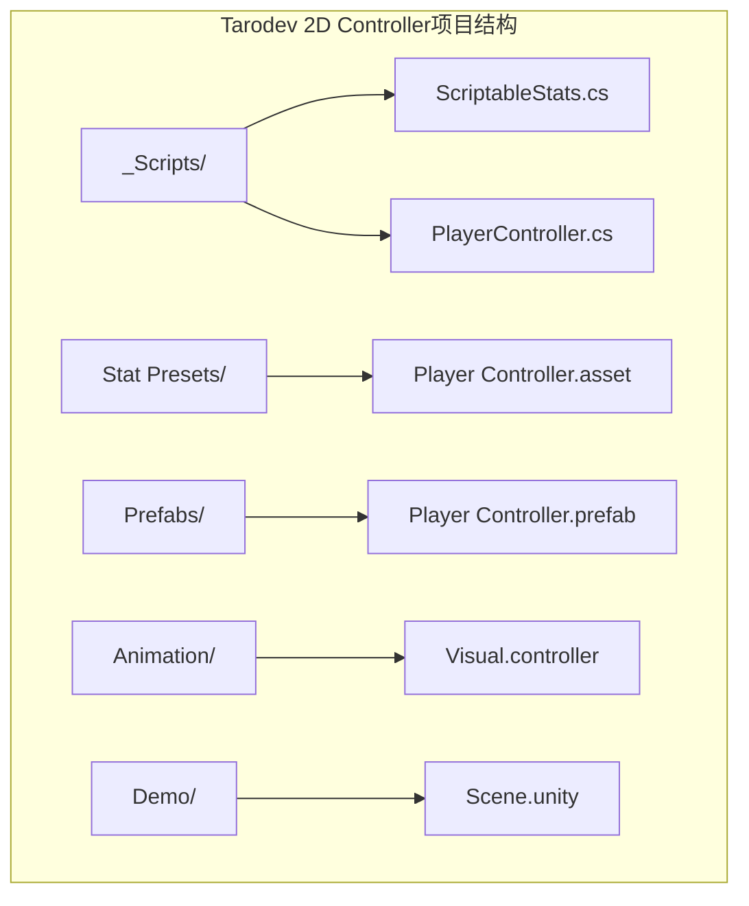
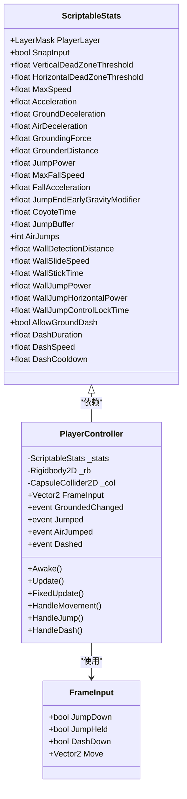
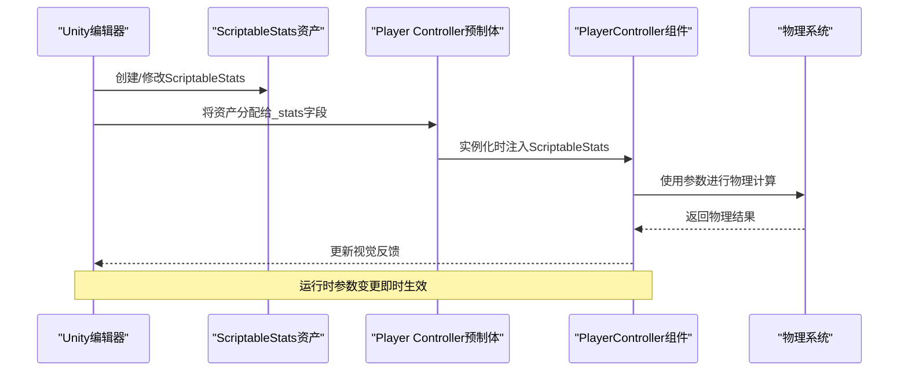

# ScriptableStats类API

<cite>
**本文档引用的文件**
- [ScriptableStats.cs](file://Tarodev 2D Controller/_Scripts/ScriptableStats.cs)
- [PlayerController.cs](file://Tarodev 2D Controller/_Scripts/PlayerController.cs)
- [Player Controller.asset](file://Tarodev 2D Controller/Stat Presets/Player Controller.asset)
- [Player Controller.prefab](file://Tarodev 2D Controller/Prefabs/Player Controller.prefab)
</cite>

## 目录
1. [简介](#简介)
2. [项目结构](#项目结构)
3. [核心组件](#核心组件)
4. [架构概览](#架构概览)
5. [详细组件分析](#详细组件分析)
6. [依赖关系分析](#依赖关系分析)
7. [性能考虑](#性能考虑)
8. [故障排除指南](#故障排除指南)
9. [结论](#结论)

## 简介

ScriptableStats是Tarodev 2D Controller项目中的核心配置类，它继承自Unity的ScriptableObject基类，为2D平台控制器提供了完整的参数化配置系统。该类通过ScriptableObject的工作机制，允许开发者在Unity编辑器中创建和管理游戏参数的配置预设，从而实现灵活的角色行为定制和平衡调整。

ScriptableStats类包含了角色移动、跳跃、冲刺、墙壁交互等所有核心物理参数的配置，每个参数都经过精心设计，以确保提供流畅且可预测的游戏体验。通过使用ScriptableObject，开发者可以在不修改代码的情况下调整角色行为，实现快速迭代和测试不同的游戏平衡方案。

## 项目结构

Tarodev 2D Controller项目采用模块化的文件组织结构，其中ScriptableStats类位于专门的脚本目录中，并与相关的预制体、动画资源和演示场景共同构成完整的控制器系统。



**图表来源**
- [ScriptableStats.cs:1-97](file://Tarodev 2D Controller/_Scripts/ScriptableStats.cs#L1-L97)
- [PlayerController.cs:14-16](file://Tarodev 2D Controller/_Scripts/PlayerController.cs#L14-L16)

**章节来源**
- [ScriptableStats.cs:1-97](file://Tarodev 2D Controller/_Scripts/ScriptableStats.cs#L1-L97)
- [PlayerController.cs:14-16](file://Tarodev 2D Controller/_Scripts/PlayerController.cs#L14-L16)

## 核心组件

ScriptableStats类作为整个2D控制器系统的配置中心，提供了超过30个可配置参数，涵盖了角色行为的各个方面。该类的设计遵循了Unity的最佳实践，通过属性标签和验证机制确保参数的有效性和易用性。

### 主要特性
- **类型安全的参数配置**：所有参数都有明确的数据类型和范围限制
- **实时编辑支持**：在Unity编辑器中可直接修改参数值
- **参数验证**：内置范围检查和默认值设置
- **层次化组织**：通过分组标签清晰分类不同类型的参数
- **文档化注释**：每个参数都有详细的用途说明和推荐设置

### 参数分类体系
ScriptableStats将参数按照功能逻辑分为多个类别，每个类别都包含相关的配置项：

1. **层级设置**：角色物理层配置
2. **输入设置**：输入处理和死区配置  
3. **移动设置**：基础移动行为参数
4. **跳跃设置**：跳跃系统参数
5. **空中选项**：二段跳和空中机动
6. **墙壁交互**：墙面攀爬和滑行
7. **冲刺设置**：冲刺系统配置

**章节来源**
- [ScriptableStats.cs:8-95](file://Tarodev 2D Controller/_Scripts/ScriptableStats.cs#L8-L95)

## 架构概览

ScriptableStats与PlayerController之间建立了清晰的依赖关系，形成了一个松耦合的配置驱动架构。这种设计使得控制器的行为完全由外部配置决定，实现了高度的可定制性和可维护性。



**图表来源**
- [ScriptableStats.cs:6-95](file://Tarodev 2D Controller/_Scripts/ScriptableStats.cs#L6-L95)
- [PlayerController.cs:14-374](file://Tarodev 2D Controller/_Scripts/PlayerController.cs#L14-L374)

### 数据流架构

ScriptableStats通过PlayerController的FixedUpdate循环被持续读取，形成了一条清晰的数据流：



**图表来源**
- [PlayerController.cs:16](file://Tarodev 2D Controller/_Scripts/PlayerController.cs#L16)
- [Player Controller.prefab:50](file://Tarodev 2D Controller/Prefabs/Player Controller.prefab#L50)

**章节来源**
- [PlayerController.cs:14-374](file://Tarodev 2D Controller/_Scripts/PlayerController.cs#L14-L374)
- [Player Controller.prefab:50](file://Tarodev 2D Controller/Prefabs/Player Controller.prefab#L50)

## 详细组件分析

### 输入处理参数

ScriptableStats提供了精细的输入处理配置，确保在不同输入设备上的表现一致性和稳定性。

#### 层级设置
- **PlayerLayer**：指定角色所属的物理层，用于碰撞检测和射线投射
- **SnapInput**：启用输入值的整数化处理，防止手柄微小抖动导致的意外移动

#### 死区阈值
- **VerticalDeadZoneThreshold**：垂直方向的最小输入阈值，范围0.01-0.99
- **HorizontalDeadZoneThreshold**：水平方向的最小输入阈值，范围0.01-0.99

这些参数通过PlayerController的GatherInput方法应用，实现了输入的平滑处理和设备兼容性。

**章节来源**
- [ScriptableStats.cs:8-20](file://Tarodev 2D Controller/_Scripts/ScriptableStats.cs#L8-L20)
- [PlayerController.cs:53-76](file://Tarodev 2D Controller/_Scripts/PlayerController.cs#L53-L76)

### 移动控制参数

移动系统是2D平台控制器的核心，ScriptableStats提供了全面的移动参数配置。

#### 基础移动参数
- **MaxSpeed**：最大移动速度（单位：单位/秒）
- **Acceleration**：水平加速度（单位：单位/秒²）
- **GroundDeceleration**：地面减速度（单位：单位/秒²）
- **AirDeceleration**：空中减速度（单位：单位/秒²）

#### 地面吸附系统
- **GroundingForce**：恒定的地面吸附力，范围0到-10
- **GrounderDistance**：地面和天花板检测距离，范围0-0.5

这些参数直接影响角色的操控感和物理表现，需要根据游戏风格进行平衡调整。

**章节来源**
- [ScriptableStats.cs:22-40](file://Tarodev 2D Controller/_Scripts/ScriptableStats.cs#L22-L40)
- [PlayerController.cs:247-266](file://Tarodev 2D Controller/_Scripts/PlayerController.cs#L247-L266)

### 跳跃系统参数

跳跃系统包含了多种高级特性，提供了丰富的空中机动能力。

#### 基础跳跃参数
- **JumpPower**：初始跳跃速度（单位：单位/秒）
- **MaxFallSpeed**：最大下落速度（单位：单位/秒）
- **FallAcceleration**：下落加速度（单位：单位/秒²）
- **JumpEndEarlyGravityModifier**：提前松开时的重力倍数

#### 高级跳跃特性
- **CoyoteTime**：离地后的跳跃宽容时间（单位：秒）
- **JumpBuffer**：跳跃缓冲时间（单位：秒）

#### 空中机动
- **AirJumps**：额外的空中跳跃次数
- **WallJumpPower**：墙壁跳跃的垂直速度
- **WallJumpHorizontalPower**：墙壁跳跃的水平速度
- **WallJumpControlLockTime**：墙壁跳跃后的控制锁定时间

**章节来源**
- [ScriptableStats.cs:41-82](file://Tarodev 2D Controller/_Scripts/ScriptableStats.cs#L41-L82)
- [PlayerController.cs:186-243](file://Tarodev 2D Controller/_Scripts/PlayerController.cs#L186-L243)

### 墙壁交互参数

墙壁系统提供了丰富的墙面互动能力，增强了平台跳跃的深度和策略性。

#### 墙壁检测
- **WallDetectionDistance**：墙壁检测距离（单位：单位）
- **WallSlideSpeed**：墙面滑行的最大下落速度
- **WallStickTime**：松开按键后的墙面保持时间

#### 墙壁跳跃
- **WallJumpPower**：墙面跳跃的垂直推力
- **WallJumpHorizontalPower**：墙面跳跃的水平推力
- **WallJumpControlLockTime**：跳跃后的控制锁定时间

**章节来源**
- [ScriptableStats.cs:64-82](file://Tarodev 2D Controller/_Scripts/ScriptableStats.cs#L64-L82)
- [PlayerController.cs:149-182](file://Tarodev 2D Controller/_Scripts/PlayerController.cs#L149-L182)

### 冲刺系统参数

冲刺系统为角色提供了快速位移能力，是2D平台游戏中重要的机动元素。

#### 冲刺配置
- **AllowGroundDash**：是否允许地面冲刺
- **DashDuration**：冲刺持续时间（单位：秒）
- **DashSpeed**：冲刺速度（单位：单位/秒）
- **DashCooldown**：冲刺冷却时间（单位：秒）

#### 冲刺机制
PlayerController中的HandleDash方法实现了完整的冲刺逻辑，包括冷却管理、方向计算和物理应用。

**章节来源**
- [ScriptableStats.cs:83-95](file://Tarodev 2D Controller/_Scripts/ScriptableStats.cs#L83-L95)
- [PlayerController.cs:270-320](file://Tarodev 2D Controller/_Scripts/PlayerController.cs#L270-L320)

## 依赖关系分析

ScriptableStats与PlayerController之间的依赖关系体现了良好的软件工程原则，形成了清晰的职责分离和接口契约。

```mermaid
graph TB
subgraph "依赖关系图"
ScriptableStats["ScriptableStats<br/>配置数据源"]
PlayerController["PlayerController<br/>控制器逻辑"]
Rigidbody2D["Rigidbody2D<br/>物理组件"]
CapsuleCollider2D["CapsuleCollider2D<br/>碰撞组件"]
ScriptableStats --> PlayerController : "提供配置"
PlayerController --> Rigidbody2D : "读取参数"
PlayerController --> CapsuleCollider2D : "读取参数"
PlayerController --> ScriptableStats : "依赖关系"
end
subgraph "运行时交互"
PlayerController --> |"FixedUpdate循环"| ScriptableStats
PlayerController --> |"物理计算"| Rigidbody2D
PlayerController --> |"碰撞检测"| CapsuleCollider2D
end
```

**图表来源**
- [PlayerController.cs:17-18](file://Tarodev 2D Controller/_Scripts/PlayerController.cs#L17-L18)
- [ScriptableStats.cs:6](file://Tarodev 2D Controller/_Scripts/ScriptableStats.cs#L6)

### 参数验证机制

ScriptableStats类通过Unity的属性系统实现了参数验证，确保配置的合理性和有效性。

#### 范围验证
- **Range属性**：为死区阈值提供0.01-0.99的范围限制
- **负值限制**：地面吸附力限制在0到-10范围内

#### 编辑器支持
- **Header标签**：为参数分组提供清晰的界面布局
- **Tooltip注释**：提供详细的参数说明和使用指导
- **CreateAssetMenu**：启用Unity编辑器中的资产创建功能

**章节来源**
- [ScriptableStats.cs:16-17](file://Tarodev 2D Controller/_Scripts/ScriptableStats.cs#L16-L17)
- [ScriptableStats.cs:35](file://Tarodev 2D Controller/_Scripts/ScriptableStats.cs#L35)

### 默认值设置

ScriptableStats为所有参数提供了经过精心调优的默认值，这些默认值基于广泛的游戏测试和平衡考虑。

#### 默认值特点
- **平衡性**：默认值经过测试，提供合理的游戏体验
- **可扩展性**：默认值允许在不破坏游戏性的前提下进行调整
- **一致性**：所有默认值都符合物理单位和游戏逻辑

**章节来源**
- [Player Controller.asset:15-44](file://Tarodev 2D Controller/Stat Presets/Player Controller.asset#L15-L44)

## 性能考虑

ScriptableStats的设计充分考虑了性能优化，通过合理的参数结构和访问模式确保了高效的运行时性能。

### 内存效率
- **轻量级数据结构**：仅包含必要的数值参数，无复杂对象引用
- **共享实例**：多个控制器实例可以共享同一个ScriptableStats实例
- **零初始化成本**：参数在内存中的布局紧凑，减少缓存未命中

### 计算效率
- **常量访问**：参数在FixedUpdate循环中按需读取，避免重复计算
- **分支优化**：条件判断逻辑简单明了，减少分支预测失败
- **物理集成**：参数直接参与物理计算，减少中间转换步骤

### 运行时优化
- **参数缓存**：PlayerController在需要时缓存关键参数值
- **批量更新**：参数变更在运行时即时生效，无需重启
- **事件驱动**：通过事件系统通知状态变化，避免轮询

## 故障排除指南

### 常见问题及解决方案

#### 参数无效警告
当ScriptableStats资产未正确分配时，PlayerController会在编辑器中显示警告信息。解决方法：
- 在Player Controller预制体中正确分配ScriptableStats资产
- 确保资产文件没有损坏或丢失

#### 物理异常
如果角色行为出现异常，检查以下参数：
- 确保MaxSpeed大于Acceleration
- 验证JumpPower与FallAcceleration的合理比例
- 检查AirJumps的数值是否符合预期

#### 输入响应问题
如果输入响应不正常，调整以下参数：
- 提高HorizontalDeadZoneThreshold以减少手柄抖动
- 调整SnapInput设置以适应不同输入设备
- 检查VerticalDeadZoneThreshold的数值范围

**章节来源**
- [PlayerController.cs:348-353](file://Tarodev 2D Controller/_Scripts/PlayerController.cs#L348-L353)

### 参数调试技巧

#### 快速验证
- 使用PlayerController的事件系统监控状态变化
- 通过Unity的Debug工具观察物理变量
- 利用编辑器的实时预览功能测试参数效果

#### 性能监控
- 监控FixedUpdate循环的执行时间
- 观察物理计算的频率和复杂度
- 检查参数变更对性能的影响

## 结论

ScriptableStats类代表了Unity中配置驱动开发的最佳实践，通过精心设计的参数系统和完善的验证机制，为2D平台控制器提供了强大的可定制性和灵活性。该类不仅满足了当前项目的需求，还为未来的扩展和定制奠定了坚实的基础。

### 设计优势总结
- **模块化设计**：清晰的功能分组和职责分离
- **类型安全**：强类型参数确保编译时错误检测
- **易于使用**：直观的编辑器界面和详细的文档说明
- **高性能**：优化的内存布局和计算模式
- **可扩展性**：为未来功能扩展预留空间

### 未来发展方向
随着项目的演进，ScriptableStats类可以进一步增强：
- 添加参数间的自动平衡算法
- 实现参数的动态调整和渐变过渡
- 增加更多的可视化调试工具
- 支持参数的版本管理和迁移

通过持续的优化和完善，ScriptableStats将继续为2D平台游戏开发提供可靠而强大的配置解决方案。