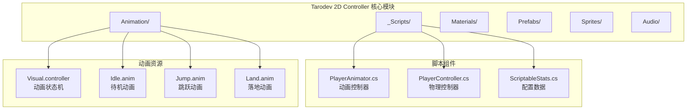
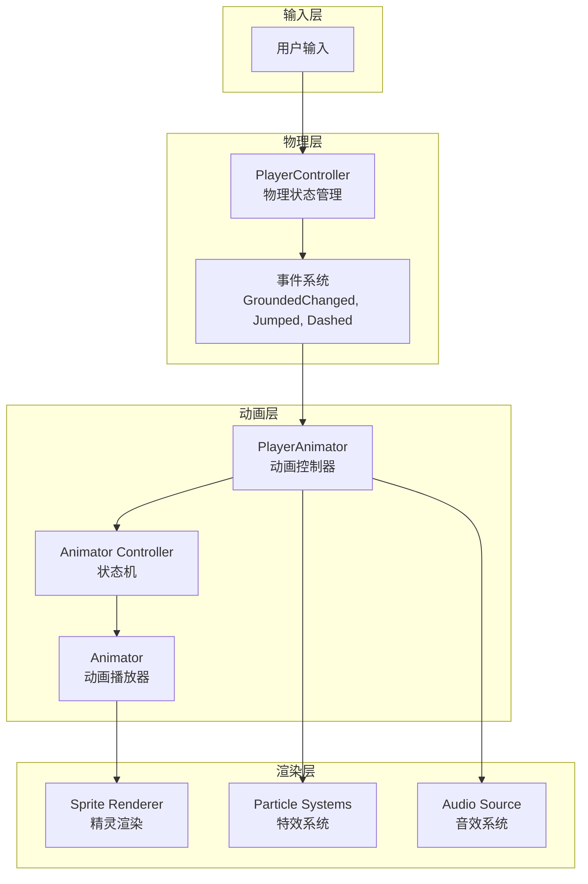
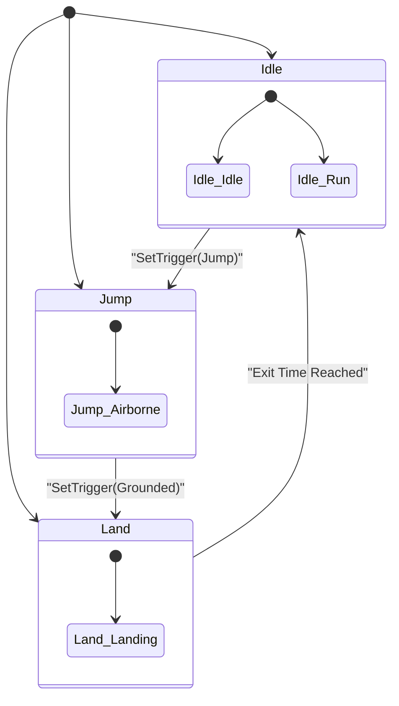
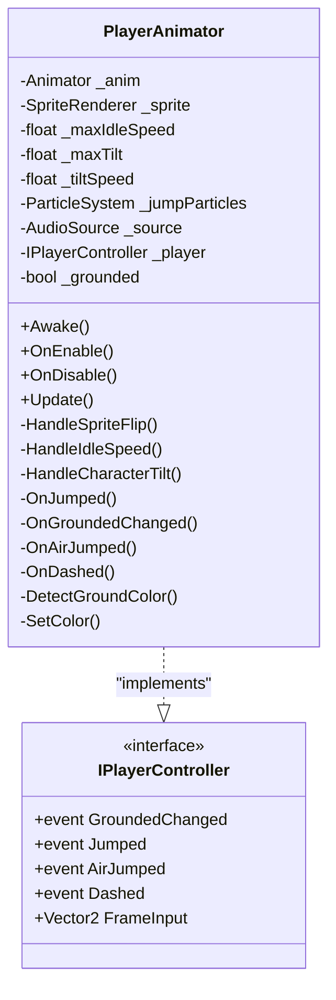
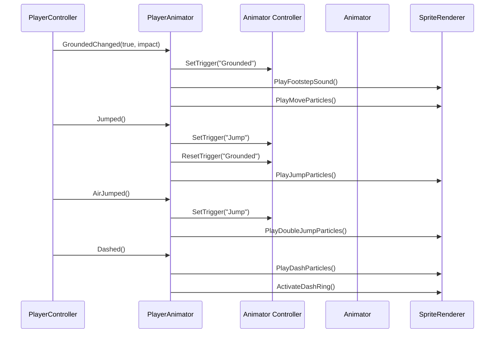
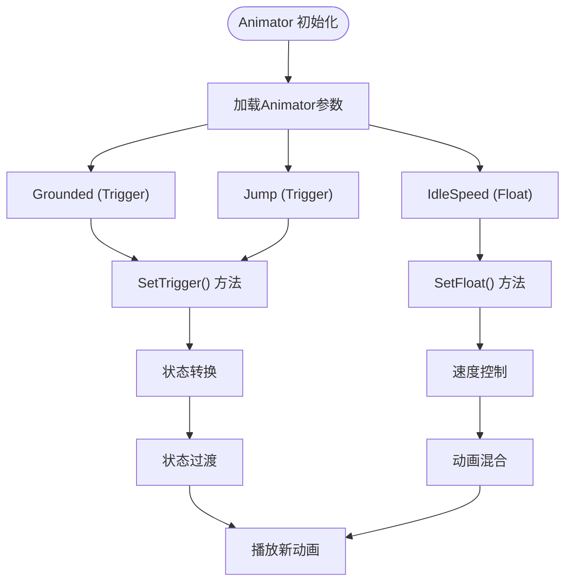
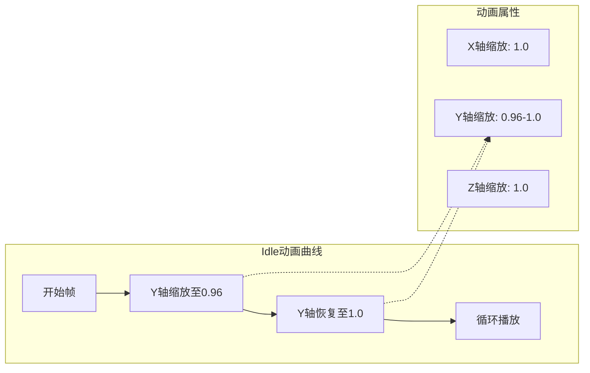
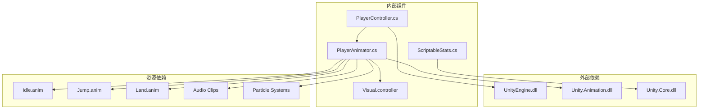
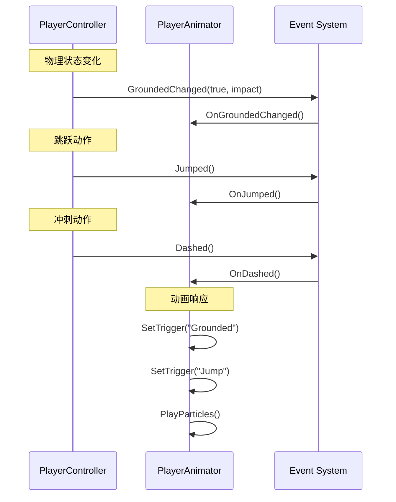

# 动画系统架构

<cite>
**本文档引用的文件**
- [PlayerAnimator.cs](file://Tarodev 2D Controller/_Scripts/PlayerAnimator.cs)
- [PlayerController.cs](file://Tarodev 2D Controller/_Scripts/PlayerController.cs)
- [Visual.controller](file://Tarodev 2D Controller/Animation/Visual.controller)
- [ScriptableStats.cs](file://Tarodev 2D Controller/_Scripts/ScriptableStats.cs)
- [Idle.anim](file://Tarodev 2D Controller/Animation/Idle.anim)
- [Jump.anim](file://Tarodev 2D Controller/Animation/Jump.anim)
- [Land.anim](file://Tarodev 2D Controller/Animation/Land.anim)
- [Player Controller.prefab](file://Tarodev 2D Controller/Prefabs/Player Controller.prefab)
</cite>

## 目录
1. [简介](#简介)
2. [项目结构](#项目结构)
3. [核心组件](#核心组件)
4. [架构概览](#架构概览)
5. [详细组件分析](#详细组件分析)
6. [依赖关系分析](#依赖关系分析)
7. [性能考虑](#性能考虑)
8. [故障排除指南](#故障排除指南)
9. [结论](#结论)

## 简介

本文件详细解析Tarodev 2D Controller项目中的PlayerAnimator类，这是一个基于Unity Animator的工作流动画系统。该系统通过将物理状态（地面、跳跃、冲刺等）映射到动画状态，实现了流畅的角色动画表现。文档涵盖了动画状态机的设计思路、实现细节、状态转换逻辑、动画混合和过渡效果，以及Unity Animator的工作原理和配置方法。

## 项目结构

Tarodev 2D Controller项目采用模块化设计，主要包含以下关键目录：

**图表来源**
- [PlayerAnimator.cs:1-178](file://Tarodev 2D Controller/_Scripts/PlayerAnimator.cs#L1-L178)
- [PlayerController.cs:1-374](file://Tarodev 2D Controller/_Scripts/PlayerController.cs#L1-L374)

**章节来源**
- [PlayerAnimator.cs:1-178](file://Tarodev 2D Controller/_Scripts/PlayerAnimator.cs#L1-L178)
- [PlayerController.cs:1-374](file://Tarodev 2D Controller/_Scripts/PlayerController.cs#L1-L374)

## 核心组件

### PlayerAnimator类概述

PlayerAnimator是动画系统的核心控制器，负责将物理状态转换为视觉反馈。该类继承自MonoBehaviour，提供了完整的动画控制功能。

#### 主要职责
- 监听PlayerController的事件并触发相应的动画
- 控制精灵翻转和倾斜效果
- 管理粒子效果的播放和颜色匹配
- 处理音频反馈

#### 关键特性
- **事件驱动**：通过IPlayerController接口监听物理状态变化
- **参数化控制**：使用Animator参数控制动画播放速度和状态
- **环境适配**：根据地面颜色动态调整粒子效果颜色
- **性能优化**：在启用/禁用时正确管理事件订阅和粒子系统

**章节来源**
- [PlayerAnimator.cs:8-178](file://Tarodev 2D Controller/_Scripts/PlayerAnimator.cs#L8-L178)

## 架构概览

动画系统采用分层架构设计，实现了清晰的关注点分离：

**图表来源**
- [PlayerAnimator.cs:37-74](file://Tarodev 2D Controller/_Scripts/PlayerAnimator.cs#L37-L74)
- [PlayerController.cs:29-372](file://Tarodev 2D Controller/_Scripts/PlayerController.cs#L29-L372)

### 状态机设计

Unity Animator状态机采用简单而有效的状态设计：

**图表来源**
- [Visual.controller:129-224](file://Tarodev 2D Controller/Animation/Visual.controller#L129-L224)

## 详细组件分析

### PlayerAnimator类深度解析

#### 类结构设计

**图表来源**
- [PlayerAnimator.cs:8-178](file://Tarodev 2D Controller/_Scripts/PlayerAnimator.cs#L8-L178)

#### 状态转换逻辑

PlayerAnimator通过事件驱动的方式实现状态转换：

**图表来源**
- [PlayerAnimator.cs:94-154](file://Tarodev 2D Controller/_Scripts/PlayerAnimator.cs#L94-L154)
- [PlayerController.cs:132-139](file://Tarodev 2D Controller/_Scripts/PlayerController.cs#L132-L139)

#### 动画参数映射

系统使用三个核心Animator参数来控制动画行为：

| 参数名称 | 类型 | 用途 | 值范围 | 默认值 |
|---------|------|------|--------|--------|
| Grounded | Trigger | 地面状态切换 | 无 | 0 |
| Jump | Trigger | 跳跃触发 | 无 | 0 |
| IdleSpeed | Float | 待机速度控制 | 1-3 | 2 |

**章节来源**
- [PlayerAnimator.cs:173-176](file://Tarodev 2D Controller/_Scripts/PlayerAnimator.cs#L173-L176)
- [Visual.controller:136-154](file://Tarodev 2D Controller/Animation/Visual.controller#L136-L154)

### Unity Animator工作原理

#### 参数设置机制

Unity Animator通过参数系统实现状态机的动态控制：

**图表来源**
- [Visual.controller:136-154](file://Tarodev 2D Controller/Animation/Visual.controller#L136-L154)
- [PlayerAnimator.cs:84-85](file://Tarodev 2D Controller/_Scripts/PlayerAnimator.cs#L84-L85)

#### 条件判断系统

状态机使用条件系统实现智能的状态转换：

| 条件类型 | 触发方式 | 作用域 | 说明 |
|---------|----------|--------|------|
| Trigger | SetTrigger() | 全局 | 一次性触发，自动重置 |
| Float | SetFloat() | 层级 | 连续数值控制 |
| Bool | SetBool() | 层级 | 布尔状态切换 |
| Int | SetInteger() | 层级 | 整数状态选择 |

**章节来源**
- [Visual.controller:37-54](file://Tarodev 2D Controller/Animation/Visual.controller#L37-L54)
- [Visual.controller:109-127](file://Tarodev 2D Controller/Animation/Visual.controller#L109-L127)

### 动画剪辑组织结构

#### Idle动画设计

Idle动画通过微妙的缩放变化创造呼吸感：

**图表来源**
- [Idle.anim:18-51](file://Tarodev 2D Controller/Animation/Idle.anim#L18-L51)

#### Jump动画设计

Jump动画包含独特的变形效果：

| 时间点 | X轴缩放 | Y轴缩放 | 效果描述 |
|--------|---------|---------|----------|
| 0.0s | 1.35 | 0.67 | 起跳时压缩 |
| 0.1s | 0.7256 | 1.2009 | 弹起时拉伸 |
| 0.2167s | 1.0 | 1.0 | 恢复原状 |

**章节来源**
- [Jump.anim:21-49](file://Tarodev 2D Controller/Animation/Jump.anim#L21-L49)

#### Land动画设计

Land动画强调着陆冲击效果：

| 时间点 | X轴缩放 | Y轴缩放 | 效果描述 |
|--------|---------|---------|----------|
| 0.0s | 1.44 | 0.6 | 着陆时压缩 |
| 0.1667s | 0.79 | 1.21 | 反弹时拉伸 |
| 0.3333s | 1.0 | 1.0 | 平衡恢复 |

**章节来源**
- [Land.anim:21-49](file://Tarodev 2D Controller/Animation/Land.anim#L21-L49)

## 依赖关系分析

### 组件耦合度分析

**图表来源**
- [PlayerAnimator.cs:1-178](file://Tarodev 2D Controller/_Scripts/PlayerAnimator.cs#L1-L178)
- [PlayerController.cs:1-374](file://Tarodev 2D Controller/_Scripts/PlayerController.cs#L1-L374)

### 事件系统设计

系统采用发布-订阅模式实现松耦合通信：

**图表来源**
- [PlayerController.cs:29-372](file://Tarodev 2D Controller/_Scripts/PlayerController.cs#L29-L372)
- [PlayerAnimator.cs:43-61](file://Tarodev 2D Controller/_Scripts/PlayerAnimator.cs#L43-L61)

**章节来源**
- [PlayerController.cs:29-372](file://Tarodev 2D Controller/_Scripts/PlayerController.cs#L29-L372)
- [PlayerAnimator.cs:43-61](file://Tarodev 2D Controller/_Scripts/PlayerAnimator.cs#L43-L61)

## 性能考虑

### 优化策略

1. **事件订阅管理**
   - 在启用时订阅事件，在禁用时取消订阅
   - 避免内存泄漏和不必要的回调调用

2. **动画参数缓存**
   - 使用静态哈希值缓存Animator参数
   - 减少字符串查找开销

3. **粒子系统优化**
   - 按需播放和停止粒子系统
   - 合理设置粒子数量和生命周期

4. **物理射线检测**
   - 限制射线检测距离
   - 避免频繁的Physics2D调用

### 性能基准

| 操作类型 | 开销级别 | 优化建议 |
|---------|----------|----------|
| 事件订阅 | 低 | 使用OnEnable/OnDisable |
| 参数设置 | 低 | 缓存Animator参数哈希 |
| 射线检测 | 中 | 限制检测距离和频率 |
| 粒子播放 | 中高 | 按需播放和停止 |
| 音频播放 | 低 | 使用PlayOneShot |

## 故障排除指南

### 常见问题诊断

#### 动画不播放问题

**症状**：角色动画不随物理状态变化而改变

**可能原因**：
1. Animator组件未正确配置
2. 动画剪辑丢失或损坏
3. 参数名称不匹配
4. 事件未正确触发

**解决方案**：
1. 检查Animator组件的Controller引用
2. 验证动画剪辑文件完整性
3. 确认参数名称与代码一致
4. 使用Debug.Log验证事件触发

#### 状态转换异常

**症状**：动画状态无法正确转换

**可能原因**：
1. 状态机连接错误
2. 过渡条件配置不当
3. 触发器未正确重置
4. 状态持续时间设置错误

**解决方案**：
1. 检查状态机的过渡连接
2. 验证条件判断逻辑
3. 确保触发器在适当时机重置
4. 调整状态持续时间和退出时间

#### 性能问题

**症状**：游戏运行卡顿或帧率下降

**可能原因**：
1. 过多的事件订阅
2. 频繁的射线检测
3. 粒子系统过度使用
4. 动画参数频繁更新

**解决方案**：
1. 实施事件订阅管理
2. 优化射线检测频率
3. 合理配置粒子系统
4. 减少动画参数更新频率

**章节来源**
- [PlayerAnimator.cs:37-61](file://Tarodev 2D Controller/_Scripts/PlayerAnimator.cs#L37-L61)
- [PlayerAnimator.cs:156-171](file://Tarodev 2D Controller/_Scripts/PlayerAnimator.cs#L156-L171)

## 结论

Tarodev 2D Controller的PlayerAnimator类展现了优秀的动画系统设计原则。通过事件驱动的状态转换、参数化的动画控制和环境适配的特效系统，实现了高质量的角色动画表现。

### 设计优势

1. **模块化设计**：清晰的职责分离和松耦合架构
2. **事件驱动**：基于物理状态变化的动画响应
3. **参数化控制**：灵活的动画参数调节机制
4. **环境适配**：根据场景环境动态调整视觉效果
5. **性能优化**：合理的资源管理和性能考虑

### 扩展建议

1. **动画混合**：实现更复杂的动画混合和插值
2. **状态机增强**：添加更多物理状态的动画映射
3. **材质系统**：集成材质变化的动画效果
4. **性能监控**：添加运行时性能监控和调试工具
5. **动画预设**：支持动画参数的预设和切换

该系统为2D平台游戏的动画开发提供了坚实的基础，其设计理念和实现方法值得在类似项目中借鉴和应用。