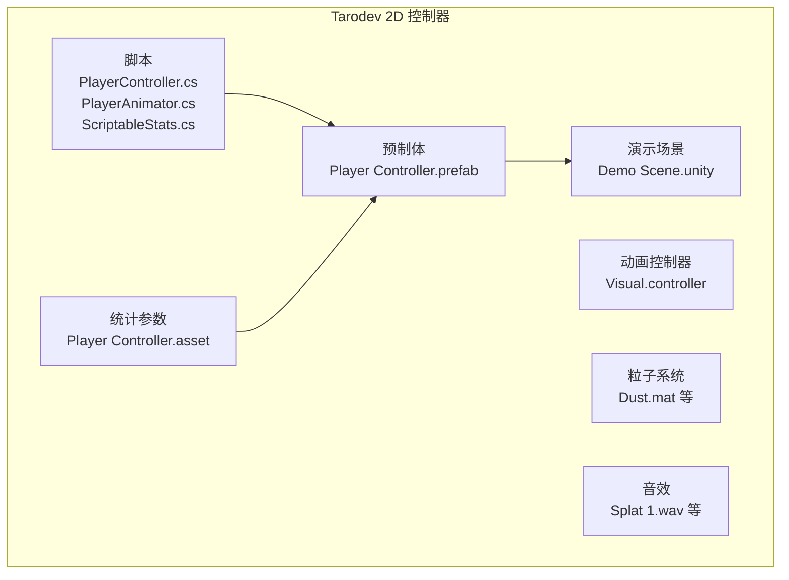
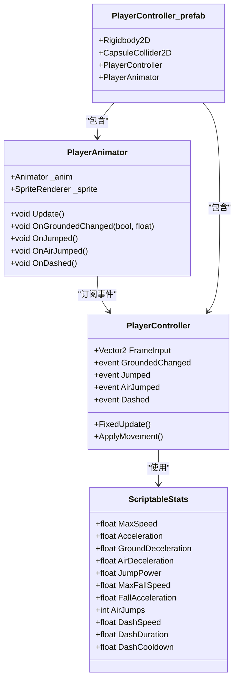
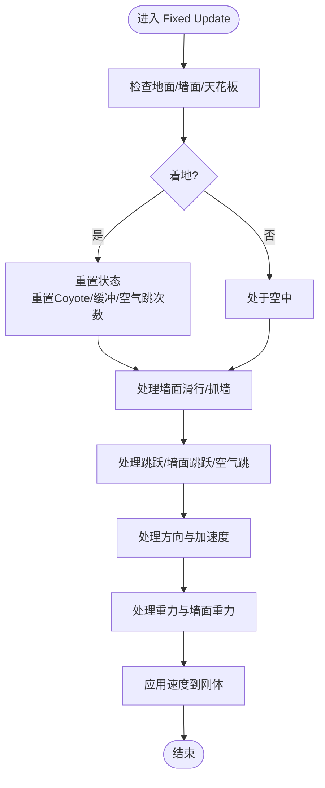
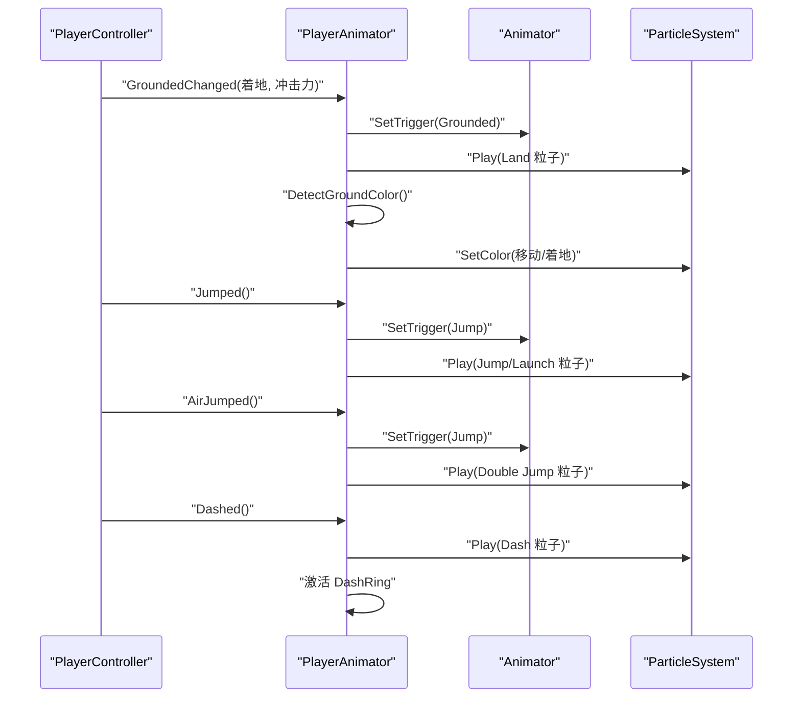
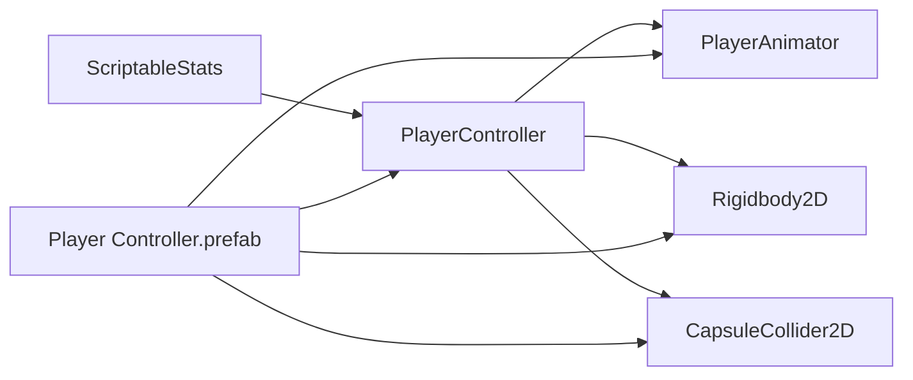

# 快速开始

<cite>
**本文引用的文件列表**
- [PlayerController.cs](file://Tarodev%202D%20Controller/_Scripts/PlayerController.cs)
- [PlayerAnimator.cs](file://Tarodev%202D%20Controller/_Scripts/PlayerAnimator.cs)
- [ScriptableStats.cs](file://Tarodev%202D%20Controller/_Scripts/ScriptableStats.cs)
- [Player Controller.prefab](file://Tarodev%202D%20Controller/Prefabs/Player%20Controller.prefab)
- [Player Controller.asset](file://Tarodev%202D%20Controller/Stat%20Presets/Player%20Controller.asset)
- [SampleScene.unity](file://Scenes/SampleScene.unity)
- [Demo Scene.unity](file://Tarodev%2D2D%20Controller/Demo/Scene.unity)
</cite>

## 目录
1. [简介](#简介)
2. [项目结构](#项目结构)
3. [核心组件](#核心组件)
4. [架构总览](#架构总览)
5. [详细组件分析](#详细组件分析)
6. [依赖关系分析](#依赖关系分析)
7. [性能注意事项](#性能注意事项)
8. [故障排除指南](#故障排除指南)
9. [结论](#结论)
10. [附录](#附录)

## 简介
本指南面向初学者，帮助你在Unity中快速集成并运行Tarodev 2D平台控制器。你将学到：
- 环境要求与前置条件（含Unity版本兼容性）
- 场景设置、预制体拖拽、参数配置与首次运行测试
- 关键组件的作用与基本设置方法
- 常见问题的快速解决
- 简单的测试流程以验证控制器正常工作

## 项目结构
该仓库提供了完整的2D平台控制器实现，包含脚本、预制体、动画控制器、粒子系统、音效以及示例场景。核心目录与文件如下：
- 脚本：PlayerController.cs、PlayerAnimator.cs、ScriptableStats.cs
- 预制体：Player Controller.prefab
- 统计参数：Player Controller.asset
- 示例场景：SampleScene.unity、Demo Scene.unity

图表来源
- [PlayerController.cs:1-374](file://Tarodev%202D%20Controller/_Scripts/PlayerController.cs#L1-L374)
- [PlayerAnimator.cs:1-178](file://Tarodev%202D%20Controller/_Scripts/PlayerAnimator.cs#L1-L178)
- [ScriptableStats.cs:1-97](file://Tarodev%202D%20Controller/_Scripts/ScriptableStats.cs#L1-L97)
- [Player Controller.prefab:1-34680](file://Tarodev%202D%20Controller/Prefabs/Player%20Controller.prefab#L1-L34680)
- [Player Controller.asset:1-44](file://Tarodev%202D%20Controller/Stat%20Presets/Player%20Controller.asset#L1-L44)
- [Demo Scene.unity:1-836](file://Tarodev%2D2D%20Controller/Demo/Scene.unity#L1-L836)

章节来源
- [PlayerController.cs:1-374](file://Tarodev%202D%20Controller/_Scripts/PlayerController.cs#L1-L374)
- [PlayerAnimator.cs:1-178](file://Tarodev%202D%20Controller/_Scripts/PlayerAnimator.cs#L1-L178)
- [ScriptableStats.cs:1-97](file://Tarodev%202D%20Controller/_Scripts/ScriptableStats.cs#L1-L97)
- [Player Controller.prefab:1-34680](file://Tarodev%202D%20Controller/Prefabs/Player%20Controller.prefab#L1-L34680)
- [Player Controller.asset:1-44](file://Tarodev%202D%20Controller/Stat%20Presets/Player%20Controller.asset#L1-L44)
- [Demo Scene.unity:1-836](file://Tarodev%2D2D%20Controller/Demo/Scene.unity#L1-L836)

## 核心组件
- PlayerController：负责输入采集、碰撞检测、移动、跳跃、冲刺、重力与墙面交互等核心物理逻辑。
- PlayerAnimator：驱动动画状态机、粒子特效与音效，响应控制器事件。
- ScriptableStats：可编辑的参数集，统一管理移动、跳跃、墙面交互、冲刺等物理参数。
- Player Controller.prefab：包含Rigidbody2D、CapsuleCollider2D、PlayerController、PlayerAnimator等组件的预制体。
- Player Controller.asset：默认参数预设，可直接使用或复制修改。

章节来源
- [PlayerController.cs:14-374](file://Tarodev%202D%20Controller/_Scripts/PlayerController.cs#L14-L374)
- [PlayerAnimator.cs:8-178](file://Tarodev%202D%20Controller/_Scripts/PlayerAnimator.cs#L8-L178)
- [ScriptableStats.cs:6-97](file://Tarodev%202D%20Controller/_Scripts/ScriptableStats.cs#L6-L97)
- [Player Controller.prefab:38-112](file://Tarodev%202D%20Controller/Prefabs/Player%20Controller.prefab#L38-L112)
- [Player Controller.asset:1-44](file://Tarodev%202D%20Controller/Stat%20Presets/Player%20Controller.asset#L1-L44)

## 架构总览
控制器采用“脚本+预制体+参数”的分层设计：
- 脚本层：PlayerController与PlayerAnimator分别处理物理与表现。
- 数据层：ScriptableStats集中管理所有物理参数。
- 实例层：Player Controller.prefab将组件组合成可复用的玩家对象。

图表来源
- [PlayerController.cs:14-374](file://Tarodev%202D%20Controller/_Scripts/PlayerController.cs#L14-L374)
- [PlayerAnimator.cs:8-178](file://Tarodev%202D%20Controller/_Scripts/PlayerAnimator.cs#L8-L178)
- [ScriptableStats.cs:6-97](file://Tarodev%202D%20Controller/_Scripts/ScriptableStats.cs#L6-L97)
- [Player Controller.prefab:38-112](file://Tarodev%202D%20Controller/Prefabs/Player%20Controller.prefab#L38-L112)

## 详细组件分析

### PlayerController 组件
- 输入与帧更新：在Update中收集输入，在FixedUpdate中执行物理计算。
- 碰撞检测：使用胶囊射线检测地面、天花板与墙面，支持Coyote时间与跳跃缓冲。
- 移动与重力：根据地面/空中状态应用加速度、减速度与重力修正。
- 跳跃与墙面：支持地面起跳、Coyote起跳、墙面滑行与墙面跳跃。
- 冲刺：支持冷却与持续时间控制，支持地面/空中冲刺。

图表来源
- [PlayerController.cs:78-143](file://Tarodev%202D%20Controller/_Scripts/PlayerController.cs#L78-L143)
- [PlayerController.cs:147-243](file://Tarodev%202D%20Controller/_Scripts/PlayerController.cs#L147-L243)
- [PlayerController.cs:245-346](file://Tarodev%202D%20Controller/_Scripts/PlayerController.cs#L245-L346)

章节来源
- [PlayerController.cs:47-97](file://Tarodev%202D%20Controller/_Scripts/PlayerController.cs#L47-L97)
- [PlayerController.cs:107-143](file://Tarodev%202D%20Controller/_Scripts/PlayerController.cs#L107-L143)
- [PlayerController.cs:147-243](file://Tarodev%202D%20Controller/_Scripts/PlayerController.cs#L147-L243)
- [PlayerController.cs:245-346](file://Tarodev%202D%20Controller/_Scripts/PlayerController.cs#L245-L346)

### PlayerAnimator 组件
- 订阅控制器事件：着地、跳跃、二段跳、冲刺。
- 动画与特效：根据输入与状态驱动动画、粒子颜色与大小、音效播放。
- 角色倾斜与翻转：依据输入与地面状态调整角色朝向与倾斜角度。

图表来源
- [PlayerAnimator.cs:43-154](file://Tarodev%202D%20Controller/_Scripts/PlayerAnimator.cs#L43-L154)
- [PlayerController.cs:29-34](file://Tarodev%202D%20Controller/_Scripts/PlayerController.cs#L29-L34)

章节来源
- [PlayerAnimator.cs:43-154](file://Tarodev%202D%20Controller/_Scripts/PlayerAnimator.cs#L43-L154)

### ScriptableStats 参数集
- 层级设置：PlayerLayer（玩家所在物理层）。
- 输入设置：SnapInput、垂直/水平死区阈值。
- 移动设置：最大速度、加速度、地面/空中减速度、地面吸附力、地面检测距离。
- 跳跃设置：跳跃初速度、最大下落速度、重力加速度、提前松开重力修正、Coyote时间、跳跃缓冲。
- 空中选项：AirJumps（二段跳次数）。
- 墙壁交互：墙面检测距离、滑行速度、抓墙时间、墙面跳跃速度与控制锁。
- 冲刺设置：AllowGroundDash、DashDuration、DashSpeed、DashCooldown。

章节来源
- [ScriptableStats.cs:8-95](file://Tarodev%202D%20Controller/_Scripts/ScriptableStats.cs#L8-L95)
- [Player Controller.asset:15-44](file://Tarodev%202D%20Controller/Stat%20Presets/Player%20Controller.asset#L15-L44)

## 依赖关系分析
- PlayerController 依赖 ScriptableStats 提供的物理参数。
- PlayerAnimator 通过接口订阅 PlayerController 的事件，驱动动画与特效。
- Player Controller.prefab 将 PlayerController、PlayerAnimator、Rigidbody2D、CapsuleCollider2D 组合为可实例化的对象。

图表来源
- [PlayerController.cs:16-18](file://Tarodev%202D%20Controller/_Scripts/PlayerController.cs#L16-L18)
- [PlayerAnimator.cs:33-40](file://Tarodev%202D%20Controller/_Scripts/PlayerAnimator.cs#L33-L40)
- [Player Controller.prefab:38-112](file://Tarodev%202D%20Controller/Prefabs/Player%20Controller.prefab#L38-L112)

章节来源
- [PlayerController.cs:16-18](file://Tarodev%202D%20Controller/_Scripts/PlayerController.cs#L16-L18)
- [PlayerAnimator.cs:33-40](file://Tarodev%202D%20Controller/_Scripts/PlayerAnimator.cs#L33-L40)
- [Player Controller.prefab:38-112](file://Tarodev%202D%20Controller/Prefabs/Player%20Controller.prefab#L38-L112)

## 性能注意事项
- 使用FixedUpdate进行物理更新，避免在Update中直接修改刚体速度。
- 合理设置CapsuleCollider2D尺寸与位置，减少不必要的射线检测开销。
- 适当降低粒子系统数量与复杂度，避免在低端设备上造成卡顿。
- 使用LayerMask精确过滤碰撞层，减少无效检测。

## 故障排除指南
- 编辑器警告：未分配ScriptableStats
  - 现象：在Inspector中看到“请在Player Controller的Stats槽位分配一个ScriptableStats资源”的警告。
  - 解决：在Project窗口中找到Player Controller.asset，拖拽到Player Controller预制体上的Stats字段。
  - 参考路径：[PlayerController.cs:348-353](file://Tarodev%202D%20Controller/_Scripts/PlayerController.cs#L348-L353)
- 角色无法移动
  - 检查：输入轴名称是否正确（Jump、Horizontal、Vertical），按键映射是否生效。
  - 检查：Rigidbody2D与CapsuleCollider2D是否正确挂载且未被禁用。
  - 参考路径：[PlayerController.cs:53-76](file://Tarodev%202D%20Controller/_Scripts/PlayerController.cs#L53-L76)
- 跳跃高度异常
  - 检查：JumpPower、FallAcceleration、MaxFallSpeed等参数是否合理。
  - 参考路径：[ScriptableStats.cs:41-58](file://Tarodev%202D%20Controller/_Scripts/ScriptableStats.cs#L41-L58)
- 墙面滑行或跳跃不符合预期
  - 检查：WallDetectionDistance、WallSlideSpeed、WallJumpPower、WallJumpHorizontalPower等参数。
  - 参考路径：[ScriptableStats.cs:64-82](file://Tarodev%202D%20Controller/_Scripts/ScriptableStats.cs#L64-L82)
- 冲刺无法使用或冷却过长
  - 检查：AllowGroundDash、DashDuration、DashSpeed、DashCooldown。
  - 参考路径：[ScriptableStats.cs:83-95](file://Tarodev%202D%20Controller/_Scripts/ScriptableStats.cs#L83-L95)

章节来源
- [PlayerController.cs:348-353](file://Tarodev%202D%20Controller/_Scripts/PlayerController.cs#L348-L353)
- [PlayerController.cs:53-76](file://Tarodev%202D%20Controller/_Scripts/PlayerController.cs#L53-L76)
- [ScriptableStats.cs:41-95](file://Tarodev%202D%20Controller/_Scripts/ScriptableStats.cs#L41-L95)

## 结论
通过本指南，你可以快速完成Unity 2D平台控制器的集成与测试。建议先在Demo场景中运行，再逐步迁移到你的项目场景。根据实际需求微调ScriptableStats参数，即可获得顺滑的平台跳跃体验。

## 附录

### 环境要求与前置条件
- Unity版本：推荐使用Unity 2021 LTS及以上版本，以获得最佳兼容性与性能。
- 2D物理：确保场景中存在合适的地面与障碍物，使用BoxCollider2D或类似碰撞器。
- 输入系统：确保输入轴已配置（Jump、Horizontal、Vertical），或在脚本中自定义按键映射。
- 场景相机：建议使用正交相机（Orthographic），以便于2D平台游戏的视觉呈现。

章节来源
- [Demo Scene.unity:126-195](file://Tarodev%2D2D%20Controller/Demo/Scene.unity#L126-L195)
- [SampleScene.unity:126-209](file://Scenes/SampleScene.unity#L126-L209)

### 完整集成步骤
1. 创建或打开场景
   - 打开Demo Scene.unity或SampleScene.unity作为起点。
   - 确保场景中有地面与障碍物，便于测试移动与跳跃。
   - 参考路径：[Demo Scene.unity:125-254](file://Tarodev%2D2D%20Controller/Demo/Scene.unity#L125-L254)

2. 拖拽预制体
   - 在Project窗口中找到Player Controller.prefab，将其拖拽到场景中。
   - 参考路径：[Player Controller.prefab:1-34680](file://Tarodev%202D%20Controller/Prefabs/Player%20Controller.prefab#L1-L34680)

3. 分配参数集
   - 在Inspector中，将Player Controller.prefab上的Stats字段指向Player Controller.asset。
   - 参考路径：[Player Controller.prefab:47-50](file://Tarodev%202D%20Controller/Prefabs/Player%20Controller.prefab#L47-L50)
   - 参考路径：[Player Controller.asset:1-44](file://Tarodev%202D%20Controller/Stat%20Presets/Player%20Controller.asset#L1-L44)

4. 配置输入与层
   - 确认输入轴名称与按键映射符合预期（Jump、Horizontal、Vertical）。
   - 在ScriptableStats中设置PlayerLayer，确保与地面/障碍物的碰撞层一致。
   - 参考路径：[ScriptableStats.cs:8-10](file://Tarodev%202D%20Controller/_Scripts/ScriptableStats.cs#L8-L10)

5. 运行测试
   - 点击播放按钮，使用方向键或WASD移动，空格键或C键跳跃，左Shift或X键冲刺。
   - 测试墙面滑行与墙面跳跃，验证二段跳与冲刺冷却。
   - 参考路径：[PlayerController.cs:53-76](file://Tarodev%202D%20Controller/_Scripts/PlayerController.cs#L53-L76)

### 参数配置建议
- 移动与跳跃：先调整MaxSpeed与Acceleration，再调节JumpPower与FallAcceleration，最后微调CoyoteTime与JumpBuffer。
- 墙面交互：WallDetectionDistance与WallSlideSpeed决定墙面滑行手感；WallJumpPower与WallJumpHorizontalPower决定墙面跳跃高度与距离。
- 冲刺：AllowGroundDash、DashDuration、DashSpeed、DashCooldown按需调整，避免过于频繁或过于强力。

章节来源
- [ScriptableStats.cs:22-95](file://Tarodev%202D%20Controller/_Scripts/ScriptableStats.cs#L22-L95)
- [Player Controller.asset:21-44](file://Tarodev%202D%20Controller/Stat%20Presets/Player%20Controller.asset#L21-L44)

### 常见问题快速解决
- “未分配ScriptableStats”警告：将Player Controller.asset拖拽到Stats字段。
- 角色无法移动：检查输入轴与按键映射，确认Rigidbody2D与CapsuleCollider2D启用。
- 跳跃异常：调整JumpPower与FallAcceleration，确保MaxFallSpeed足够大。
- 墙面滑行不顺畅：增大WallDetectionDistance或减小WallSlideSpeed。
- 冲刺冷却过长：降低DashCooldown或提高DashSpeed。

章节来源
- [PlayerController.cs:348-353](file://Tarodev%202D%20Controller/_Scripts/PlayerController.cs#L348-L353)
- [ScriptableStats.cs:22-95](file://Tarodev%202D%20Controller/_Scripts/ScriptableStats.cs#L22-L95)

### 测试流程
- 步骤1：在Demo场景中点击播放，观察角色能否正常移动与跳跃。
- 步骤2：靠近墙面并尝试墙面滑行与墙面跳跃，确认WallJumpPower与WallJumpHorizontalPower合适。
- 步骤3：测试二段跳，确认AirJumps设置有效。
- 步骤4：测试冲刺，确认AllowGroundDash、DashDuration、DashSpeed、DashCooldown符合预期。
- 步骤5：在不同地面材质上测试着地特效与音效，确保PlayerAnimator正常工作。

章节来源
- [Demo Scene.unity:515-571](file://Tarodev%2D2D%20Controller/Demo/Scene.unity#L515-L571)
- [PlayerAnimator.cs:94-154](file://Tarodev%202D%20Controller/_Scripts/PlayerAnimator.cs#L94-L154)