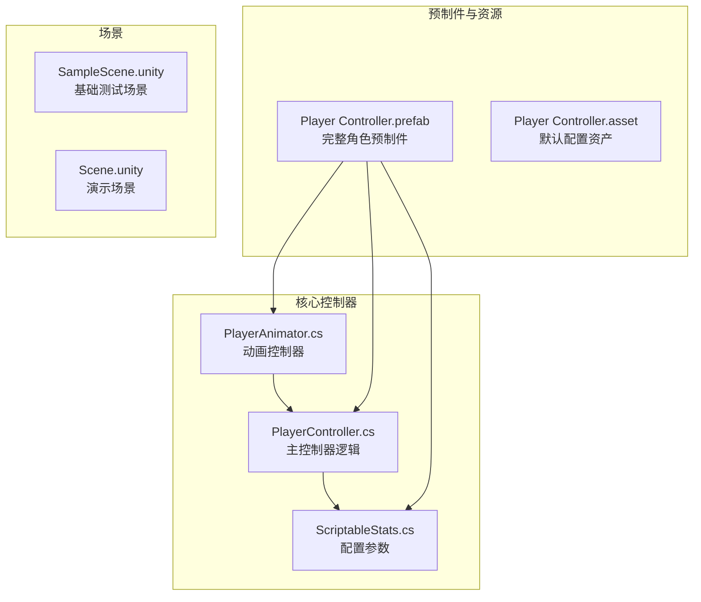
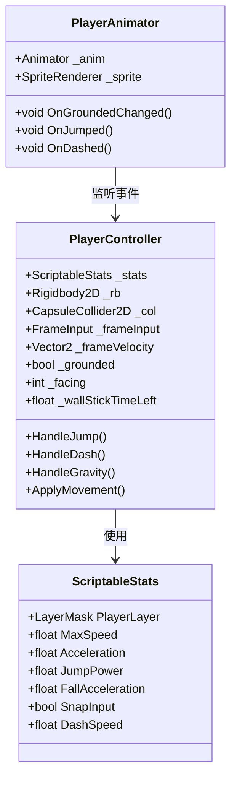
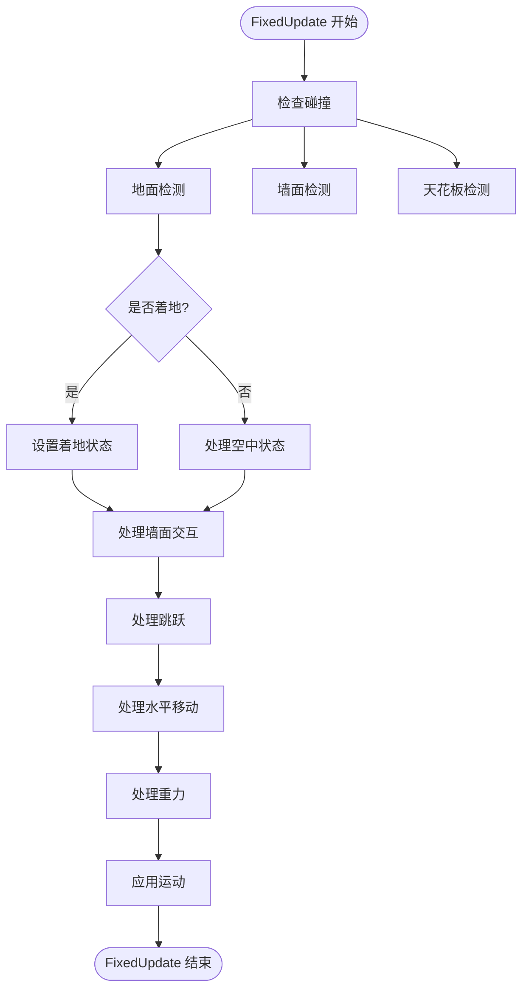
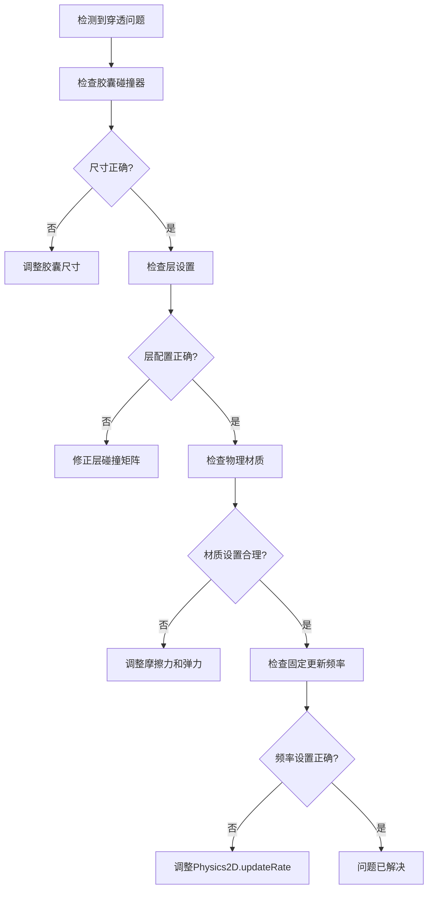
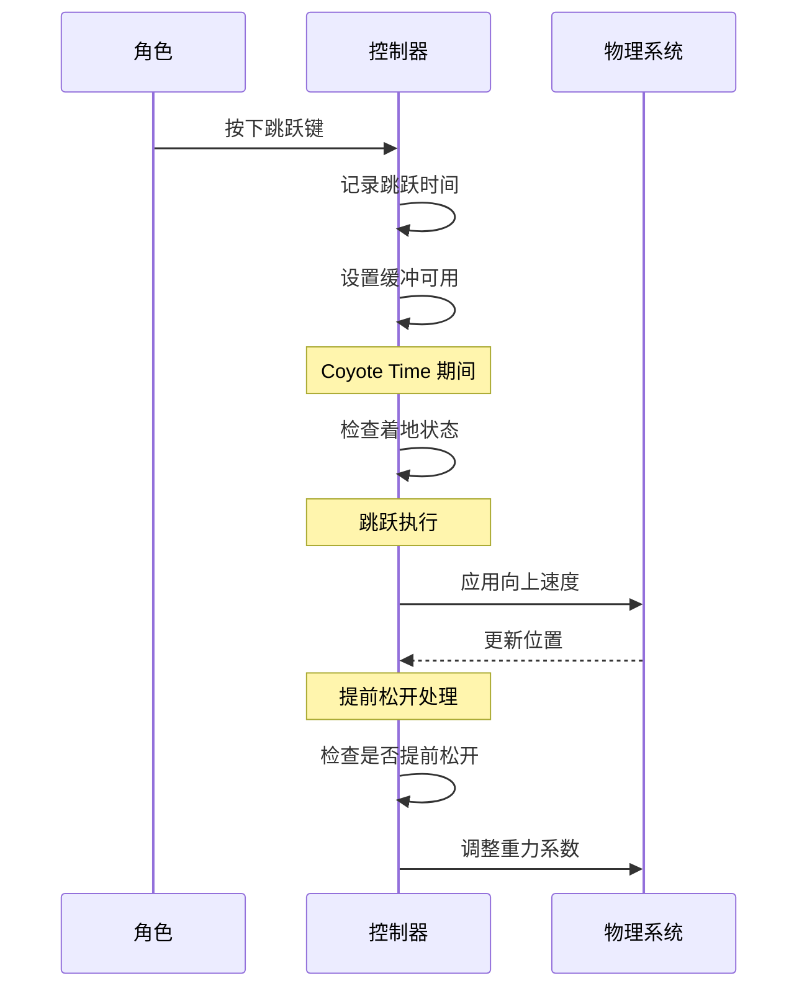
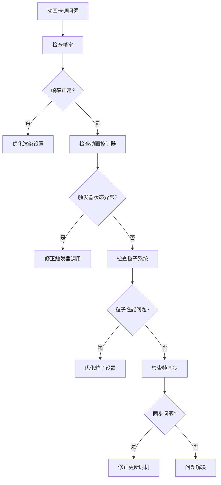
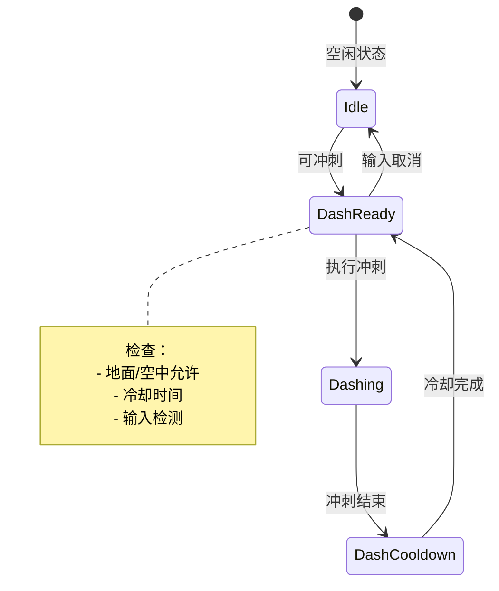
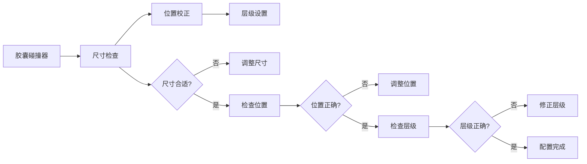
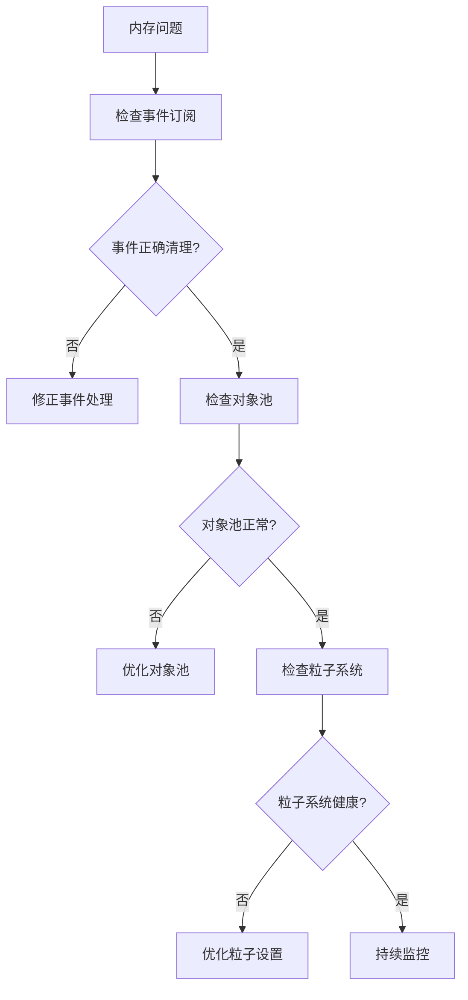

# 故障排除与常见问题

<cite>
**本文档中引用的文件**
- [PlayerController.cs](file://Tarodev 2D Controller/_Scripts/PlayerController.cs)
- [PlayerAnimator.cs](file://Tarodev 2D Controller/_Scripts/PlayerAnimator.cs)
- [ScriptableStats.cs](file://Tarodev 2D Controller/_Scripts/ScriptableStats.cs)
- [Player Controller.prefab](file://Tarodev 2D Controller/Prefabs/Player Controller.prefab)
- [Player Controller.asset](file://Tarodev 2D Controller/Stat Presets/Player Controller.asset)
- [SampleScene.unity](file://Scenes/SampleScene.unity)
- [Scene.unity](file://Tarodev 2D Controller/Demo/Scene.unity)
</cite>

## 目录
1. [简介](#简介)
2. [项目结构概览](#项目结构概览)
3. [核心组件分析](#核心组件分析)
4. [常见问题诊断](#常见问题诊断)
5. [系统性排查流程](#系统性排查流程)
6. [调试工具使用](#调试工具使用)
7. [配置错误与修正](#配置错误与修正)
8. [性能问题识别与优化](#性能问题识别与优化)
9. [故障排除最佳实践](#故障排除最佳实践)
10. [总结](#总结)

## 简介

本指南针对Tarodev 2D平台控制器的常见问题提供系统性的故障排除方法。该控制器提供了完整的2D平台游戏功能，包括物理移动、跳跃、墙面滑行、冲刺等特性。本文档涵盖从基础配置到高级调试的所有方面，帮助开发者快速定位和解决开发过程中的各种问题。

## 项目结构概览

该项目采用模块化架构设计，主要包含以下核心组件：



**图表来源**
- [PlayerController.cs:1-374](file://Tarodev 2D Controller/_Scripts/PlayerController.cs#L1-L374)
- [PlayerAnimator.cs:1-178](file://Tarodev 2D Controller/_Scripts/PlayerAnimator.cs#L1-L178)
- [ScriptableStats.cs:1-97](file://Tarodev 2D Controller/_Scripts/ScriptableStats.cs#L1-L97)

**章节来源**
- [PlayerController.cs:13-45](file://Tarodev 2D Controller/_Scripts/PlayerController.cs#L13-L45)
- [PlayerAnimator.cs:8-41](file://Tarodev 2D Controller/_Scripts/PlayerAnimator.cs#L8-L41)
- [ScriptableStats.cs:5-97](file://Tarodev 2D Controller/_Scripts/ScriptableStats.cs#L5-L97)

## 核心组件分析

### 主控制器架构

主控制器实现了完整的2D平台游戏物理系统，采用固定时间步长更新机制：



**图表来源**
- [PlayerController.cs:14-374](file://Tarodev 2D Controller/_Scripts/PlayerController.cs#L14-L374)
- [ScriptableStats.cs:6-97](file://Tarodev 2D Controller/_Scripts/ScriptableStats.cs#L6-L97)
- [PlayerAnimator.cs:8-178](file://Tarodev 2D Controller/_Scripts/PlayerAnimator.cs#L8-L178)

### 物理系统核心机制

控制器使用基于胶囊体的射线检测系统来处理碰撞：



**图表来源**
- [PlayerController.cs:78-97](file://Tarodev 2D Controller/_Scripts/PlayerController.cs#L78-L97)
- [PlayerController.cs:107-143](file://Tarodev 2D Controller/_Scripts/PlayerController.cs#L107-L143)

**章节来源**
- [PlayerController.cs:78-346](file://Tarodev 2D Controller/_Scripts/PlayerController.cs#L78-L346)
- [PlayerAnimator.cs:43-128](file://Tarodev 2D Controller/_Scripts/PlayerAnimator.cs#L43-L128)

## 常见问题诊断

### 1. 物理穿透问题

**症状表现：**
- 角色穿过平台或墙壁
- 在空中时位置异常跳跃
- 碰撞检测失效

**诊断步骤：**
1. 检查胶囊碰撞器尺寸和位置
2. 验证物理材质设置
3. 确认层碰撞矩阵配置
4. 排查固定更新频率问题

**解决方案：**


**图表来源**
- [PlayerController.cs:112-116](file://Tarodev 2D Controller/_Scripts/PlayerController.cs#L112-L116)
- [Player Controller.prefab:84-112](file://Tarodev 2D Controller/Prefabs/Player Controller.prefab#L84-L112)

**章节来源**
- [PlayerController.cs:107-143](file://Tarodev 2D Controller/_Scripts/PlayerController.cs#L107-L143)
- [Player Controller.prefab:52-77](file://Tarodev 2D Controller/Prefabs/Player Controller.prefab#L52-L77)

### 2. 跳跃异常问题

**症状表现：**
- 跳跃高度不符合预期
- 空中跳跃次数异常
- 提前松开跳跃键无效

**诊断步骤：**
1. 检查跳跃参数配置
2. 验证跳跃缓冲和宽容时间
3. 确认重力参数设置
4. 排查二段跳逻辑

**解决方案：**


**图表来源**
- [PlayerController.cs:195-227](file://Tarodev 2D Controller/_Scripts/PlayerController.cs#L195-L227)
- [ScriptableStats.cs:41-58](file://Tarodev 2D Controller/_Scripts/ScriptableStats.cs#L41-L58)

**章节来源**
- [PlayerController.cs:198-241](file://Tarodev 2D Controller/_Scripts/PlayerController.cs#L198-L241)
- [ScriptableStats.cs:41-62](file://Tarodev 2D Controller/_Scripts/ScriptableStats.cs#L41-L62)

### 3. 动画卡顿问题

**症状表现：**
- 动画播放不流畅
- 触发器状态异常
- 精灵翻转延迟

**诊断步骤：**
1. 检查动画控制器状态机
2. 验证触发器调用时机
3. 确认帧率同步问题
4. 排查粒子系统性能

**解决方案：**


**图表来源**
- [PlayerAnimator.cs:63-92](file://Tarodev 2D Controller/_Scripts/PlayerAnimator.cs#L63-L92)
- [PlayerAnimator.cs:140-154](file://Tarodev 2D Controller/_Scripts/PlayerAnimator.cs#L140-L154)

**章节来源**
- [PlayerAnimator.cs:63-178](file://Tarodev 2D Controller/_Scripts/PlayerAnimator.cs#L63-L178)

### 4. 冲刺异常问题

**症状表现：**
- 冲刺无法使用
- 冲刺冷却时间异常
- 冲刺方向错误

**诊断步骤：**
1. 检查冲刺参数配置
2. 验证冷却时间逻辑
3. 确认输入检测
4. 排查冲刺状态管理

**解决方案：**


**图表来源**
- [PlayerController.cs:278-318](file://Tarodev 2D Controller/_Scripts/PlayerController.cs#L278-L318)
- [ScriptableStats.cs:83-95](file://Tarodev 2D Controller/_Scripts/ScriptableStats.cs#L83-L95)

**章节来源**
- [PlayerController.cs:278-320](file://Tarodev 2D Controller/_Scripts/PlayerController.cs#L278-L320)
- [ScriptableStats.cs:83-95](file://Tarodev 2D Controller/_Scripts/ScriptableStats.cs#L83-L95)

## 系统性排查流程

### 第一阶段：基础检查

**步骤1：场景验证**
1. 确认场景中包含完整预制件
2. 验证相机设置和渲染配置
3. 检查物理世界设置

**步骤2：组件完整性**
1. 检查Rigidbody2D组件配置
2. 验证CapsuleCollider2D设置
3. 确认ScriptableStats引用

**步骤3：输入系统**
1. 测试基本移动输入
2. 验证跳跃和冲刺按键
3. 检查输入轴配置

### 第二阶段：核心功能测试

**步骤4：物理检测**
1. 测试地面检测准确性
2. 验证墙面检测范围
3. 检查天花板碰撞

**步骤5：运动逻辑**
1. 测试水平移动
2. 验证跳跃高度
3. 检查重力影响

**步骤6：特殊能力**
1. 测试二段跳
2. 验证墙面滑行
3. 检查冲刺功能

### 第三阶段：高级诊断

**步骤7：性能监控**
1. 使用Profiler分析帧率
2. 检查内存使用情况
3. 监控物理更新频率

**步骤8：调试输出**
1. 启用调试日志
2. 分析事件触发顺序
3. 跟踪状态变化

## 调试工具使用

### Unity Profiler集成

**CPU使用率分析：**
- 监控FixedUpdate执行时间
- 检查物理计算开销
- 分析脚本执行效率

**内存使用监控：**
- 跟踪对象分配
- 检查垃圾回收频率
- 监控内存泄漏

**渲染性能分析：**
- 分析Draw Call数量
- 检查粒子系统性能
- 监控纹理内存使用

### 日志分析技巧

**关键日志点：**
1. 碰撞检测结果
2. 状态转换事件
3. 参数变更记录
4. 性能警告信息

**调试模式启用：**
```csharp
// 在编辑器模式下启用详细日志
#if UNITY_EDITOR
    private void OnValidate()
    {
        if (_stats == null) 
            Debug.LogWarning("请在Player Controller的Stats槽位分配ScriptableStats资产", this);
    }
#endif
```

**章节来源**
- [PlayerController.cs:348-353](file://Tarodev 2D Controller/_Scripts/PlayerController.cs#L348-L353)

### 场景调试方法

**场景设置检查：**
1. 确认物理材质设置
2. 验证碰撞器层级
3. 检查触发器配置

**环境因素：**
1. 光照设置影响
2. 后处理效果
3. 多相机配置

## 配置错误与修正

### 碰撞器设置不当

**常见问题：**
- 胶囊碰撞器尺寸不匹配
- 碰撞器位置偏移
- 层级设置错误

**修正方案：**


**图表来源**
- [Player Controller.prefab:110-112](file://Tarodev 2D Controller/Prefabs/Player Controller.prefab#L110-L112)
- [PlayerController.cs:112-116](file://Tarodev 2D Controller/_Scripts/PlayerController.cs#L112-L116)

### 重力参数异常

**问题识别：**
- 下落速度过快或过慢
- 空中控制感异常
- 跳跃高度不符合预期

**参数调优：**
1. **FallAcceleration**: 控制下落加速度
2. **MaxFallSpeed**: 限制最大下落速度
3. **GroundingForce**: 地面吸附力

**章节来源**
- [ScriptableStats.cs:45-52](file://Tarodev 2D Controller/_Scripts/ScriptableStats.cs#L45-L52)
- [PlayerController.cs:324-342](file://Tarodev 2D Controller/_Scripts/PlayerController.cs#L324-L342)

### 输入配置问题

**按键映射冲突：**
- 检查Input Manager设置
- 验证按键重复率
- 确认输入轴配置

**死区设置：**
- **HorizontalDeadZoneThreshold**: 水平死区
- **VerticalDeadZoneThreshold**: 垂直死区
- **SnapInput**: 输入数字化

**章节来源**
- [ScriptableStats.cs:12-20](file://Tarodev 2D Controller/_Scripts/ScriptableStats.cs#L12-L20)
- [PlayerController.cs:53-76](file://Tarodev 2D Controller/_Scripts/PlayerController.cs#L53-L76)

## 性能问题识别与优化

### 内存泄漏检测

**常见内存问题：**
1. 事件订阅未正确清理
2. 对象池管理不当
3. 粒子系统资源未释放

**检测方法：**


**图表来源**
- [PlayerAnimator.cs:53-61](file://Tarodev 2D Controller/_Scripts/PlayerAnimator.cs#L53-L61)

### 帧率优化方法

**优化策略：**
1. **减少物理计算**: 优化碰撞检测频率
2. **降低渲染开销**: 减少Draw Call
3. **优化脚本执行**: 合理安排Update/FixedUpdate

**性能监控指标：**
- 平均帧时间
- 物理更新时间
- 渲染时间占比

**章节来源**
- [PlayerController.cs:78-97](file://Tarodev 2D Controller/_Scripts/PlayerController.cs#L78-L97)
- [PlayerAnimator.cs:156-171](file://Tarodev 2D Controller/_Scripts/PlayerAnimator.cs#L156-L171)

### 帧同步问题

**问题表现：**
- 移动卡顿
- 跳跃不连贯
- 动画不同步

**解决方案：**
1. 确保所有物理更新在FixedUpdate中进行
2. 验证Time.fixedDeltaTime使用
3. 检查协程和异步操作

## 故障排除最佳实践

### 预防性措施

**开发阶段：**
1. 定期备份配置资产
2. 使用版本控制系统
3. 建立测试场景
4. 编写单元测试

**发布前检查：**
1. 性能基准测试
2. 跨平台兼容性测试
3. 用户体验评估
4. 回归测试

### 快速修复清单

**必备检查项：**
- ✅ 所有组件正确挂载
- ✅ 物理材质设置合理
- ✅ 层级碰撞矩阵正确
- ✅ 输入映射完整
- ✅ 参数范围有效
- ✅ 资产引用正确

**紧急修复步骤：**
1. 立即保存当前工作
2. 恢复默认配置
3. 逐步重新配置
4. 记录修改内容
5. 进行回归测试

### 文档维护

**配置文档：**
- 记录每个参数的作用
- 说明推荐值范围
- 提供调试技巧
- 包含常见问题解答

**版本管理：**
- 跟踪配置变更历史
- 记录修复内容
- 维护迁移指南
- 建立回滚机制

## 总结

本故障排除指南涵盖了Tarodev 2D平台控制器开发过程中的主要问题类型和解决方法。通过系统性的排查流程、有效的调试工具使用和合理的配置管理，开发者可以快速定位和解决大部分技术问题。

**关键要点：**
- 建立标准化的排查流程
- 充分利用Unity调试工具
- 维护详细的配置文档
- 实施预防性质量保证措施

**持续改进：**
- 定期回顾和更新故障排除流程
- 收集用户反馈和问题报告
- 扩展自动化测试覆盖
- 建立知识分享机制

通过遵循这些指导原则，开发者可以显著提高问题解决效率，减少开发周期中的技术障碍，最终交付高质量的2D平台游戏体验。