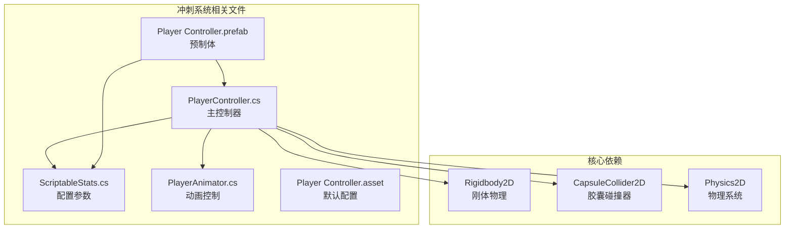
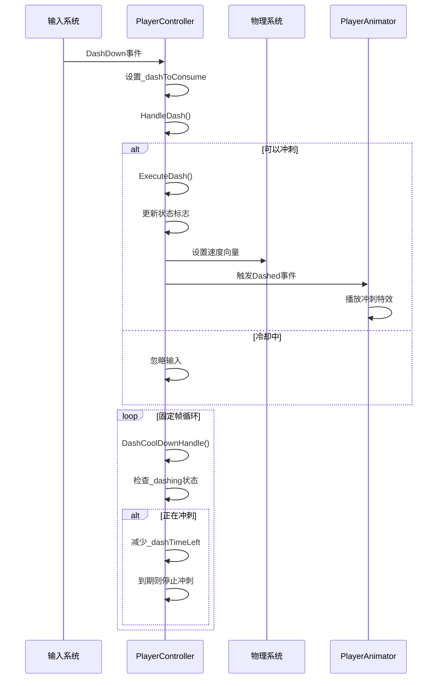
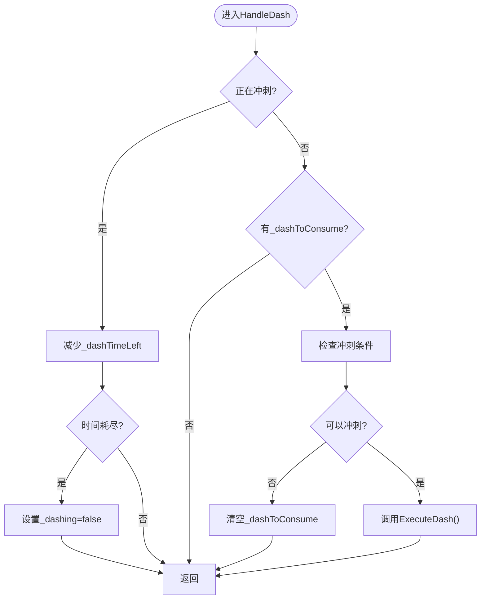
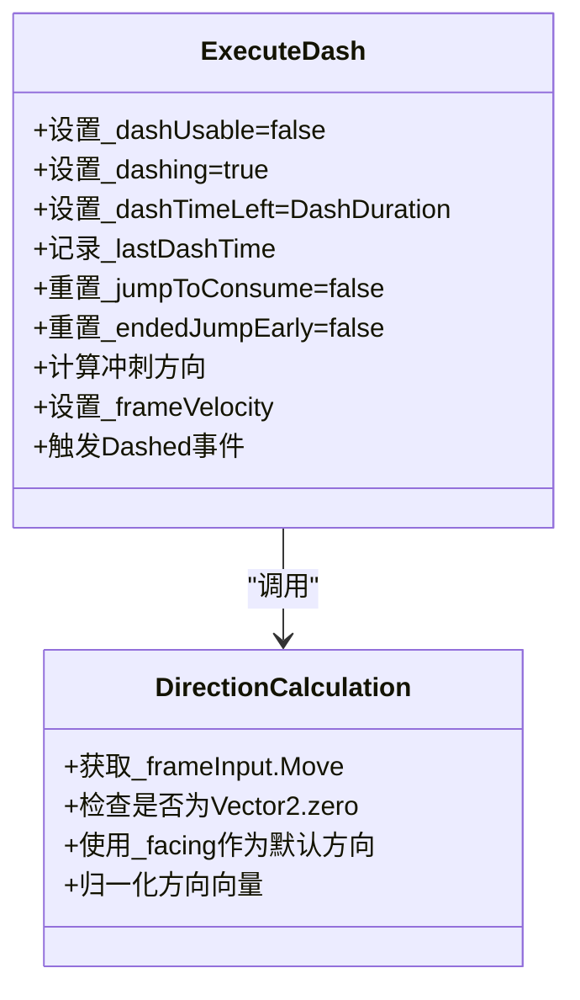
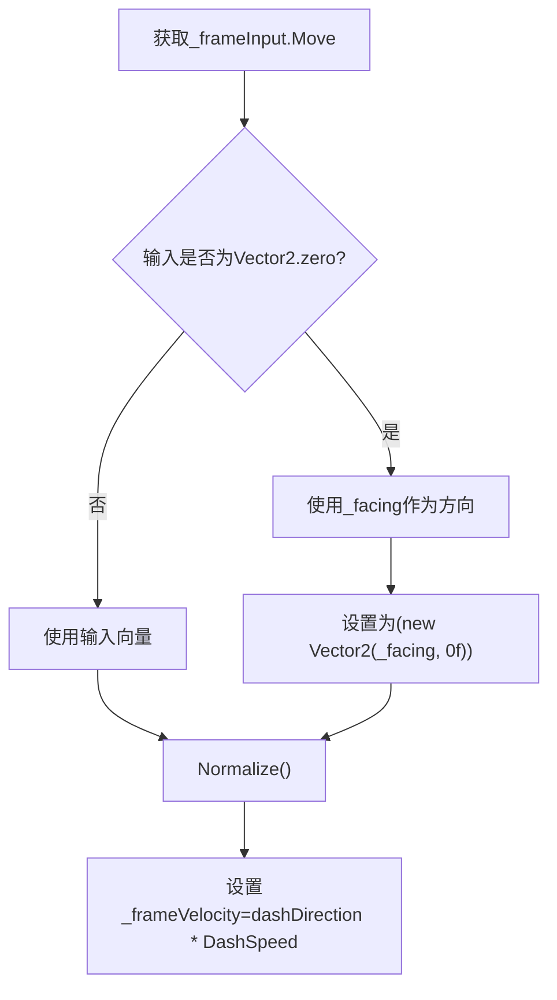
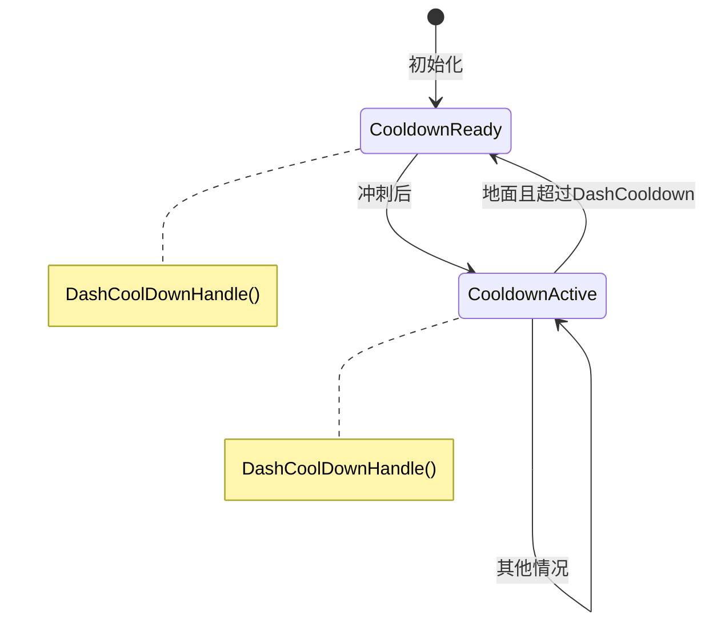
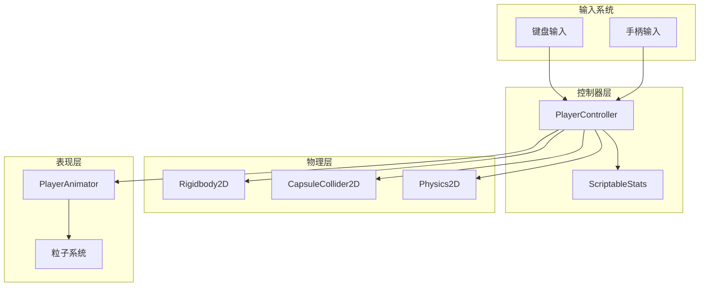

# 冲刺系统

<cite>
**本文档引用的文件**
- [PlayerController.cs](file://Tarodev 2D Controller/_Scripts/PlayerController.cs)
- [ScriptableStats.cs](file://Tarodev 2D Controller/_Scripts/ScriptableStats.cs)
- [PlayerAnimator.cs](file://Tarodev 2D Controller/_Scripts/PlayerAnimator.cs)
- [Player Controller.asset](file://Tarodev 2D Controller/Stat Presets/Player Controller.asset)
- [Player Controller.prefab](file://Tarodev 2D Controller/Prefabs/Player Controller.prefab)
</cite>

## 目录
1. [简介](#简介)
2. [项目结构](#项目结构)
3. [核心组件](#核心组件)
4. [架构概览](#架构概览)
5. [详细组件分析](#详细组件分析)
6. [依赖关系分析](#依赖关系分析)
7. [性能考虑](#性能考虑)
8. [故障排除指南](#故障排除指南)
9. [结论](#结论)

## 简介

本文档深入分析了Tarodev 2D Controller中的冲刺系统实现，重点解析PlayerController的HandleDash和ExecuteDash方法。该系统提供了完整的冲刺功能，包括触发机制、持续时间管理和冷却系统。文档详细说明了冲刺方向计算逻辑，特别是零输入时的默认冲刺方向处理，并分析了冲刺状态管理机制。

## 项目结构

冲刺系统位于Tarodev 2D Controller包中，主要涉及以下文件：

**图表来源**
- [PlayerController.cs:14-45](file://Tarodev 2D Controller/_Scripts/PlayerController.cs#L14-L45)
- [ScriptableStats.cs:6-10](file://Tarodev 2D Controller/_Scripts/ScriptableStats.cs#L6-L10)
- [Player Controller.prefab:47-50](file://Tarodev 2D Controller/Prefabs/Player Controller.prefab#L47-L50)

**章节来源**
- [PlayerController.cs:14-45](file://Tarodev 2D Controller/_Scripts/PlayerController.cs#L14-L45)
- [ScriptableStats.cs:6-10](file://Tarodev 2D Controller/_Scripts/ScriptableStats.cs#L6-L10)
- [Player Controller.prefab:47-50](file://Tarodev 2D Controller/Prefabs/Player Controller.prefab#L47-L50)

## 核心组件

冲刺系统由三个核心组件构成：

### 主控制器组件
- **PlayerController**: 实现所有游戏逻辑，包括输入处理、物理模拟和状态管理
- **ScriptableStats**: 提供可配置的游戏参数
- **PlayerAnimator**: 处理视觉反馈和动画

### 冲刺系统关键属性
- `_dashToConsume`: 冲刺输入标记
- `_dashUsable`: 冷却状态标志
- `_dashing`: 冲刺进行中标志
- `_dashTimeLeft`: 冲刺剩余时间
- `_lastDashTime`: 上次冲刺时间

**章节来源**
- [PlayerController.cs:272-277](file://Tarodev 2D Controller/_Scripts/PlayerController.cs#L272-L277)
- [ScriptableStats.cs:83-94](file://Tarodev 2D Controller/_Scripts/ScriptableStats.cs#L83-L94)

## 架构概览

**图表来源**
- [PlayerController.cs:53-76](file://Tarodev 2D Controller/_Scripts/PlayerController.cs#L53-L76)
- [PlayerController.cs:278-296](file://Tarodev 2D Controller/_Scripts/PlayerController.cs#L278-L296)
- [PlayerController.cs:298-313](file://Tarodev 2D Controller/_Scripts/PlayerController.cs#L298-L313)

## 详细组件分析

### HandleDash方法实现

HandleDash是冲刺系统的核心调度器，负责处理所有与冲刺相关的逻辑：

**图表来源**
- [PlayerController.cs:278-296](file://Tarodev 2D Controller/_Scripts/PlayerController.cs#L278-L296)

#### 条件检查逻辑

冲刺触发需要满足三个条件：
1. **冷却状态检查**: `_dashUsable`必须为true
2. **地面条件检查**: 如果在地面，必须启用AllowGroundDash
3. **冷却时间检查**: `_time >= _lastDashTime + _stats.DashCooldown`

**章节来源**
- [PlayerController.cs:289-291](file://Tarodev 2D Controller/_Scripts/PlayerController.cs#L289-L291)

### ExecuteDash方法实现

ExecuteDash负责执行实际的冲刺动作，设置所有必要的状态：

**图表来源**
- [PlayerController.cs:298-313](file://Tarodev 2D Controller/_Scripts/PlayerController.cs#L298-L313)

#### 冲刺方向计算逻辑

冲刺方向计算遵循以下优先级：

1. **输入优先**: 使用当前的移动输入作为冲刺方向
2. **零输入处理**: 当输入为零时，使用角色朝向(_facing)作为默认方向
3. **归一化**: 对最终方向向量进行归一化处理

**图表来源**
- [PlayerController.cs:307-311](file://Tarodev 2D Controller/_Scripts/PlayerController.cs#L307-L311)

**章节来源**
- [PlayerController.cs:307-309](file://Tarodev 2D Controller/_Scripts/PlayerController.cs#L307-L309)

### 冷却管理系统

冷却系统通过两个独立的方法实现：

**图表来源**
- [PlayerController.cs:315-318](file://Tarodev 2D Controller/_Scripts/PlayerController.cs#L315-L318)

#### 冷却机制细节

- **DashCoolDownHandle()**: 在固定更新中检查，当角色着地且距离上次冲刺时间超过DashCooldown时，设置_dashUsable=true
- **ExecuteDash()**: 每次冲刺后立即设置_dashUsable=false，开始冷却
- **条件冷却**: 冷却只在着地状态下生效，确保玩家不会在空中无限冷却

**章节来源**
- [PlayerController.cs:315-318](file://Tarodev 2D Controller/_Scripts/PlayerController.cs#L315-L318)

### 状态管理机制

冲刺系统采用多标志位的状态管理模式：

| 标志位 | 类型 | 作用 | 触发条件 |
|--------|------|------|----------|
| `_dashToConsume` | bool | 标记待消费的冲刺输入 | 收到DashDown事件 |
| `_dashUsable` | bool | 冷却状态 | DashCoolDownHandle() |
| `_dashing` | bool | 冲刺进行中 | ExecuteDash() |
| `_dashTimeLeft` | float | 冲刺剩余时间 | ExecuteDash() |
| `_lastDashTime` | float | 上次冲刺时间戳 | ExecuteDash() |

**章节来源**
- [PlayerController.cs:272-277](file://Tarodev 2D Controller/_Scripts/PlayerController.cs#L272-L277)

## 依赖关系分析

**图表来源**
- [PlayerController.cs:16](file://Tarodev 2D Controller/_Scripts/PlayerController.cs#L16)
- [PlayerAnimator.cs:10-27](file://Tarodev 2D Controller/_Scripts/PlayerAnimator.cs#L10-L27)

### 关键依赖关系

1. **输入依赖**: PlayerController依赖于ScriptableStats中的SnapInput设置
2. **物理依赖**: 直接操作Rigidbody2D的velocity属性
3. **配置依赖**: 所有冲刺参数都来自ScriptableStats
4. **动画依赖**: 通过事件系统与PlayerAnimator通信

**章节来源**
- [PlayerController.cs:16](file://Tarodev 2D Controller/_Scripts/PlayerController.cs#L16)
- [PlayerAnimator.cs:43-61](file://Tarodev 2D Controller/_Scripts/PlayerAnimator.cs#L43-L61)

## 性能考虑

### 时间复杂度分析

- **HandleDash**: O(1) - 常数时间检查和条件判断
- **ExecuteDash**: O(1) - 单次向量计算和状态设置
- **DashCoolDownHandle**: O(1) - 简单的时间比较操作

### 内存使用优化

1. **无额外分配**: 所有计算都在现有变量上进行
2. **向量归一化**: 使用Unity内置的Normalize方法
3. **事件系统**: 使用委托而非反射，提高性能

### 建议的性能优化

1. **输入处理优化**: 考虑使用InputSystem框架替代传统Input
2. **物理更新频率**: 确保FixedUpdate频率设置合理(约50Hz)
3. **碰撞检测优化**: 适当调整GrounderDistance和WallDetectionDistance

## 故障排除指南

### 常见问题及解决方案

#### 问题1: 冲刺无法触发
**可能原因**:
- `_dashUsable`为false（冷却中）
- 地面条件不满足（AllowGroundDash=false且在地面）
- 输入未正确设置

**解决方法**:
1. 检查ScriptableStats中的AllowGroundDash设置
2. 确认DashDown输入按键配置
3. 验证DashCooldown时间设置

#### 问题2: 冲刺方向异常
**可能原因**:
- 输入为零时_facing状态错误
- 方向向量未正确归一化

**解决方法**:
1. 检查HandleDirection方法中的_facing更新逻辑
2. 确认ExecuteDash中的方向计算流程

#### 问题3: 冷却时间不准确
**可能原因**:
- 时间基准不一致
- 固定更新频率变化

**解决方法**:
1. 使用_time变量而非Time.time进行时间计算
2. 确保FixedUpdate调用频率稳定

**章节来源**
- [PlayerController.cs:289-291](file://Tarodev 2D Controller/_Scripts/PlayerController.cs#L289-L291)
- [PlayerController.cs:307-309](file://Tarodev 2D Controller/_Scripts/PlayerController.cs#L307-L309)
- [PlayerController.cs:315-318](file://Tarodev 2D Controller/_Scripts/PlayerController.cs#L315-L318)

## 结论

Tarodev 2D Controller的冲刺系统实现了简洁而高效的机制。其设计特点包括：

1. **清晰的状态分离**: 通过多个标志位精确控制冲刺状态
2. **灵活的方向计算**: 支持输入驱动和默认方向两种模式
3. **可靠的冷却系统**: 基于时间戳的冷却机制确保游戏平衡
4. **良好的扩展性**: 通过ScriptableStats实现参数化配置

该系统为2D平台游戏提供了标准的冲刺功能，既保证了游戏体验的流畅性，又保持了代码的可维护性和可扩展性。通过合理的参数配置，开发者可以根据具体游戏需求调整冲刺的强度和行为。