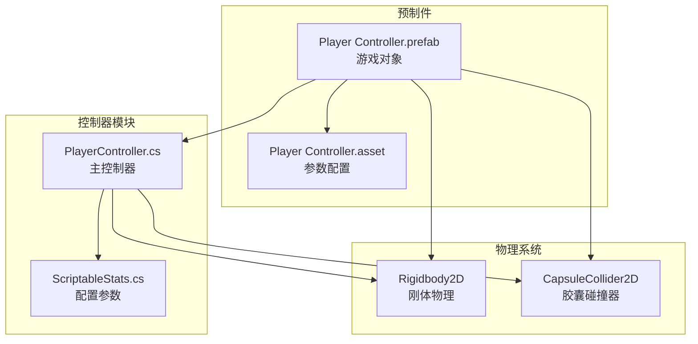
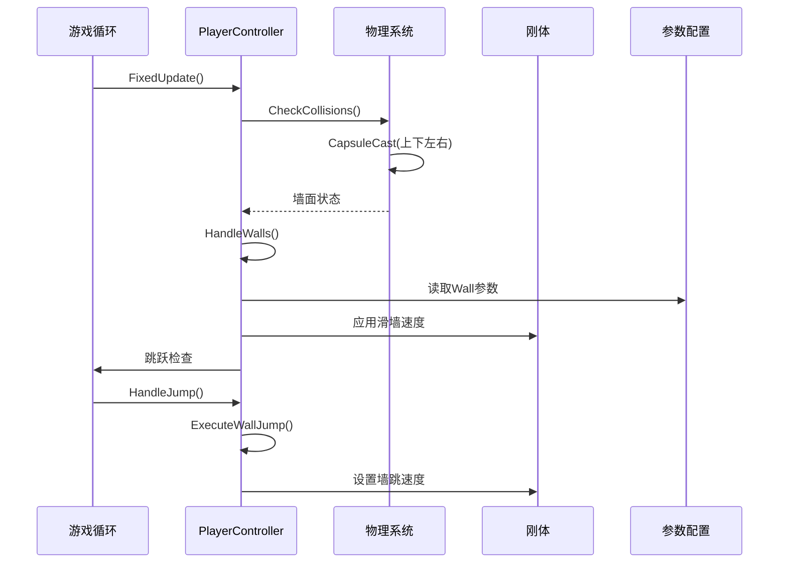
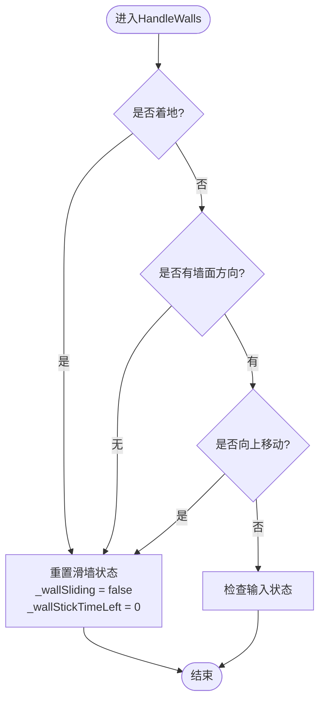
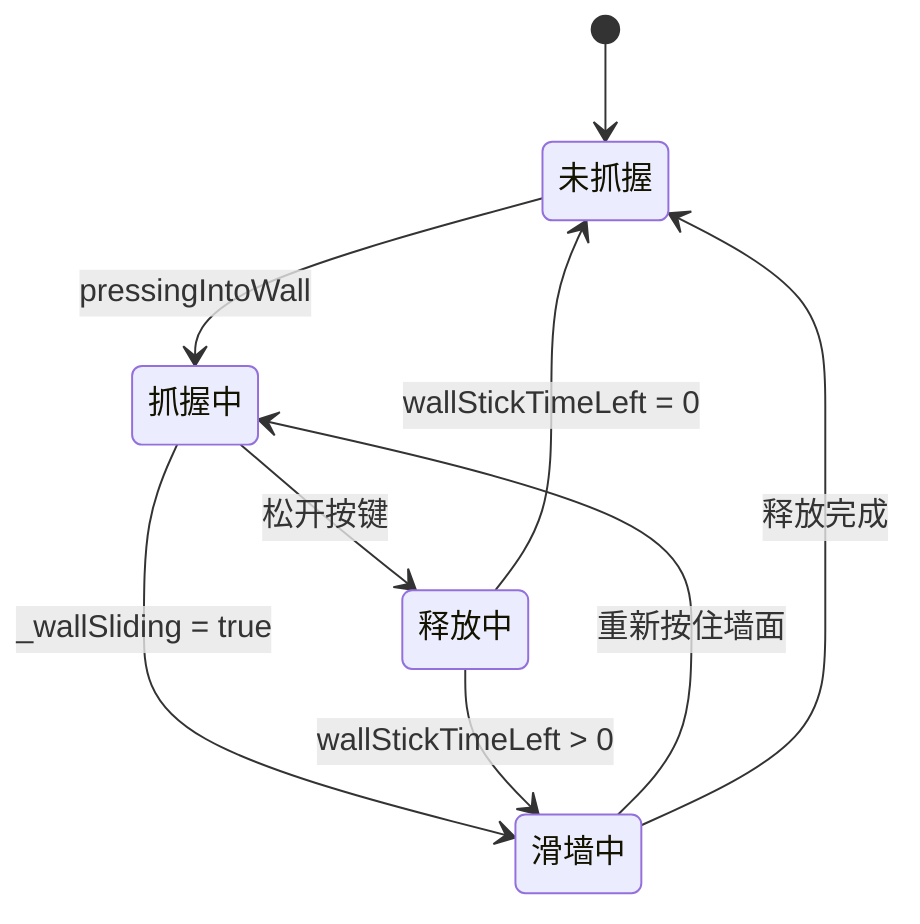
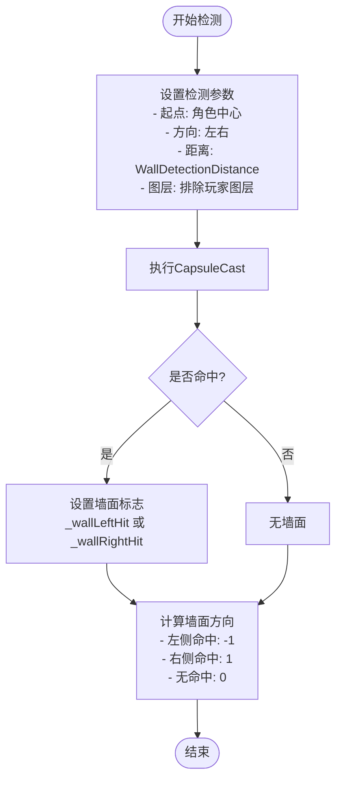
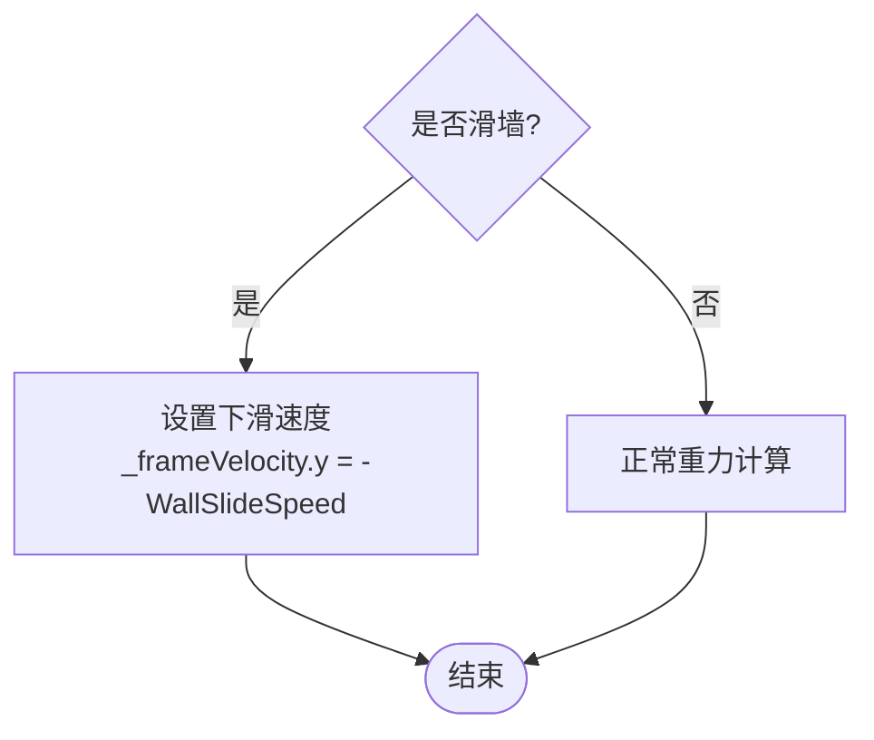
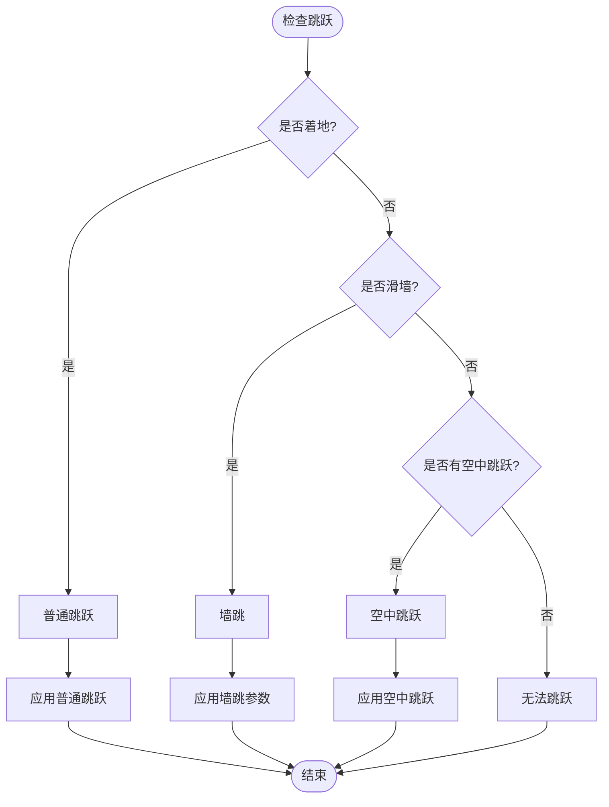
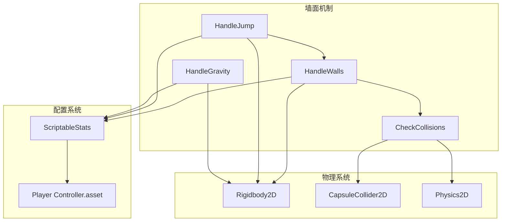

# 墙面机制

<cite>
**本文档引用的文件**
- [PlayerController.cs](file://Tarodev 2D Controller/_Scripts/PlayerController.cs)
- [ScriptableStats.cs](file://Tarodev 2D Controller/_Scripts/ScriptableStats.cs)
- [Player Controller.asset](file://Tarodev 2D Controller/Stat Presets/Player Controller.asset)
- [Player Controller.prefab](file://Tarodev 2D Controller/Prefabs/Player Controller.prefab)
</cite>

## 目录
1. [简介](#简介)
2. [项目结构](#项目结构)
3. [核心组件](#核心组件)
4. [架构概览](#架构概览)
5. [详细组件分析](#详细组件分析)
6. [依赖关系分析](#依赖关系分析)
7. [性能考虑](#性能考虑)
8. [故障排除指南](#故障排除指南)
9. [结论](#结论)

## 简介

本文档深入解析了PlayerController的墙面机制，重点关注HandleWalls方法的实现原理。该系统包含墙面检测算法、滑墙系统和墙跳功能，提供了完整的2D平台游戏中墙面交互的完整解决方案。

墙面机制通过Physics2D.CapsuleCast进行精确的墙面检测，实现了智能的滑墙控制和墙跳功能。系统支持墙面抓握、滑墙下降、墙跳和墙面释放等完整功能，为玩家提供了流畅的墙面交互体验。

## 项目结构

Tarodev 2D Controller项目采用模块化设计，墙面机制作为核心功能之一集成在PlayerController中：

**图表来源**
- [PlayerController.cs:14-45](file://Tarodev 2D Controller/_Scripts/PlayerController.cs#L14-L45)
- [Player Controller.prefab:39-50](file://Tarodev 2D Controller/Prefabs/Player Controller.prefab#L39-L50)

**章节来源**
- [PlayerController.cs:1-374](file://Tarodev 2D Controller/_Scripts/PlayerController.cs#L1-L374)
- [ScriptableStats.cs:1-97](file://Tarodev 2D Controller/_Scripts/ScriptableStats.cs#L1-L97)

## 核心组件

### 墙面检测系统

墙面检测系统基于Physics2D.CapsuleCast实现，具有以下特点：

- **胶囊射线检测**：使用角色的胶囊碰撞器边界进行射线检测
- **双方向检测**：同时检测左侧和右侧墙面
- **距离控制**：通过WallDetectionDistance参数控制检测范围
- **图层过滤**：排除玩家图层，只检测可交互物体

### 滑墙控制系统

滑墙系统实现了智能的墙面抓握和滑降控制：

- **墙面抓握**：当玩家面向墙面且向上移动时自动抓握
- **滑墙速度**：通过WallSlideSpeed控制下滑速度
- **墙面释放**：支持松开按键后的墙面释放机制
- **WallStickTime**：提供墙面释放后的短暂抓握保持

### 墙跳功能

墙跳系统提供了完整的墙面反弹功能：

- **墙跳触发**：在滑墙状态下按跳跃键触发
- **双轴控制**：同时控制水平和垂直方向的速度
- **控制锁定**：WallJumpControlLockTime防止立即反向输入
- **方向控制**：根据墙面方向自动调整跳跃方向

**章节来源**
- [PlayerController.cs:147-184](file://Tarodev 2D Controller/_Scripts/PlayerController.cs#L147-L184)
- [PlayerController.cs:186-243](file://Tarodev 2D Controller/_Scripts/PlayerController.cs#L186-L243)

## 架构概览

墙面机制在整个游戏循环中的位置和作用：

**图表来源**
- [PlayerController.cs:78-97](file://Tarodev 2D Controller/_Scripts/PlayerController.cs#L78-L97)
- [PlayerController.cs:107-143](file://Tarodev 2D Controller/_Scripts/PlayerController.cs#L107-L143)
- [PlayerController.cs:149-182](file://Tarodev 2D Controller/_Scripts/PlayerController.cs#L149-L182)

## 详细组件分析

### HandleWalls方法实现

HandleWalls是墙面机制的核心方法，实现了完整的墙面检测和控制逻辑：

#### 方法入口条件

**图表来源**
- [PlayerController.cs:149-182](file://Tarodev 2D Controller/_Scripts/PlayerController.cs#L149-L182)

#### 输入状态检测

HandleWalls方法通过三个关键状态判断墙面行为：

1. **pressingIntoWall**：玩家面向墙面并按住对应方向键
2. **releasedTowardsWall**：玩家松开按键但仍然朝向墙面
3. **其他情况**：默认释放墙面

#### 墙面Stick机制

wallStickTimeLeft变量是墙面机制的关键组件：

**图表来源**
- [PlayerController.cs:164-181](file://Tarodev 2D Controller/_Scripts/PlayerController.cs#L164-L181)

#### 墙面检测算法

墙面检测使用Physics2D.CapsuleCast进行精确的射线检测：

**图表来源**
- [PlayerController.cs:111-116](file://Tarodev 2D Controller/_Scripts/PlayerController.cs#L111-L116)

### 墙面滑降控制

滑墙系统通过HandleGravity方法实现：

#### 滑墙速度控制

滑墙时的垂直速度通过WallSlideSpeed参数控制：

**图表来源**
- [PlayerController.cs:326-330](file://Tarodev 2D Controller/_Scripts/PlayerController.cs#L326-L330)

#### 重力与滑墙的协调

滑墙系统与重力系统完美结合，确保玩家在墙面时的自然运动：

- **滑墙状态**：强制下滑速度，忽略重力加速度
- **正常状态**：应用FallAcceleration和MaxFallSpeed限制
- **过渡状态**：平滑切换滑墙和正常重力模式

### 墙跳功能实现

墙跳系统提供了完整的墙面反弹功能：

#### 墙跳触发条件

**图表来源**
- [PlayerController.cs:198-213](file://Tarodev 2D Controller/_Scripts/PlayerController.cs#L198-L213)

#### 墙跳参数配置

墙跳功能使用多个参数控制不同方面：

- **WallJumpPower**：垂直方向的初始速度
- **WallJumpHorizontalPower**：水平方向的初始速度
- **WallJumpControlLockTime**：控制锁定时间，防止立即反向输入

**章节来源**
- [PlayerController.cs:149-182](file://Tarodev 2D Controller/_Scripts/PlayerController.cs#L149-L182)
- [PlayerController.cs:229-241](file://Tarodev 2D Controller/_Scripts/PlayerController.cs#L229-L241)

## 依赖关系分析

墙面机制与其他系统的关系：

**图表来源**
- [PlayerController.cs:107-143](file://Tarodev 2D Controller/_Scripts/PlayerController.cs#L107-L143)
- [PlayerController.cs:149-182](file://Tarodev 2D Controller/_Scripts/PlayerController.cs#L149-L182)
- [PlayerController.cs:198-241](file://Tarodev 2D Controller/_Scripts/PlayerController.cs#L198-L241)

**章节来源**
- [PlayerController.cs:1-374](file://Tarodev 2D Controller/_Scripts/PlayerController.cs#L1-L374)

## 性能考虑

### 物理检测优化

墙面检测使用CapsuleCast而非BoxCast，具有以下优势：

- **更精确的碰撞检测**：胶囊形状更好地匹配角色轮廓
- **减少误检测**：避免角部穿透问题
- **统一的检测方式**：与地面检测使用相同的算法

### 时间复杂度分析

墙面检测的时间复杂度为O(1)，因为：
- 每帧只进行固定数量的射线检测（最多4条）
- 检测距离是常量值
- 不涉及循环或递归操作

### 内存使用

墙面机制的内存占用极小：
- 仅使用几个float变量存储状态
- 无动态分配内存
- 状态变量随角色实例化而创建

## 故障排除指南

### 常见问题及解决方案

#### 墙面检测不准确

**问题症状**：
- 角色无法正确抓墙
- 在边缘处误判墙面

**可能原因**：
- WallDetectionDistance设置不当
- 角色碰撞器尺寸不合适
- 场景中存在异常的碰撞器

**解决方法**：
1. 调整WallDetectionDistance参数
2. 检查角色胶囊碰撞器的尺寸和位置
3. 验证场景中碰撞器的正确性

#### 滑墙速度过快或过慢

**问题症状**：
- 滑墙时下降速度异常
- 感觉滑墙过于困难

**可能原因**：
- WallSlideSpeed参数设置不合理
- 重力系统与其他因素冲突

**解决方法**：
1. 调整WallSlideSpeed参数
2. 检查重力和下落速度的平衡
3. 测试不同场景下的表现

#### 墙跳功能异常

**问题症状**：
- 墙跳时方向错误
- 墙跳高度不符合预期

**可能原因**：
- WallJumpPower或WallJumpHorizontalPower设置不当
- WallJumpControlLockTime影响操作体验

**解决方法**：
1. 调整WallJumpPower和WallJumpHorizontalPower
2. 适当调整WallJumpControlLockTime
3. 测试墙跳的连贯性和流畅性

### 调试技巧

#### 实时监控参数

使用Unity的Inspector面板实时监控关键参数：
- wallStickTimeLeft：墙面释放后的剩余时间
- _wallSliding：当前是否处于滑墙状态
- _wallDirection：墙面方向（-1、0、1）

#### 场景测试方法

1. **基础测试**：在简单场景中验证基本功能
2. **边界测试**：测试各种墙面角度和高度
3. **组合测试**：与其他动作（跳跃、冲刺）的组合效果
4. **性能测试**：大量角色同时进行墙面操作的性能表现

**章节来源**
- [ScriptableStats.cs:64-81](file://Tarodev 2D Controller/_Scripts/ScriptableStats.cs#L64-L81)
- [Player Controller.asset:34-39](file://Tarodev 2D Controller/Stat Presets/Player Controller.asset#L34-L39)

## 结论

Tarodev 2D Controller的墙面机制是一个精心设计的系统，具有以下特点：

### 设计优势

1. **算法简洁高效**：使用标准的CapsuleCast检测，性能优异
2. **状态管理清晰**：通过明确的状态变量控制复杂的交互逻辑
3. **参数可调性强**：提供丰富的配置选项满足不同需求
4. **用户体验优秀**：提供流畅自然的墙面交互体验

### 技术亮点

- **智能的墙面检测**：精确的胶囊射线检测算法
- **灵活的滑墙控制**：可调节的滑墙速度和释放机制
- **完整的墙跳系统**：双轴控制的墙跳功能
- **良好的性能表现**：常量时间复杂度的检测算法

### 改进建议

1. **可视化调试**：添加墙面检测可视化的调试工具
2. **参数预设**：提供针对不同游戏风格的参数预设
3. **扩展接口**：为自定义墙面行为提供扩展接口
4. **性能监控**：添加物理检测性能的实时监控

墙面机制为2D平台游戏提供了坚实的基础，通过合理的参数配置和适当的调试，可以创建出优秀的墙面交互体验。