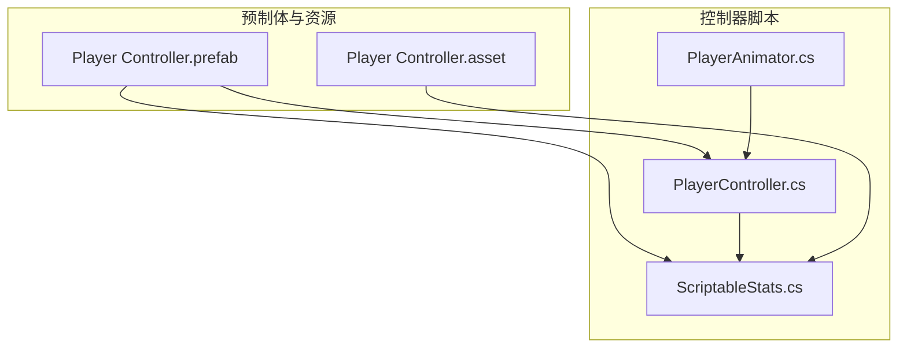
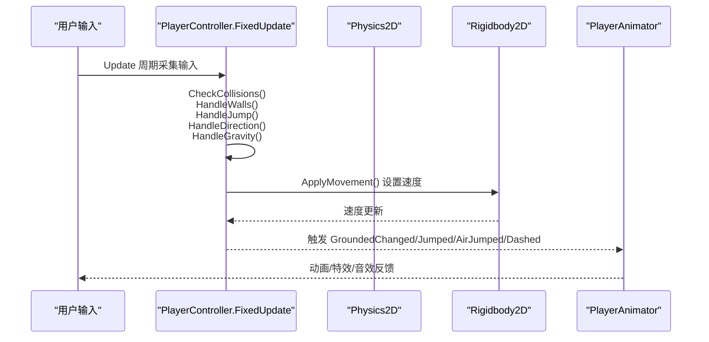
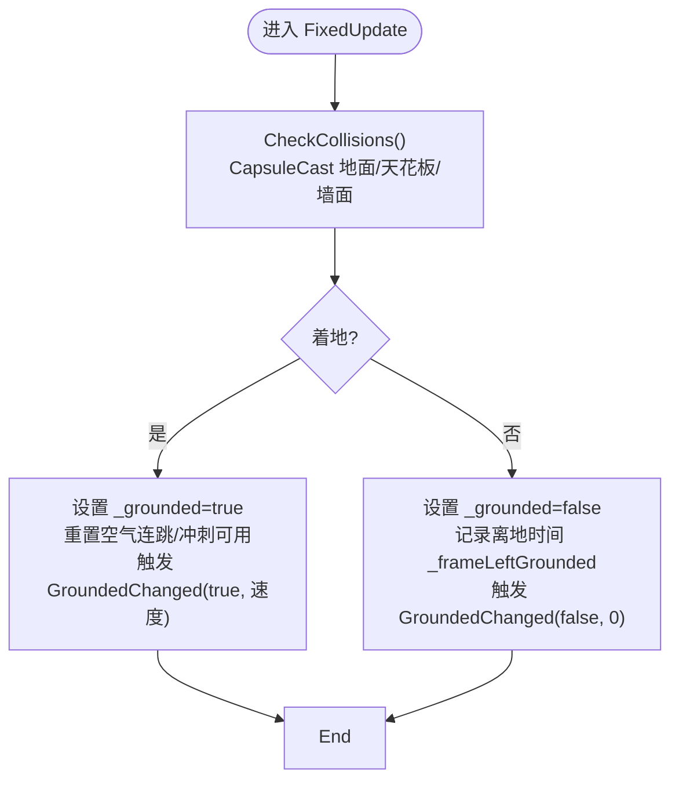
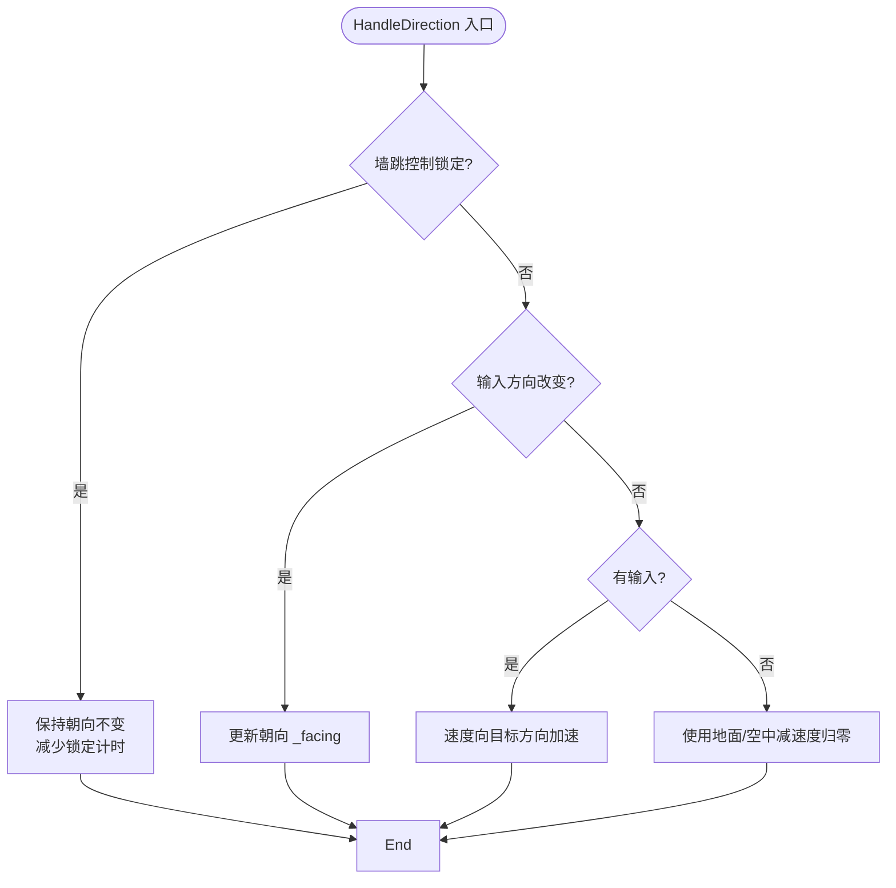
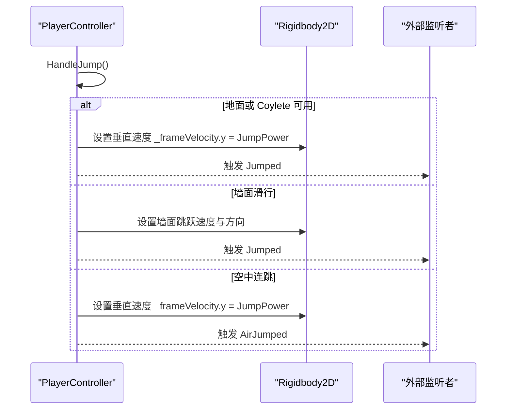
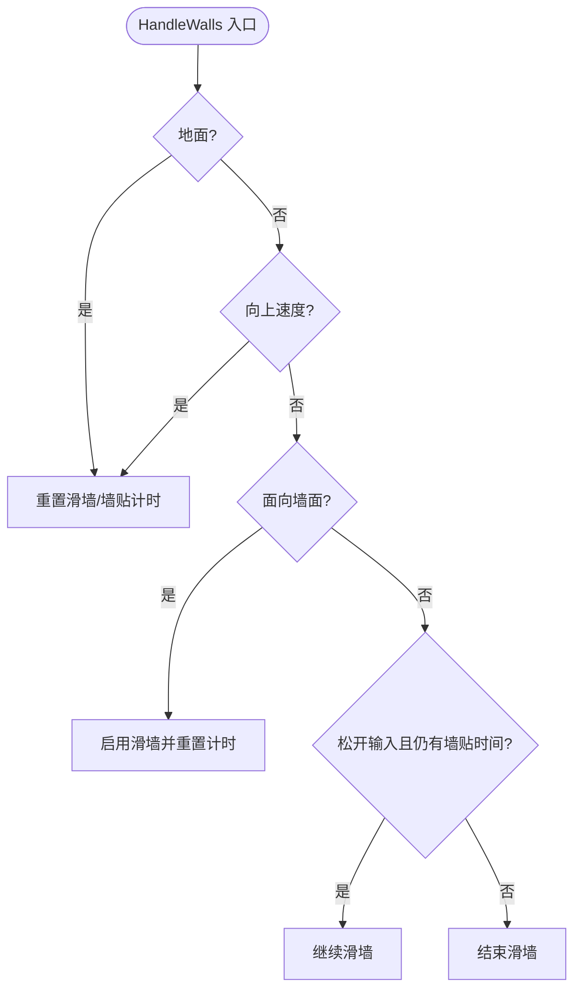
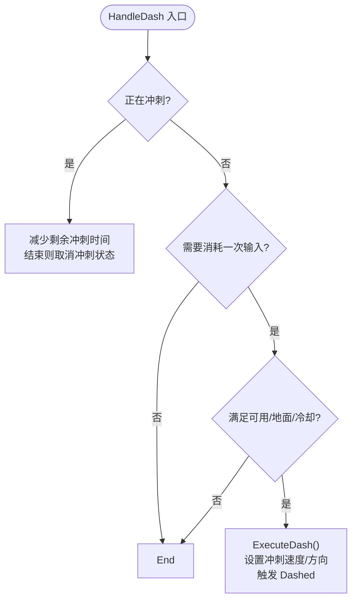
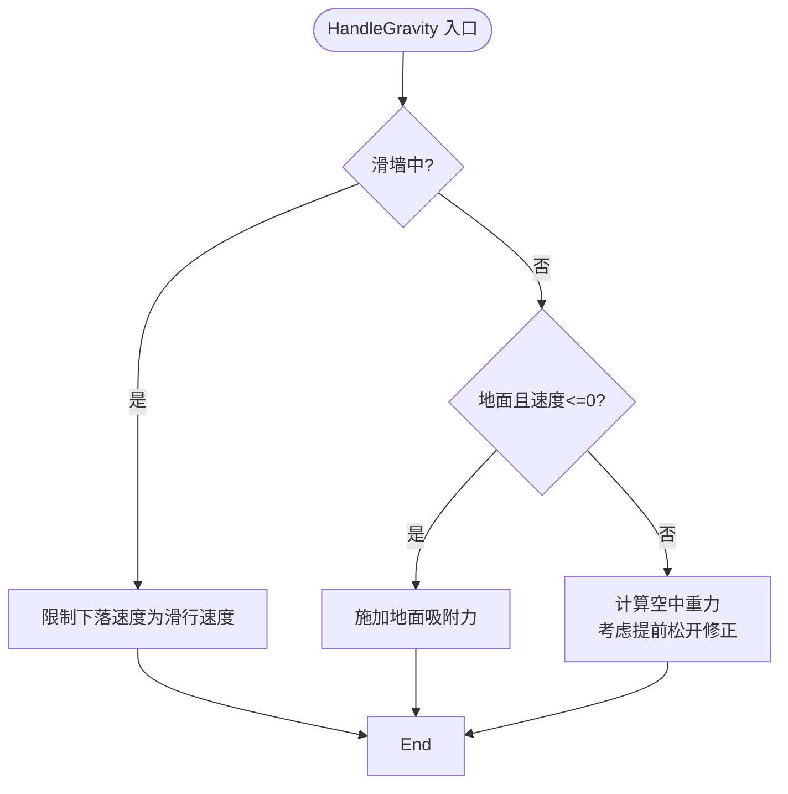
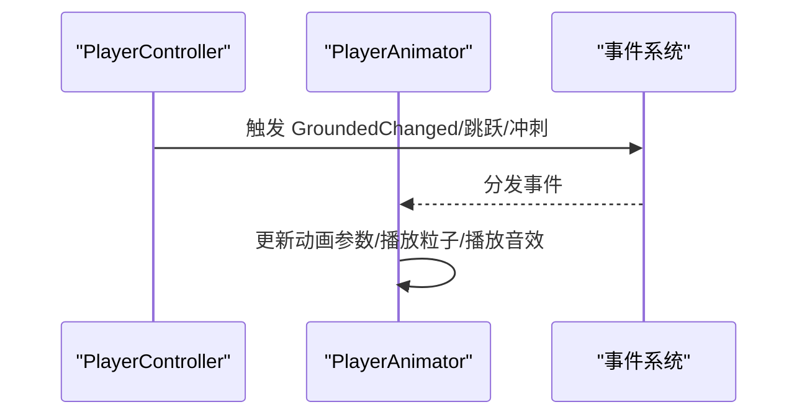
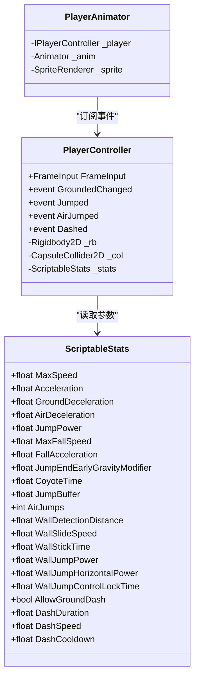

# 核心控制器详解

<cite>
**本文引用的文件**
- [PlayerController.cs](file://Tarodev 2D Controller/_Scripts/PlayerController.cs)
- [PlayerAnimator.cs](file://Tarodev 2D Controller/_Scripts/PlayerAnimator.cs)
- [ScriptableStats.cs](file://Tarodev 2D Controller/_Scripts/ScriptableStats.cs)
- [Player Controller.prefab](file://Tarodev 2D Controller/Prefabs/Player Controller.prefab)
- [Player Controller.asset](file://Tarodev 2D Controller/Stat Presets/Player Controller.asset)
</cite>

## 目录
1. [简介](#简介)
2. [项目结构](#项目结构)
3. [核心组件](#核心组件)
4. [架构总览](#架构总览)
5. [详细组件分析](#详细组件分析)
6. [依赖关系分析](#依赖关系分析)
7. [性能考量](#性能考量)
8. [故障排查指南](#故障排查指南)
9. [结论](#结论)
10. [附录](#附录)

## 简介
本文件针对 Tarodev 2D Controller 中的 PlayerController 类进行深入技术解析，覆盖其核心物理控制算法与状态机设计，包括移动控制、跳跃系统、墙面机制、冲刺系统等。文档同时解释 Update 与 FixedUpdate 的职责分工、碰撞检测算法、状态管理机制与事件系统，并提供性能优化建议与调试技巧，帮助开发者在 Unity 2D 平台游戏中构建高质量的角色控制体验。

## 项目结构
该控制器采用“脚本驱动 + 预制体装配”的组织方式：
- 控制器脚本位于 Tarodev 2D Controller/_Scripts 下，包含 PlayerController、PlayerAnimator、ScriptableStats。
- 预制体 Player Controller.prefab 将控制器、刚体、胶囊碰撞体等组件组合在一起，并引用 ScriptableStats 资产。
- Stat Presets 提供可编辑的参数资产，便于非程序员调整平衡性。

图表来源
- [PlayerController.cs:14-45](file://Tarodev 2D Controller/_Scripts/PlayerController.cs#L14-L45)
- [Player Controller.prefab:47-50](file://Tarodev 2D Controller/Prefabs/Player Controller.prefab#L47-L50)
- [ScriptableStats.cs:6-10](file://Tarodev 2D Controller/_Scripts/ScriptableStats.cs#L6-L10)
- [Player Controller.asset:15-17](file://Tarodev 2D Controller/Stat Presets/Player Controller.asset#L15-L17)

章节来源
- [PlayerController.cs:14-45](file://Tarodev 2D Controller/_Scripts/PlayerController.cs#L14-L45)
- [Player Controller.prefab:47-50](file://Tarodev 2D Controller/Prefabs/Player Controller.prefab#L47-L50)
- [ScriptableStats.cs:6-10](file://Tarodev 2D Controller/_Scripts/ScriptableStats.cs#L6-L10)
- [Player Controller.asset:15-17](file://Tarodev 2D Controller/Stat Presets/Player Controller.asset#L15-L17)

## 核心组件
- PlayerController：核心物理控制与状态机，负责输入采集、碰撞检测、移动、跳跃、墙面机制、冲刺与重力处理，并通过事件对外暴露状态变化。
- PlayerAnimator：动画与特效驱动，订阅 PlayerController 的事件以驱动动画、粒子与音效。
- ScriptableStats：可编辑的参数资产，集中定义移动、跳跃、墙面、冲刺等物理参数。

章节来源
- [PlayerController.cs:14-374](file://Tarodev 2D Controller/_Scripts/PlayerController.cs#L14-L374)
- [PlayerAnimator.cs:8-178](file://Tarodev 2D Controller/_Scripts/PlayerAnimator.cs#L8-L178)
- [ScriptableStats.cs:6-97](file://Tarodev 2D Controller/_Scripts/ScriptableStats.cs#L6-L97)

## 架构总览
控制器遵循“输入在 Update、物理在 FixedUpdate”的经典分层模式，通过 ScriptableStats 统一配置，通过事件解耦动画与控制器。

图表来源
- [PlayerController.cs:47-97](file://Tarodev 2D Controller/_Scripts/PlayerController.cs#L47-L97)
- [PlayerController.cs:107-143](file://Tarodev 2D Controller/_Scripts/PlayerController.cs#L107-L143)
- [PlayerController.cs:149-182](file://Tarodev 2D Controller/_Scripts/PlayerController.cs#L149-L182)
- [PlayerController.cs:198-241](file://Tarodev 2D Controller/_Scripts/PlayerController.cs#L198-L241)
- [PlayerController.cs:247-266](file://Tarodev 2D Controller/_Scripts/PlayerController.cs#L247-L266)
- [PlayerController.cs:324-342](file://Tarodev 2D Controller/_Scripts/PlayerController.cs#L324-L342)
- [PlayerController.cs:346](file://Tarodev 2D Controller/_Scripts/PlayerController.cs#L346)
- [PlayerAnimator.cs:43-61](file://Tarodev 2D Controller/_Scripts/PlayerAnimator.cs#L43-L61)

## 详细组件分析

### 输入与职责分工（Update vs FixedUpdate）
- Update 负责：
  - 时间累计与输入采集（GatherInput），包括跳跃、冲刺、移动方向与死区处理。
  - 缓存“按压时间”用于跳跃缓冲与延迟触发。
- FixedUpdate 负责：
  - 碰撞检测与状态判定（CheckCollisions）。
  - 墙面检测与滑行/抓墙逻辑（HandleWalls）。
  - 跳跃判定与执行（HandleJump/ExecuteJump/ExecuteWallJump）。
  - 方向与加速度处理（HandleDirection）。
  - 重力与着地吸附（HandleGravity）。
  - 冲刺判定与执行（HandleDash/ExecuteDash）。
  - 最终应用速度到 Rigidbody2D（ApplyMovement）。

为何如此分工？
- 物理模拟必须在固定帧间隔内进行，以保证稳定性与可重复性；输入采样在每帧进行即可，避免滞后。
- 将“输入采样”放在 Update，能确保按键按下瞬间被记录，再在 FixedUpdate 中根据缓冲与 Coylete 机制决定是否生效。

章节来源
- [PlayerController.cs:47-76](file://Tarodev 2D Controller/_Scripts/PlayerController.cs#L47-L76)
- [PlayerController.cs:78-97](file://Tarodev 2D Controller/_Scripts/PlayerController.cs#L78-L97)

### 碰撞检测与状态管理
- 使用 CapsuleCast 进行地面、天花板与左右墙面检测，避免查询起点在碰撞体内导致误判，必要时临时关闭 queriesStartInColliders。
- 状态标志：
  - _grounded：地面状态，配合着陆事件与缓冲/Coylete 机制。
  - _wallLeftHit/_wallRightHit/_wallDirection：墙面命中与方向。
  - _wallSliding：滑墙状态。
  - _endedJumpEarly：提前松开跳跃键的标记。
  - _coyoteUsable/_bufferedJumpUsable：跳跃缓冲与 Coylete 状态。
- 着陆时重置空气连跳次数、恢复冲刺可用性、触发 GroundedChanged 事件；离地时记录时间并触发事件。

图表来源
- [PlayerController.cs:107-143](file://Tarodev 2D Controller/_Scripts/PlayerController.cs#L107-L143)

章节来源
- [PlayerController.cs:107-143](file://Tarodev 2D Controller/_Scripts/PlayerController.cs#L107-L143)

### 移动控制与加速度
- 方向切换：当墙跳控制锁定时间内不改变朝向；否则依据输入方向更新朝向。
- 加速/减速：
  - 地面：使用地面加速度达到最大速度。
  - 空中：使用空中加速度，停止输入时使用空中减速度。
  - 无输入时：使用地面/空中减速度将 x 速度平滑归零。
- 死区与输入整形：SnapInput 与死区阈值确保手柄输入稳定。

图表来源
- [PlayerController.cs:247-266](file://Tarodev 2D Controller/_Scripts/PlayerController.cs#L247-L266)

章节来源
- [PlayerController.cs:247-266](file://Tarodev 2D Controller/_Scripts/PlayerController.cs#L247-L266)

### 跳跃系统（含 Coylete 与缓冲）
- 跳跃缓冲：在一定时间内记录按压时间，落地后仍可触发一次起跳。
- Coylete：离开平台边缘后的一段时间内仍可起跳，提升操作宽容度。
- 跳跃优先级：
  1) 地面起跳（触发 Jumped 事件）。
  2) Coylete 起跳（触发 Jumped 事件）。
  3) 墙面滑行时的墙面跳跃（触发 Jumped 事件）。
  4) 空中连跳（AirJumps 次数递减）。
- 提前松开：若在上升阶段松开按键，重力系数增大，实现短跳效果。

图表来源
- [PlayerController.cs:198-241](file://Tarodev 2D Controller/_Scripts/PlayerController.cs#L198-L241)

章节来源
- [PlayerController.cs:186-241](file://Tarodev 2D Controller/_Scripts/PlayerController.cs#L186-L241)

### 墙面机制（抓墙、滑墙、墙跳）
- 抓墙：面向墙面且向下速度不大时，启用滑墙并重置滑墙计时。
- 滑墙：松开输入但仍在滑墙方向时，保留短暂的“墙贴时间”，平滑下落速度。
- 墙跳：在滑墙状态下，按住跳跃键触发墙面跳跃，设置水平与垂直速度，并短暂锁定水平输入，防止反向输入导致误操作。

图表来源
- [PlayerController.cs:149-182](file://Tarodev 2D Controller/_Scripts/PlayerController.cs#L149-L182)

章节来源
- [PlayerController.cs:149-182](file://Tarodev 2D Controller/_Scripts/PlayerController.cs#L149-L182)

### 冲刺系统（Dash）
- 触发条件：满足“可用性”“地面允许/任意”“冷却时间”。
- 执行：设置冲刺状态与持续时间，计算冲刺方向（优先使用输入方向，否则使用当前朝向），设置冲刺速度，触发 Dashed 事件。
- 冷却：着地后经过冷却时间才恢复可用。

图表来源
- [PlayerController.cs:278-318](file://Tarodev 2D Controller/_Scripts/PlayerController.cs#L278-L318)
- [PlayerController.cs:298-313](file://Tarodev 2D Controller/_Scripts/PlayerController.cs#L298-L313)

章节来源
- [PlayerController.cs:270-318](file://Tarodev 2D Controller/_Scripts/PlayerController.cs#L270-L318)

### 重力与吸附
- 滑墙时使用墙面滑行速度上限，避免自由落体。
- 着地时施加恒定的地面吸附力，防止角色在斜坡上滑动。
- 空中重力受“提前松开”影响，增大重力以实现短跳。

图表来源
- [PlayerController.cs:324-342](file://Tarodev 2D Controller/_Scripts/PlayerController.cs#L324-L342)

章节来源
- [PlayerController.cs:324-342](file://Tarodev 2D Controller/_Scripts/PlayerController.cs#L324-L342)

### 事件系统与动画联动
- PlayerController 通过事件对外暴露状态变化：GroundedChanged、Jumped、AirJumped、Dashed。
- PlayerAnimator 订阅这些事件以驱动动画、粒子与音效，并根据 FrameInput 控制翻转与倾斜。

图表来源
- [PlayerController.cs:29-34](file://Tarodev 2D Controller/_Scripts/PlayerController.cs#L29-L34)
- [PlayerAnimator.cs:43-61](file://Tarodev 2D Controller/_Scripts/PlayerAnimator.cs#L43-L61)
- [PlayerAnimator.cs:108-128](file://Tarodev 2D Controller/_Scripts/PlayerAnimator.cs#L108-L128)
- [PlayerAnimator.cs:130-138](file://Tarodev 2D Controller/_Scripts/PlayerAnimator.cs#L130-L138)
- [PlayerAnimator.cs:140-154](file://Tarodev 2D Controller/_Scripts/PlayerAnimator.cs#L140-L154)

章节来源
- [PlayerController.cs:29-34](file://Tarodev 2D Controller/_Scripts/PlayerController.cs#L29-L34)
- [PlayerAnimator.cs:43-61](file://Tarodev 2D Controller/_Scripts/PlayerAnimator.cs#L43-L61)
- [PlayerAnimator.cs:108-154](file://Tarodev 2D Controller/_Scripts/PlayerAnimator.cs#L108-L154)

### 数据模型与关键变量
- 关键变量作用概览：
  - _frameInput：本帧输入（跳跃/冲刺/移动）。
  - _frameVelocity：本帧速度（x/y）。
  - _grounded：地面状态。
  - _wallLeftHit/_wallRightHit/_wallDirection/_wallSliding：墙面状态。
  - _endedJumpEarly：提前松开标记。
  - _coyoteUsable/_bufferedJumpUsable：跳跃缓冲与 Coylete。
  - _dashUsable/_dashing/_dashTimeLeft：冲刺状态。
  - _wallJumpLockTimeLeft：墙跳后控制锁定。
  - _facing：朝向（1 或 -1）。
- 参数来源：ScriptableStats 提供所有物理参数，统一由 PlayerController 读取。

章节来源
- [PlayerController.cs:16-26](file://Tarodev 2D Controller/_Scripts/PlayerController.cs#L16-L26)
- [ScriptableStats.cs:6-97](file://Tarodev 2D Controller/_Scripts/ScriptableStats.cs#L6-L97)

## 依赖关系分析
- PlayerController 依赖：
  - Rigidbody2D/CapsuleCollider2D：物理与碰撞。
  - ScriptableStats：参数配置。
  - PlayerAnimator：事件消费方。
- PlayerAnimator 依赖：
  - IPlayerController 接口：订阅事件与读取 FrameInput。
- 预制体装配：
  - Player Controller.prefab 将 PlayerController、Rigidbody2D、CapsuleCollider2D 与 ScriptableStats 资产绑定。

图表来源
- [PlayerController.cs:16-26](file://Tarodev 2D Controller/_Scripts/PlayerController.cs#L16-L26)
- [PlayerAnimator.cs:33-41](file://Tarodev 2D Controller/_Scripts/PlayerAnimator.cs#L33-L41)
- [ScriptableStats.cs:6-97](file://Tarodev 2D Controller/_Scripts/ScriptableStats.cs#L6-L97)

章节来源
- [PlayerController.cs:16-26](file://Tarodev 2D Controller/_Scripts/PlayerController.cs#L16-L26)
- [PlayerAnimator.cs:33-41](file://Tarodev 2D Controller/_Scripts/PlayerAnimator.cs#L33-L41)
- [ScriptableStats.cs:6-97](file://Tarodev 2D Controller/_Scripts/ScriptableStats.cs#L6-L97)

## 性能考量
- 固定帧物理：将所有与物理相关的状态变更放入 FixedUpdate，确保与 Time.fixedDeltaTime 对齐，避免抖动与不同帧率下的行为差异。
- 查询优化：在 CheckCollisions 中临时关闭 queriesStartInColliders，避免因起点在碰撞体内导致的无效射线/胶囊检测。
- 减少事件调用频率：仅在状态发生实质性变化时触发事件（如着地/离地），避免每帧重复触发。
- 参数化：通过 ScriptableStats 集中管理参数，便于热重载与平衡性调整，减少硬编码带来的维护成本。
- 动画与物理解耦：通过事件驱动动画，避免在 FixedUpdate 中进行渲染相关操作。

## 故障排查指南
- 输入不响应或迟滞：
  - 检查 Update 中 GatherInput 是否正确读取按键与轴输入。
  - 确认 SnapInput 与死区阈值设置是否合理。
- 跳跃异常（无法起跳/提前掉空）：
  - 检查 Coylete 与 JumpBuffer 的时间窗口是否过小。
  - 确认提前松开重力修正是否过大。
- 墙面卡顿或滑墙不稳定：
  - 调整 WallDetectionDistance 与 WallSlideSpeed。
  - 确认墙跳后的控制锁定时间是否足够。
- 冲刺不可用或冷却过长：
  - 检查 AllowGroundDash、DashCooldown 与 DashDuration。
  - 确认着地冷却逻辑是否在着地后才恢复可用。
- 着地吸附导致角色“陷进”斜坡：
  - 适当降低 GroundingForce，或在场景中使用合适的斜坡角度与材质。

章节来源
- [PlayerController.cs:53-76](file://Tarodev 2D Controller/_Scripts/PlayerController.cs#L53-L76)
- [PlayerController.cs:186-241](file://Tarodev 2D Controller/_Scripts/PlayerController.cs#L186-L241)
- [PlayerController.cs:149-182](file://Tarodev 2D Controller/_Scripts/PlayerController.cs#L149-L182)
- [PlayerController.cs:278-318](file://Tarodev 2D Controller/_Scripts/PlayerController.cs#L278-L318)
- [ScriptableStats.cs:22-36](file://Tarodev 2D Controller/_Scripts/ScriptableStats.cs#L22-L36)

## 结论
PlayerController 通过清晰的 Update/FixedUpdate 分工、基于 ScriptableStats 的参数化设计以及事件驱动的动画联动，实现了稳定、可调、可扩展的 2D 平台角色控制。其碰撞检测、跳跃缓冲与 Coylete、墙面滑行与墙跳、冲刺冷却与锁定等机制共同构成了现代平台游戏所期望的“顺滑手感”。建议在实际项目中结合场景与玩法进一步微调参数，并利用事件系统扩展更多视觉与听觉反馈。

## 附录
- 参数资产位置：Tarodev 2D Controller/Stat Presets/Player Controller.asset
- 预制体位置：Tarodev 2D Controller/Prefabs/Player Controller.prefab
- 关键实现路径参考：
  - [PlayerController.cs:47-97](file://Tarodev 2D Controller/_Scripts/PlayerController.cs#L47-L97)
  - [PlayerController.cs:107-143](file://Tarodev 2D Controller/_Scripts/PlayerController.cs#L107-L143)
  - [PlayerController.cs:149-182](file://Tarodev 2D Controller/_Scripts/PlayerController.cs#L149-L182)
  - [PlayerController.cs:198-241](file://Tarodev 2D Controller/_Scripts/PlayerController.cs#L198-L241)
  - [PlayerController.cs:247-266](file://Tarodev 2D Controller/_Scripts/PlayerController.cs#L247-L266)
  - [PlayerController.cs:278-318](file://Tarodev 2D Controller/_Scripts/PlayerController.cs#L278-L318)
  - [PlayerController.cs:324-342](file://Tarodev 2D Controller/_Scripts/PlayerController.cs#L324-L342)
  - [PlayerAnimator.cs:43-61](file://Tarodev 2D Controller/_Scripts/PlayerAnimator.cs#L43-L61)
  - [ScriptableStats.cs:6-97](file://Tarodev 2D Controller/_Scripts/ScriptableStats.cs#L6-L97)