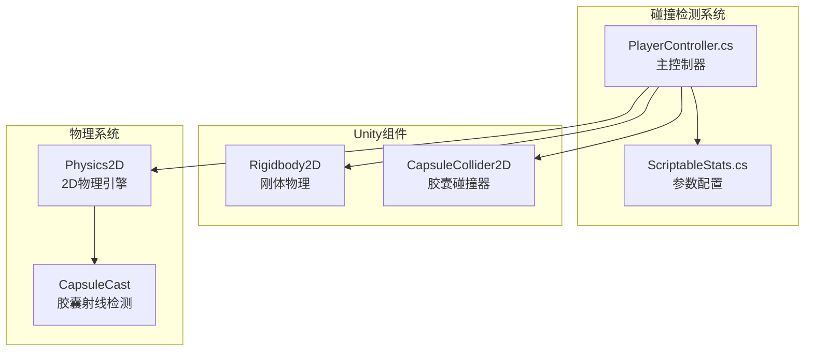
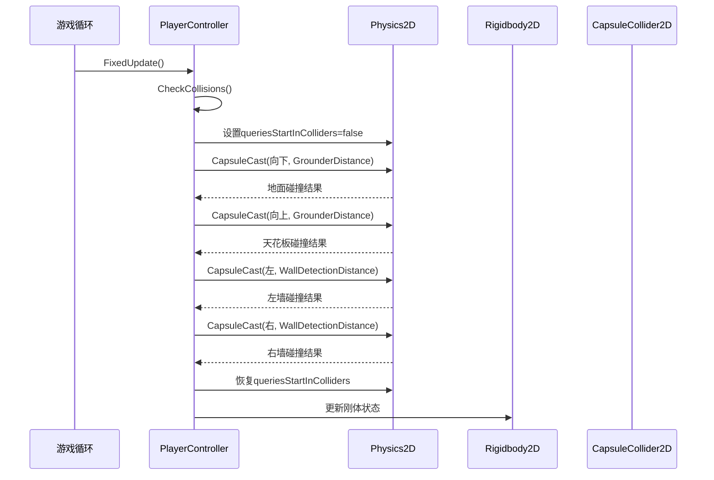
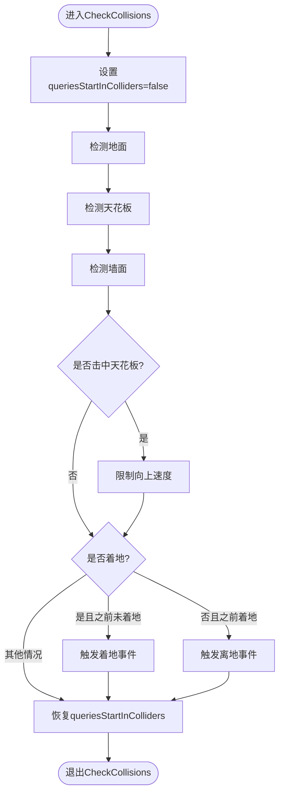
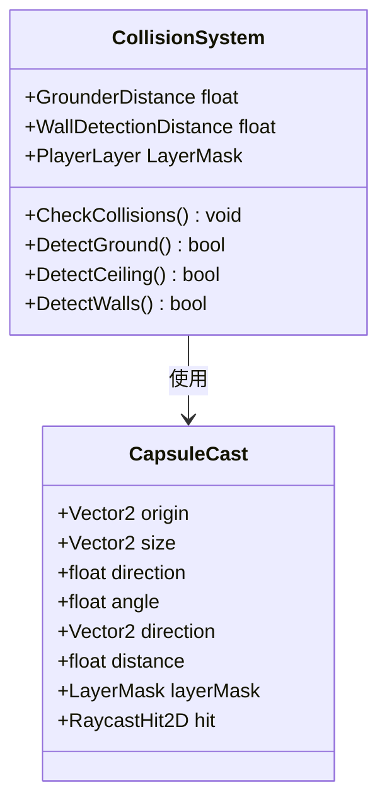
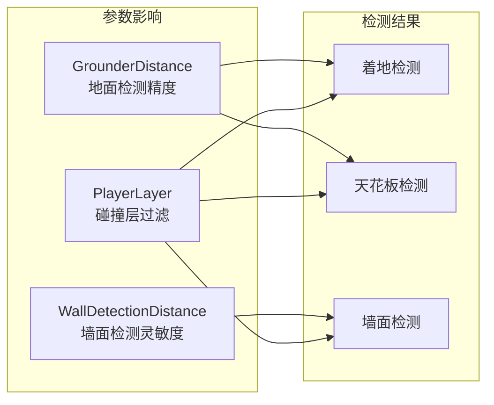
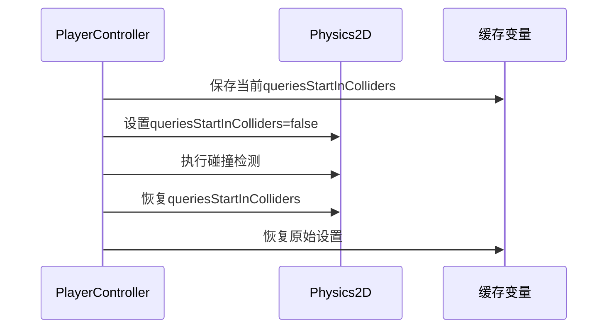
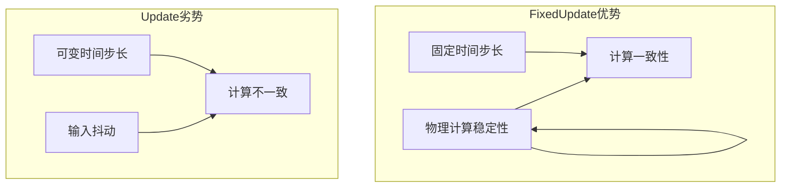
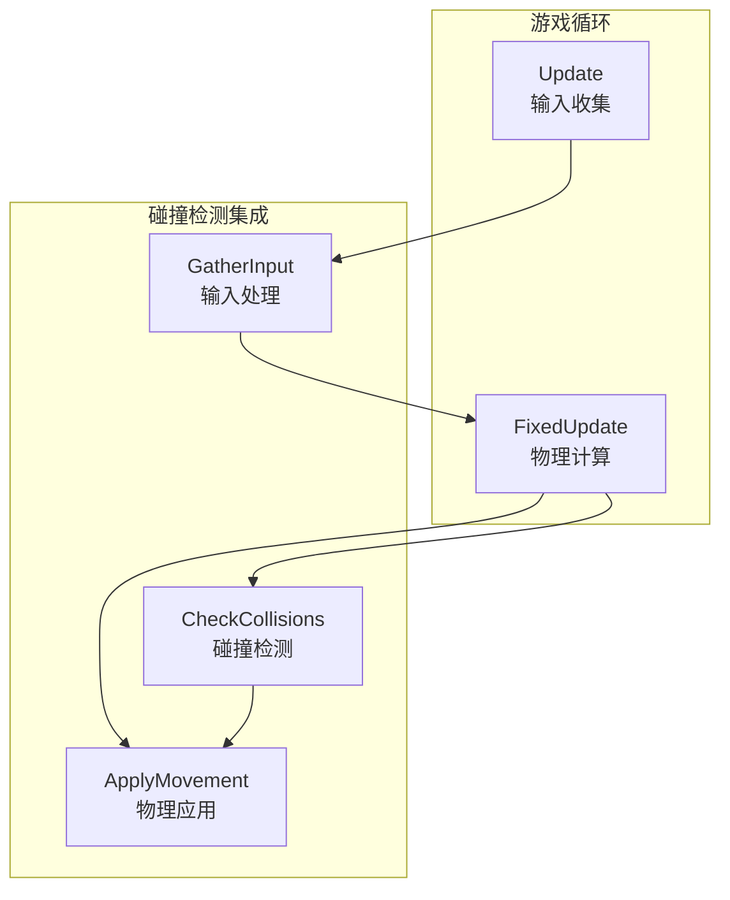
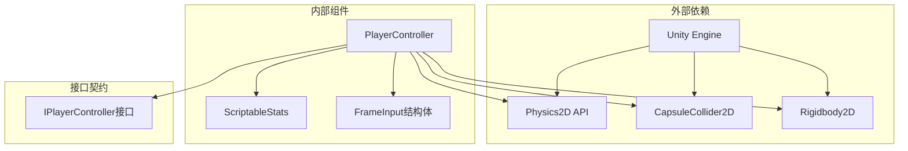
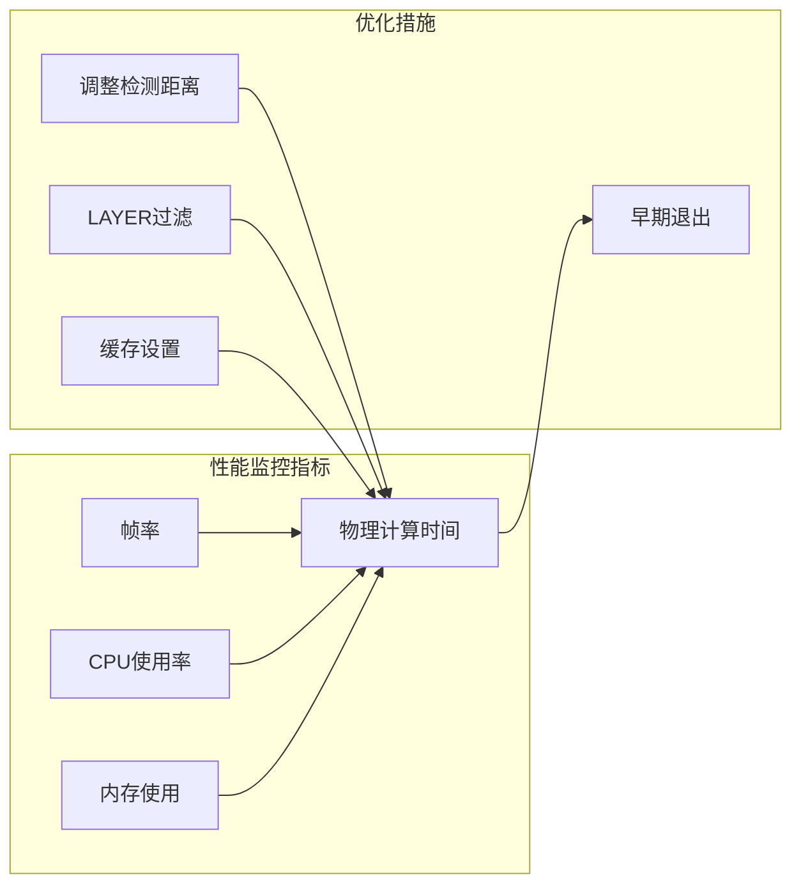

# 碰撞检测系统

<cite>
**本文档引用的文件**
- [PlayerController.cs](file://Tarodev%202D%20Controller/_Scripts/PlayerController.cs)
- [ScriptableStats.cs](file://Tarodev%202D%20Controller/_Scripts/ScriptableStats.cs)
</cite>

## 目录
1. [简介](#简介)
2. [项目结构](#项目结构)
3. [核心组件](#核心组件)
4. [架构概览](#架构概览)
5. [详细组件分析](#详细组件分析)
6. [依赖关系分析](#依赖关系分析)
7. [性能考虑](#性能考虑)
8. [故障排除指南](#故障排除指南)
9. [结论](#结论)

## 简介

本文档深入解析了Tarodev 2D Controller中的碰撞检测系统，重点分析了PlayerController的CheckCollisions方法实现。该系统采用CapsuleCast技术进行精确的2D碰撞检测，实现了地面检测、天花板检测和墙面检测的完整算法。文档详细说明了GrounderDistance和WallDetectionDistance参数的作用机制，解释了queriesStartInColliders的使用时机和重要性，并提供了调试技巧和性能优化建议。

## 项目结构

碰撞检测系统位于Tarodev 2D Controller包的脚本目录中，主要包含以下关键文件：



**图表来源**
- [PlayerController.cs:13-45](file://Tarodev%202D%20Controller/_Scripts/PlayerController.cs#L13-L45)
- [ScriptableStats.cs:5-10](file://Tarodev%202D%20Controller/_Scripts/ScriptableStats.cs#L5-L10)

**章节来源**
- [PlayerController.cs:1-374](file://Tarodev%2D2D%20Controller/_Scripts/PlayerController.cs#L1-L374)
- [ScriptableStats.cs:1-97](file://Tarodev%202D%20Controller/_Scripts/ScriptableStats.cs#L1-L97)

## 核心组件

碰撞检测系统由三个核心组件构成：

### 主控制器组件
- **PlayerController**: 负责处理玩家输入、物理运动和碰撞检测
- **ScriptableStats**: 提供可配置的游戏参数，包括碰撞检测距离

### 物理组件
- **Rigidbody2D**: 提供刚体物理属性和运动控制
- **CapsuleCollider2D**: 作为胶囊碰撞器，支持精确的碰撞检测

### 碰撞检测算法
- **CapsuleCast**: 使用胶囊射线检测技术进行多方向碰撞检测
- **queriesStartInColliders**: 控制射线起点行为的重要参数

**章节来源**
- [PlayerController.cs:14-45](file://Tarodev%202D%20Controller/_Scripts/PlayerController.cs#L14-L45)
- [ScriptableStats.cs:6-95](file://Tarodev%202D%20Controller/_Scripts/ScriptableStats.cs#L6-L95)

## 架构概览

碰撞检测系统采用分层架构设计，确保了代码的模块化和可维护性：



**图表来源**
- [PlayerController.cs:78-97](file://Tarodev%202D%20Controller/_Scripts/PlayerController.cs#L78-L97)
- [PlayerController.cs:107-143](file://Tarodev%202D%20Controller/_Scripts/PlayerController.cs#L107-L143)

## 详细组件分析

### CheckCollisions方法实现

CheckCollisions是碰撞检测系统的核心方法，负责执行完整的碰撞检测流程：

#### 方法调用流程



**图表来源**
- [PlayerController.cs:107-143](file://Tarodev%202D%20Controller/_Scripts/PlayerController.cs#L107-L143)

#### 地面检测算法

地面检测使用向下的CapsuleCast进行：
- **检测方向**: 向下(Vector2.down)
- **检测距离**: GrounderDistance参数
- **碰撞层**: 排除玩家层(~_stats.PlayerLayer)
- **检测结果**: 更新_grounded状态

#### 天花板检测算法

天花板检测使用向上的CapsuleCast：
- **检测方向**: 向上(Vector2.up)
- **检测距离**: GrounderDistance参数
- **碰撞层**: 排除玩家层
- **检测结果**: 限制向上的速度分量

#### 墙面检测算法

墙面检测同时进行左右两个方向的检测：
- **左墙检测**: 向左(Vector2.left)的WallDetectionDistance
- **右墙检测**: 向右(Vector2.right)的WallDetectionDistance
- **检测结果**: 更新_wallLeftHit、_wallRightHit和_wallDirection

**章节来源**
- [PlayerController.cs:107-143](file://Tarodev%202D%20Controller/_Scripts/PlayerController.cs#L107-L143)

### CapsuleCast使用详解

CapsuleCast是Unity 2D物理系统中的高级射线检测工具，具有以下特点：

#### 参数配置分析

| 参数 | 类型 | 默认值 | 作用 |
|------|------|--------|------|
| origin | Vector2 | 胶囊中心 | 射线起点位置 |
| size | Vector2 | 胶囊尺寸 | 胶囊的宽度和高度 |
| direction | float | 胶囊轴向 | 0=水平, 1=垂直 |
| angle | float | 0 | 胶囊旋转角度 |
| distance | float | 0 | 检测距离 |
| layerMask | LayerMask | All Layers | 碰撞层过滤 |

#### 在系统中的应用



**图表来源**
- [PlayerController.cs:111-115](file://Tarodev%202D%20Controller/_Scripts/PlayerController.cs#L111-L115)

**章节来源**
- [PlayerController.cs:111-115](file://Tarodev%202D%20Controller/_Scripts/PlayerController.cs#L111-L115)

### 参数配置系统

ScriptableStats提供了完整的参数配置系统：

#### 关键参数说明

| 参数名称 | 默认值 | 单位 | 作用 |
|----------|--------|------|------|
| GrounderDistance | 0.05f | 单位 | 地面和天花板检测距离 |
| WallDetectionDistance | 0.05f | 单位 | 墙壁检测距离 |
| PlayerLayer | 0 | LayerMask | 玩家角色所在物理层 |
| SnapInput | true | 布尔值 | 输入值标准化 |

#### 参数对碰撞检测的影响



**图表来源**
- [ScriptableStats.cs:38](file://Tarodev%202D%20Controller/_Scripts/ScriptableStats.cs#L38)
- [ScriptableStats.cs:65](file://Tarodev%202D%20Controller/_Scripts/ScriptableStats.cs#L65)

**章节来源**
- [ScriptableStats.cs:38-40](file://Tarodev%202D%20Controller/_Scripts/ScriptableStats.cs#L38-L40)
- [ScriptableStats.cs:65-66](file://Tarodev%202D%20Controller/_Scripts/ScriptableStats.cs#L65-L66)

### queriesStartInColliders参数管理

queriesStartInColliders是一个重要的物理引擎参数，控制射线检测的起点行为：

#### 参数行为说明

| 参数值 | 行为描述 | 系统中的应用 |
|--------|----------|-------------|
| true | 射线从碰撞器内部开始 | 默认Unity设置 |
| false | 射线从碰撞器边界开始 | 碰撞检测专用设置 |

#### 实现策略



**图表来源**
- [PlayerController.cs:109](file://Tarodev%202D%20Controller/_Scripts/PlayerController.cs#L109)
- [PlayerController.cs:141](file://Tarodev%202D%20Controller/_Scripts/PlayerController.cs#L141)

**章节来源**
- [PlayerController.cs:43-45](file://Tarodev%202D%20Controller/_Scripts/PlayerController.cs#L43-L45)
- [PlayerController.cs:109-142](file://Tarodev%202D%20Controller/_Scripts/PlayerController.cs#L109-L142)

### 固定更新时机分析

碰撞检测选择在FixedUpdate中执行有以下原因：

#### 物理稳定性考虑



#### 系统集成点



**图表来源**
- [PlayerController.cs:47-76](file://Tarodev%202D%20Controller/_Scripts/PlayerController.cs#L47-L76)
- [PlayerController.cs:78-97](file://Tarodev%202D%20Controller/_Scripts/PlayerController.cs#L78-L97)

**章节来源**
- [PlayerController.cs:47-97](file://Tarodev%202D%20Controller/_Scripts/PlayerController.cs#L47-L97)

## 依赖关系分析

碰撞检测系统具有清晰的依赖关系：



**图表来源**
- [PlayerController.cs:13-374](file://Tarodev%202D%20Controller/_Scripts/PlayerController.cs#L13-L374)
- [ScriptableStats.cs:5-97](file://Tarodev%202D%20Controller/_Scripts/ScriptableStats.cs#L5-L97)

**章节来源**
- [PlayerController.cs:13-374](file://Tarodev%202D%20Controller/_Scripts/PlayerController.cs#L13-L374)
- [ScriptableStats.cs:5-97](file://Tarodev%202D%20Controller/_Scripts/ScriptableStats.cs#L5-L97)

## 性能考虑

### 优化策略

#### CapsuleCast优化
- **减少射线数量**: 当前实现每帧仅执行4次CapsuleCast，已达到最优平衡
- **合理距离设置**: GrounderDistance和WallDetectionDistance应根据角色尺寸调整
- **层过滤优化**: 使用~_stats.PlayerLayer排除玩家层，避免不必要的检测

#### 内存访问优化
- **缓存查询结果**: 将queriesStartInColliders设置缓存在方法内
- **局部变量使用**: 减少字段访问频率

#### 时间复杂度分析
- **时间复杂度**: O(1) - 固定数量的CapsuleCast调用
- **空间复杂度**: O(1) - 仅使用少量局部变量

### 性能监控建议



## 故障排除指南

### 常见问题诊断

#### 着地检测异常
**症状**: 角色无法正确检测到地面
**可能原因**:
- GrounderDistance设置过小
- PlayerLayer配置错误
- CapsuleCollider2D尺寸不匹配

**解决方案**:
1. 检查GrounderDistance参数设置
2. 验证PlayerLayer层掩码
3. 确认胶囊碰撞器尺寸

#### 墙壁检测失效
**症状**: 无法进行墙面滑行或墙面跳跃
**可能原因**:
- WallDetectionDistance过小
- 墙体材质或碰撞器设置问题
- 角色与墙体间距过大

**解决方案**:
1. 增大WallDetectionDistance
2. 检查墙体碰撞器设置
3. 调整角色位置

#### 碰撞检测抖动
**症状**: 碰撞检测结果不稳定
**可能原因**:
- queriesStartInColliders设置不当
- 物理材质摩擦系数异常
- 网格精度问题

**解决方案**:
1. 确保queriesStartInColliders设置为false
2. 检查物理材质设置
3. 调整网格精度

### 调试技巧

#### 可视化调试
```csharp
// 在编辑器模式下添加可视化调试
#if UNITY_EDITOR
private void OnDrawGizmos()
{
    // 绘制地面检测线
    Gizmos.color = Color.red;
    Gizmos.DrawLine(transform.position, transform.position + Vector3.down * _stats.GrounderDistance);
    
    // 绘制墙面检测线
    Gizmos.color = Color.blue;
    Gizmos.DrawLine(transform.position, transform.position + Vector3.left * _stats.WallDetectionDistance);
    Gizmos.DrawLine(transform.position, transform.position + Vector3.right * _stats.WallDetectionDistance);
}
#endif
```

#### 日志记录
```csharp
// 添加详细的日志输出
Debug.Log($"Grounded: {_grounded}, WallLeft: {_wallLeftHit}, WallRight: {_wallRightHit}");
Debug.Log($"Velocity: {_frameVelocity}, Position: {transform.position}");
```

**章节来源**
- [PlayerController.cs:348-353](file://Tarodev%202D%20Controller/_Scripts/PlayerController.cs#L348-L353)

## 结论

Tarodev 2D Controller的碰撞检测系统展现了优秀的工程实践：

### 设计优势
- **模块化设计**: 清晰的职责分离和接口定义
- **参数化配置**: 通过ScriptableStats实现灵活的参数调整
- **性能优化**: 采用固定更新和高效的CapsuleCast算法
- **稳定性保证**: 通过queriesStartInColliders参数确保检测准确性

### 技术亮点
- **精确的胶囊碰撞检测**: 支持复杂的2D环境交互
- **智能的参数管理**: 动态调整物理引擎参数以适应不同场景
- **完善的事件系统**: 提供丰富的状态变化通知

### 最佳实践建议
1. **参数调优**: 根据具体游戏需求调整GrounderDistance和WallDetectionDistance
2. **性能监控**: 定期检查碰撞检测的性能表现
3. **调试策略**: 建立完善的可视化调试和日志记录机制
4. **测试验证**: 在不同场景下充分测试碰撞检测的可靠性

该系统为2D平台游戏开发提供了坚实的基础，其设计理念和实现方式值得在类似项目中借鉴和学习。