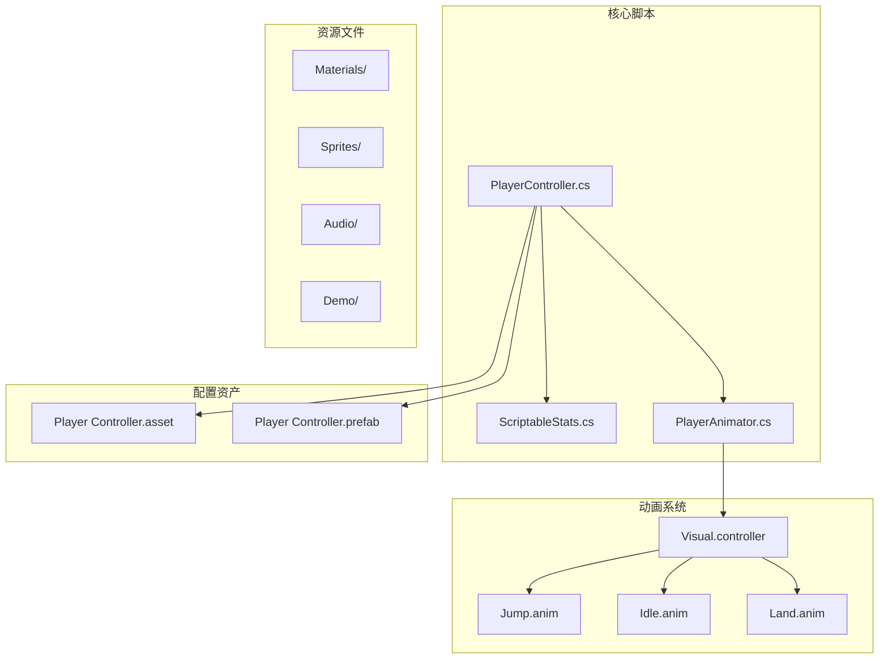
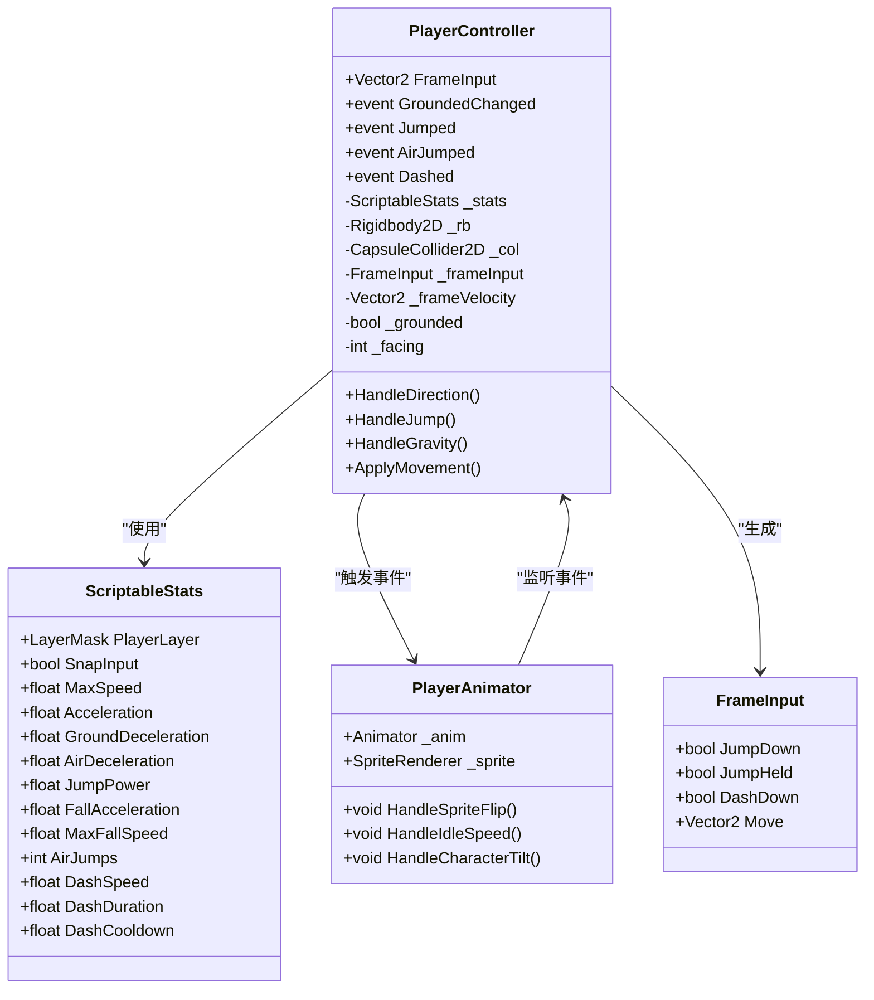
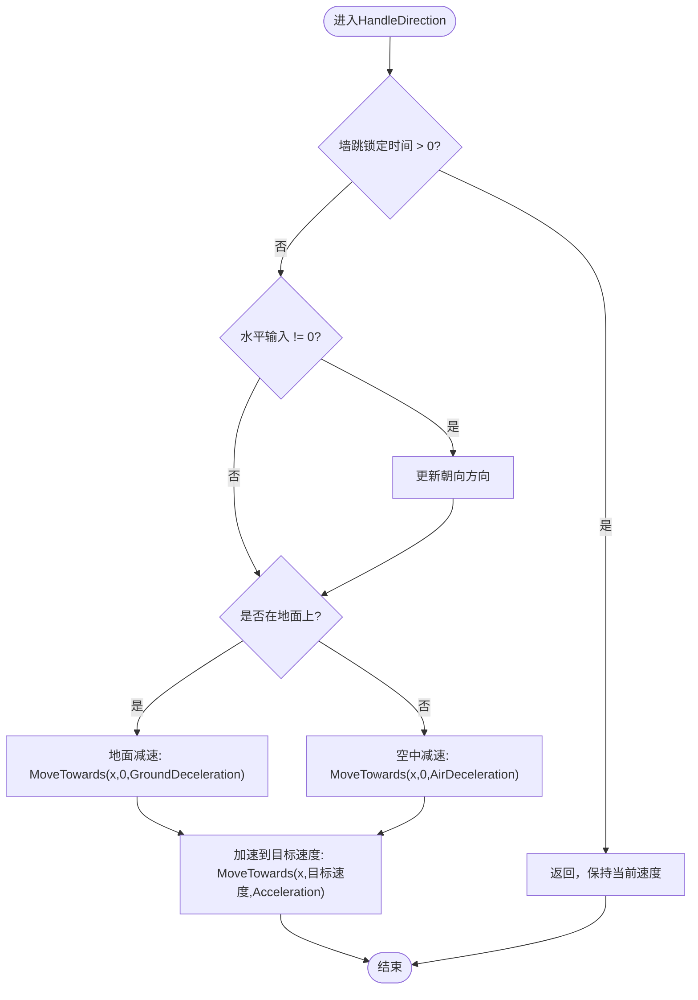
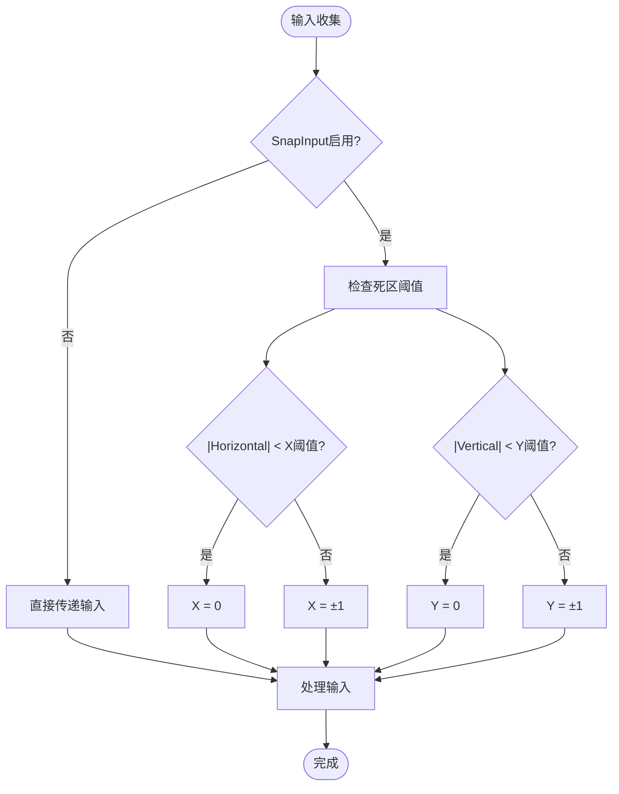
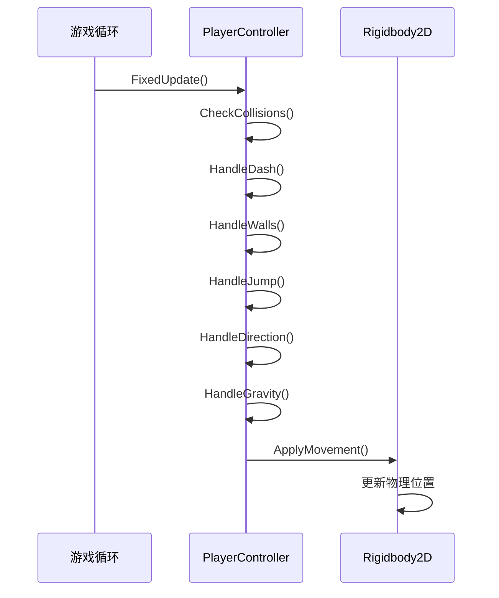
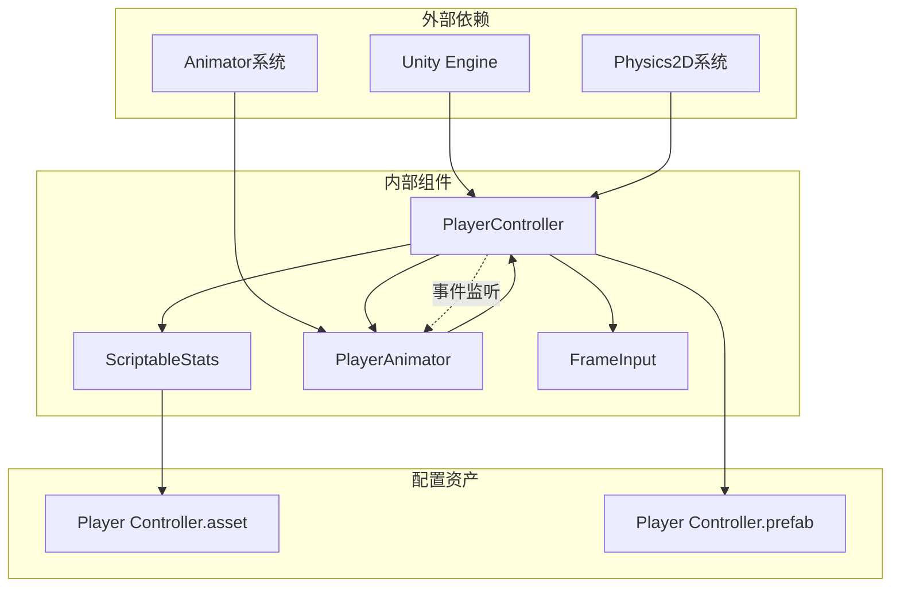

# 移动控制系统

<cite>
**本文档引用的文件**
- [PlayerController.cs](file://Tarodev 2D Controller/_Scripts/PlayerController.cs)
- [ScriptableStats.cs](file://Tarodev 2D Controller/_Scripts/ScriptableStats.cs)
- [Player Controller.asset](file://Tarodev 2D Controller/Stat Presets/Player Controller.asset)
- [PlayerAnimator.cs](file://Tarodev 2D Controller/_Scripts/PlayerAnimator.cs)
- [Visual.controller](file://Tarodev 2D Controller/Animation/Visual.controller)
- [Jump.anim](file://Tarodev 2D Controller/Animation/Jump.anim)
- [Player Controller.prefab](file://Tarodev 2D Controller/Prefabs/Player Controller.prefab)
</cite>

## 目录
1. [简介](#简介)
2. [项目结构](#项目结构)
3. [核心组件](#核心组件)
4. [架构概览](#架构概览)
5. [详细组件分析](#详细组件分析)
6. [依赖关系分析](#依赖关系分析)
7. [性能考虑](#性能考虑)
8. [故障排除指南](#故障排除指南)
9. [结论](#结论)

## 简介

本文档深入解析Tarodev 2D控制器的PlayerController移动控制系统，特别是HandleDirection方法的实现原理。该系统提供了完整的2D平台游戏控制功能，包括地面移动、加速、减速和方向控制，支持多种输入方式和高级物理特性。

系统采用脚本化统计参数设计，通过ScriptableObject实现参数的可视化编辑和复用，支持热重载和版本管理。控制器集成了碰撞检测、跳跃系统、墙面交互、冲刺功能等完整的2D平台游戏控制特性。

## 项目结构

Tarodev 2D控制器项目采用模块化组织结构，主要包含以下关键目录：

**图表来源**
- [PlayerController.cs:1-374](file://Tarodev 2D Controller/_Scripts/PlayerController.cs#L1-L374)
- [ScriptableStats.cs:1-97](file://Tarodev 2D Controller/_Scripts/ScriptableStats.cs#L1-L97)
- [Player Controller.asset:1-44](file://Tarodev 2D Controller/Stat Presets/Player Controller.asset#L1-L44)

**章节来源**
- [PlayerController.cs:1-50](file://Tarodev 2D Controller/_Scripts/PlayerController.cs#L1-L50)
- [ScriptableStats.cs:1-20](file://Tarodev 2D Controller/_Scripts/ScriptableStats.cs#L1-L20)

## 核心组件

### PlayerController主控制器

PlayerController是整个移动控制系统的核心，负责：
- 输入收集和处理
- 物理状态管理
- 移动逻辑执行
- 动画事件触发

控制器使用FixedUpdate进行物理计算，确保与Unity刚体系统的同步性。

### ScriptableStats参数系统

ScriptableStats通过ScriptableObject实现参数的集中管理：
- 可视化编辑界面
- 运行时热重载
- 参数验证和范围限制
- 多种控制模式支持

### PlayerAnimator动画系统

PlayerAnimator负责将物理状态转换为视觉表现：
- 基于输入的速度动画
- 地面着陆特效
- 跳跃动画触发
- 冲刺粒子效果

**章节来源**
- [PlayerController.cs:14-374](file://Tarodev 2D Controller/_Scripts/PlayerController.cs#L14-L374)
- [ScriptableStats.cs:6-97](file://Tarodev 2D Controller/_Scripts/ScriptableStats.cs#L6-L97)
- [PlayerAnimator.cs:8-178](file://Tarodev 2D Controller/_Scripts/PlayerAnimator.cs#L8-L178)

## 架构概览

**图表来源**
- [PlayerController.cs:14-374](file://Tarodev 2D Controller/_Scripts/PlayerController.cs#L14-L374)
- [ScriptableStats.cs:6-97](file://Tarodev 2D Controller/_Scripts/ScriptableStats.cs#L6-L97)
- [PlayerAnimator.cs:8-178](file://Tarodev 2D Controller/_Scripts/PlayerAnimator.cs#L8-L178)

## 详细组件分析

### HandleDirection方法深度解析

HandleDirection是移动控制系统的核心方法，实现了完整的地面和空中移动逻辑：

#### 墙跳锁定机制
当执行墙跳后，系统会锁定水平输入一段时间，防止玩家立即反向输入导致操作失误。

#### 方向控制逻辑

**图表来源**
- [PlayerController.cs:247-266](file://Tarodev 2D Controller/_Scripts/PlayerController.cs#L247-L266)

#### 加速度参数详解

**地面加速度 (Acceleration)**：控制角色从静止加速到最大速度的速率
- 数值越大，加速越快
- 影响角色的响应速度和操控感
- 与Time.fixedDeltaTime相乘确保帧率无关性

**地面减速度 (GroundDeceleration)**：停止输入时的减速速率
- 控制角色在地面上的滑行距离
- 数值越大，停止越快，操控越精确

**空中减速度 (AirDeceleration)**：空中停止输入时的减速速率
- 通常小于地面减速度以保持空中惯性
- 影响角色的空中操控感和飞行距离

#### 死区阈值系统

系统实现了双轴死区阈值机制：

**图表来源**
- [PlayerController.cs:63-67](file://Tarodev 2D Controller/_Scripts/PlayerController.cs#L63-L67)

**死区阈值的作用**：
- 防止手柄漂移导致的误触发
- 提供更稳定的键盘输入体验
- 支持手柄和键盘的一致性控制

**章节来源**
- [PlayerController.cs:247-266](file://Tarodev 2D Controller/_Scripts/PlayerController.cs#L247-L266)
- [ScriptableStats.cs:13-20](file://Tarodev 2D Controller/_Scripts/ScriptableStats.cs#L13-L20)

### 帧更新中的速度计算过程

系统采用分阶段的速度计算流程：

#### 固定更新循环

**图表来源**
- [PlayerController.cs:78-97](file://Tarodev 2D Controller/_Scripts/PlayerController.cs#L78-L97)

#### 速度计算公式

**MoveTowards函数应用**：
- `Mathf.MoveTowards(current, target, maxDelta)`确保速度变化不超过最大步长
- 与时间步长相乘实现帧率无关的运动
- 提供平滑的速度过渡效果

**地面vs空中加速度差异**：
- 地面：使用GroundDeceleration进行减速，使用Acceleration进行加速
- 空中：使用AirDeceleration进行减速，使用Acceleration进行加速
- 这种设计提供了不同的操控感受

**章节来源**
- [PlayerController.cs:259-265](file://Tarodev 2D Controller/_Scripts/PlayerController.cs#L259-L265)

### 移动控制配置参数详解

#### 基础移动参数
| 参数名 | 类型 | 默认值 | 作用 |
|--------|------|--------|------|
| MaxSpeed | float | 14 | 最大移动速度（单位/秒） |
| Acceleration | float | 120 | 水平加速度（单位/秒²） |
| GroundDeceleration | float | 60 | 地面减速度（单位/秒²） |
| AirDeceleration | float | 30 | 空中减速度（单位/秒²） |

#### 输入处理参数
| 参数名 | 类型 | 默认值 | 作用 |
|--------|------|--------|------|
| SnapInput | bool | true | 启用输入截断 |
| HorizontalDeadZoneThreshold | float | 0.1 | 水平死区阈值 |
| VerticalDeadZoneThreshold | float | 0.3 | 垂直死区阈值 |

#### 物理特性参数
| 参数名 | 类型 | 默认值 | 作用 |
|--------|------|--------|------|
| GroundingForce | float | -1.5 | 地面吸附力 |
| GrounderDistance | float | 0.05 | 地面检测距离 |
| FallAcceleration | float | 110 | 下落加速度 |
| MaxFallSpeed | float | 40 | 最大下落速度 |
| JumpEndEarlyGravityModifier | float | 3 | 提早松开重力修正 |

**章节来源**
- [ScriptableStats.cs:22-95](file://Tarodev 2D Controller/_Scripts/ScriptableStats.cs#L22-L95)
- [Player Controller.asset:21-44](file://Tarodev 2D Controller/Stat Presets/Player Controller.asset#L21-L44)

### 调试技巧和最佳实践

#### 实时调试方法
1. **可视化碰撞检测**：通过调整GrounderDistance和WallDetectionDistance观察检测范围
2. **速度监控**：使用FrameInput属性监控当前输入状态
3. **状态跟踪**：监听GroundedChanged事件了解地面状态变化

#### 性能优化建议
1. **参数调优**：根据目标帧率调整加速度和减速度参数
2. **死区设置**：合理设置死区阈值平衡灵敏度和稳定性
3. **物理材质**：使用合适的摩擦系数和弹性质感

#### 常见问题解决
- **手柄漂移**：提高HorizontalDeadZoneThreshold值
- **响应迟钝**：降低Acceleration值
- **过度滑行**：增加GroundDeceleration值

**章节来源**
- [PlayerController.cs:29-32](file://Tarodev 2D Controller/_Scripts/PlayerController.cs#L29-L32)
- [PlayerController.cs:348-353](file://Tarodev 2D Controller/_Scripts/PlayerController.cs#L348-L353)

## 依赖关系分析

**图表来源**
- [PlayerController.cs:13-45](file://Tarodev 2D Controller/_Scripts/PlayerController.cs#L13-L45)
- [PlayerAnimator.cs:37-61](file://Tarodev 2D Controller/_Scripts/PlayerAnimator.cs#L37-L61)

**章节来源**
- [PlayerController.cs:13-45](file://Tarodev 2D Controller/_Scripts/PlayerController.cs#L13-L45)
- [PlayerAnimator.cs:37-61](file://Tarodev 2D Controller/_Scripts/PlayerAnimator.cs#L37-L61)

## 性能考虑

### 帧率无关性
系统通过以下机制确保帧率无关性：
- 使用Time.fixedDeltaTime进行速度计算
- MoveTowards函数提供固定的最大变化量
- 固定更新频率（FixedUpdate）保证物理计算稳定性

### 内存使用优化
- ScriptableObject参数系统减少实例化开销
- 结构体FrameInput避免垃圾回收
- 事件系统采用委托模式，内存占用低

### 计算复杂度
- 单个帧的计算复杂度为O(1)
- 碰撞检测使用胶囊射线检测，效率高
- 参数访问为常数时间复杂度

## 故障排除指南

### 常见问题诊断

#### 移动异常问题
1. **检查输入处理**：确认SnapInput设置和死区阈值
2. **验证物理设置**：检查Rigidbody2D的drag和angularDrag
3. **测试碰撞器**：确保CapsuleCollider2D正确配置

#### 跳跃行为异常
1. **检查重力设置**：确认Rigidbody2D.gravityScale为0
2. **验证跳跃参数**：检查JumpPower和FallAcceleration
3. **测试缓冲机制**：验证CoyoteTime和JumpBuffer设置

#### 动画不匹配
1. **检查事件绑定**：确认PlayerAnimator正确监听控制器事件
2. **验证参数映射**：确保Animator参数与代码一致
3. **测试粒子系统**：检查特效播放条件

**章节来源**
- [PlayerController.cs:348-353](file://Tarodev 2D Controller/_Scripts/PlayerController.cs#L348-L353)
- [PlayerAnimator.cs:43-61](file://Tarodev 2D Controller/_Scripts/PlayerAnimator.cs#L43-L61)

## 结论

Tarodev 2D控制器的移动控制系统展现了优秀的工程设计，通过以下关键特性提供了高质量的游戏体验：

### 设计优势
- **模块化架构**：清晰的职责分离和接口设计
- **参数驱动**：通过ScriptableObject实现灵活的配置管理
- **帧率无关**：确保在不同硬件上的稳定表现
- **扩展性强**：易于添加新功能和自定义行为

### 技术亮点
- **智能死区处理**：平衡输入精度和稳定性
- **差异化物理**：地面和空中不同的操控感受
- **事件驱动**：解耦的动画和物理系统
- **可视化调试**：完善的运行时调试支持

### 应用价值
该系统为2D平台游戏开发提供了完整的解决方案，适用于各种类型的游戏项目。其模块化设计使得开发者可以根据具体需求进行定制和扩展，同时保持代码的可维护性和性能表现。

通过深入理解HandleDirection方法的实现原理和相关配置参数，开发者可以更好地优化游戏的操控手感，创造更加流畅和愉悦的游戏体验。