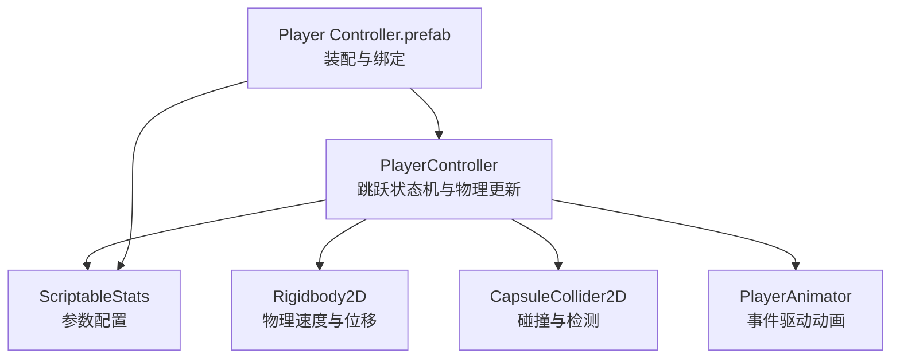
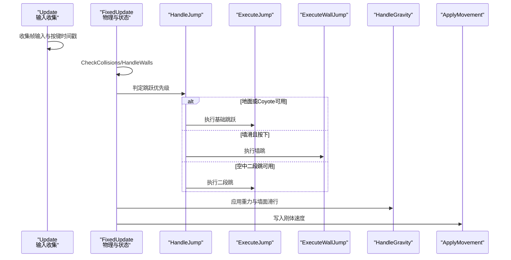
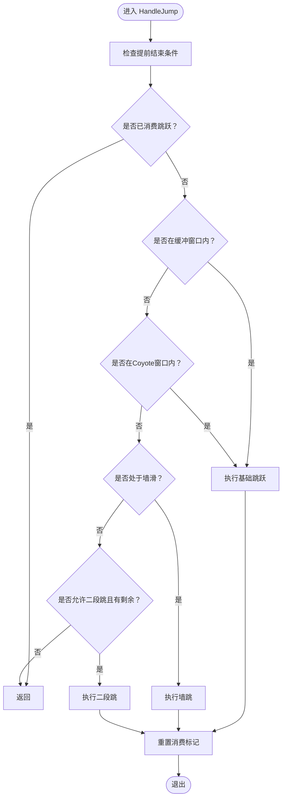
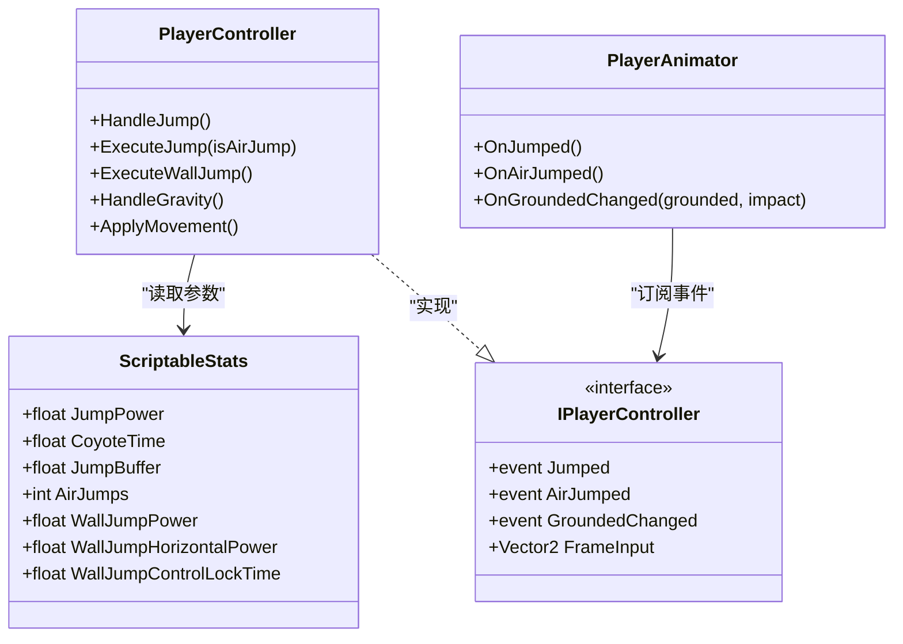

# 跳跃系统

<cite>
**本文引用的文件**
- [PlayerController.cs](file://Tarodev 2D Controller/_Scripts/PlayerController.cs)
- [ScriptableStats.cs](file://Tarodev 2D Controller/_Scripts/ScriptableStats.cs)
- [PlayerAnimator.cs](file://Tarodev 2D Controller/_Scripts/PlayerAnimator.cs)
- [Player Controller.prefab](file://Tarodev 2D Controller/Prefabs/Player Controller.prefab)
- [Player Controller.asset](file://Tarodev 2D Controller/Stat Presets/Player Controller.asset)
</cite>

## 目录
1. [简介](#简介)
2. [项目结构](#项目结构)
3. [核心组件](#核心组件)
4. [架构总览](#架构总览)
5. [详细组件分析](#详细组件分析)
6. [依赖关系分析](#依赖关系分析)
7. [性能考量](#性能考量)
8. [故障排查指南](#故障排查指南)
9. [结论](#结论)
10. [附录](#附录)

## 简介
本技术文档围绕 PlayerController 的“跳跃系统”进行深入解析，覆盖基础跳跃、缓冲跳跃（Jump Buffer）、Coyote 时间、二段跳与墙跳等高级能力。重点阐述：
- HandleJump 方法的状态管理逻辑与优先级判定
- 跳跃缓冲窗口的计算与触发条件
- Coyote 时间的实现原理与边界处理
- ExecuteJump 与 ExecuteWallJump 的参数配置与物理计算
- 配置参数详解与常见问题的解决方案

## 项目结构
跳跃系统位于 Tarodev 2D Controller 模块中，核心代码集中在 PlayerController.cs，参数通过 ScriptableStats.cs 提供，动画与事件联动由 PlayerAnimator.cs 实现。预制体 Player Controller.prefab 将控制器与物理组件绑定，并引用 Stat Presets 中的配置资源。

图表来源
- [PlayerController.cs:14-50](file://Tarodev 2D Controller/_Scripts/PlayerController.cs#L14-L50)
- [ScriptableStats.cs:6-96](file://Tarodev 2D Controller/_Scripts/ScriptableStats.cs#L6-L96)
- [PlayerAnimator.cs:37-61](file://Tarodev 2D Controller/_Scripts/PlayerAnimator.cs#L37-L61)
- [Player Controller.prefab:39-50](file://Tarodev 2D Controller/Prefabs/Player Controller.prefab#L39-L50)

章节来源
- [PlayerController.cs:14-50](file://Tarodev 2D Controller/_Scripts/PlayerController.cs#L14-L50)
- [ScriptableStats.cs:6-96](file://Tarodev 2D Controller/_Scripts/ScriptableStats.cs#L6-L96)
- [PlayerAnimator.cs:37-61](file://Tarodev 2D Controller/_Scripts/PlayerAnimator.cs#L37-L61)
- [Player Controller.prefab:39-50](file://Tarodev 2D Controller/Prefabs/Player Controller.prefab#L39-L50)

## 核心组件
- PlayerController：负责输入收集、碰撞检测、跳跃状态机、墙体交互、重力与移动应用等。跳跃系统的核心逻辑集中在 HandleJump、ExecuteJump、ExecuteWallJump 及相关状态变量。
- ScriptableStats：集中定义所有可调参数，包括跳跃功率、Coyote 时间、跳跃缓冲、二段跳次数、墙跳参数等。
- PlayerAnimator：订阅控制器事件（如 Jumped、AirJumped），驱动动画与音效粒子。
- Player Controller.prefab：装配 Rigidbody2D、CapsuleCollider2D、PlayerController 组件，并引用 ScriptableStats 资源。

章节来源
- [PlayerController.cs:186-243](file://Tarodev 2D Controller/_Scripts/PlayerController.cs#L186-L243)
- [ScriptableStats.cs:41-81](file://Tarodev 2D Controller/_Scripts/ScriptableStats.cs#L41-L81)
- [PlayerAnimator.cs:94-138](file://Tarodev 2D Controller/_Scripts/PlayerAnimator.cs#L94-L138)
- [Player Controller.prefab:39-50](file://Tarodev 2D Controller/Prefabs/Player Controller.prefab#L39-L50)

## 架构总览
跳跃系统采用“固定帧步进 + 输入收集”的双阶段流程：FixedUpdate 中完成碰撞检测、墙体处理、跳跃判定与执行；Update 中完成输入收集与计时。状态变量贯穿整个生命周期，保证缓冲、Coyote、墙跳与二段跳的正确时序。

图表来源
- [PlayerController.cs:47-97](file://Tarodev 2D Controller/_Scripts/PlayerController.cs#L47-L97)
- [PlayerController.cs:198-241](file://Tarodev 2D Controller/_Scripts/PlayerController.cs#L198-L241)
- [PlayerController.cs:324-346](file://Tarodev 2D Controller/_Scripts/PlayerController.cs#L324-L346)

## 详细组件分析

### HandleJump 状态管理与优先级
- 关键状态变量
  - _jumpToConsume：标记当前帧是否消耗一次“按压即跳”
  - _bufferedJumpUsable：跳跃缓冲是否可用
  - _timeJumpWasPressed：记录“按压即跳”发生的时间点
  - _coyoteUsable：Coyote 是否可用
  - _endedJumpEarly：是否已提前结束跳跃（用于短跳）
  - _airJumpsRemaining：剩余二段跳次数
- 缓冲窗口判断：HasBufferedJump 基于 _timeJumpWasPressed 与 _stats.JumpBuffer 计算，若当前时间未超出缓冲窗口则视为可用
- Coyote 判断：CanUseCoyote 在非地面状态下，若当前时间未超出离开地面后的 Coyote 时间窗口，则允许起跳
- 优先级顺序
  1) 若非地面且未持有跳跃键且向上速度大于 0，标记提前结束跳跃
  2) 若当前帧未消费跳跃且满足缓冲窗口或处于 Coyote 窗口内，执行基础跳跃
  3) 若处于墙体滑行状态，执行墙跳
  4) 否则若允许二段跳且仍有剩余，执行二段跳
  5) 最终重置 _jumpToConsume

图表来源
- [PlayerController.cs:198-213](file://Tarodev 2D Controller/_Scripts/PlayerController.cs#L198-L213)
- [PlayerController.cs:195-196](file://Tarodev 2D Controller/_Scripts/PlayerController.cs#L195-L196)

章节来源
- [PlayerController.cs:188-213](file://Tarodev 2D Controller/_Scripts/PlayerController.cs#L188-L213)
- [PlayerController.cs:195-196](file://Tarodev 2D Controller/_Scripts/PlayerController.cs#L195-L196)

### ExecuteJump 参数与物理计算
- 功能目标：在地面或 Coyote 窗口内执行基础跳跃
- 关键行为
  - 清理提前结束标记、重置按键时间戳、禁用缓冲与 Coyote 使用
  - 设置垂直速度为 _stats.JumpPower
  - 根据输入方向更新朝向
  - 触发 Jumped 事件（用于动画与音效）
- 物理意义：通过一次性给定初速度实现“瞬时跳跃”，随后由重力与输入共同决定后续轨迹

章节来源
- [PlayerController.cs:215-227](file://Tarodev 2D Controller/_Scripts/PlayerController.cs#L215-L227)

### ExecuteWallJump 参数与物理计算
- 功能目标：在墙滑状态下执行墙跳
- 关键行为
  - 清理提前结束标记、重置按键时间戳、禁用缓冲与 Coyote 使用
  - 结束墙滑状态、清空墙贴时间
  - 设置墙跳控制锁定时间 _stats.WallJumpControlLockTime
  - 设置水平与垂直速度：_frameVelocity = (-_wallDirection * _stats.WallJumpHorizontalPower, _stats.WallJumpPower)
  - 更新朝向为水平速度方向
  - 触发 Jumped 事件
- 物理意义：通过反向水平速度与垂直速度组合，实现“离墙弹射”的典型 2D 平台动作

章节来源
- [PlayerController.cs:229-241](file://Tarodev 2D Controller/_Scripts/PlayerController.cs#L229-L241)

### 墙体交互与墙跳前置条件
- 墙体检测：通过 CapsuleCast 向左右方向探测，得到 _wallLeftHit/_wallRightHit 与 _wallDirection
- 墙滑判定：仅当非地面且向下速度不为正时才允许墙滑
- 墙贴时间：按住墙体方向时重置 _wallStickTimeLeft；松开但仍在墙贴时间内仍可滑行
- 墙跳触发：墙滑状态下按下跳跃键时执行墙跳

章节来源
- [PlayerController.cs:107-182](file://Tarodev 2D Controller/_Scripts/PlayerController.cs#L107-L182)

### 二段跳与空气重力修正
- 二段跳：当 _stats.AirJumps > 0 且 _airJumpsRemaining > 0 时，执行二段跳并减少剩余次数
- 空气重力修正：当提前结束跳跃（_endedJumpEarly）且向上速度仍为正值时，使用 _stats.JumpEndEarlyGravityModifier 增大下落速度，实现“短跳”效果

章节来源
- [PlayerController.cs:206-210](file://Tarodev 2D Controller/_Scripts/PlayerController.cs#L206-L210)
- [PlayerController.cs:339-341](file://Tarodev 2D Controller/_Scripts/PlayerController.cs#L339-L341)

### 跳跃缓冲窗口与 Coyote 时间
- 缓冲窗口：_timeJumpWasPressed + _stats.JumpBuffer 决定缓冲有效期；在此期间即使未接触地面也可起跳
- Coyote 时间：_frameLeftGrounded + _stats.CoyoteTime 决定离开地面后的宽容起跳时间；在此期间可执行基础跳跃
- 边界处理：落地时重置缓冲与 Coyote 标记；离开地面时记录时间戳；二者互斥生效

章节来源
- [PlayerController.cs:122-140](file://Tarodev 2D Controller/_Scripts/PlayerController.cs#L122-L140)
- [PlayerController.cs:195-196](file://Tarodev 2D Controller/_Scripts/PlayerController.cs#L195-L196)

### 动画与事件联动
- PlayerAnimator 订阅 Jumped 与 AirJumped 事件，在着地与起跳时播放对应动画与粒子效果
- 通过 GroundedChanged 事件传递着地冲击强度，用于落地粒子规模

章节来源
- [PlayerAnimator.cs:43-61](file://Tarodev 2D Controller/_Scripts/PlayerAnimator.cs#L43-L61)
- [PlayerAnimator.cs:94-138](file://Tarodev 2D Controller/_Scripts/PlayerAnimator.cs#L94-L138)
- [PlayerAnimator.cs:108-128](file://Tarodev 2D Controller/_Scripts/PlayerAnimator.cs#L108-L128)

## 依赖关系分析
- PlayerController 依赖 ScriptableStats 提供的参数，包括跳跃功率、Coyote 时间、跳跃缓冲、墙跳参数等
- PlayerController 通过 Rigidbody2D 与 CapsuleCollider2D 进行物理与碰撞检测
- PlayerAnimator 通过接口 IPlayerController 订阅事件，实现动画与音效联动

图表来源
- [PlayerController.cs:16-374](file://Tarodev 2D Controller/_Scripts/PlayerController.cs#L16-L374)
- [ScriptableStats.cs:6-96](file://Tarodev 2D Controller/_Scripts/ScriptableStats.cs#L6-L96)
- [PlayerAnimator.cs:33-176](file://Tarodev 2D Controller/_Scripts/PlayerAnimator.cs#L33-L176)

章节来源
- [PlayerController.cs:16-374](file://Tarodev 2D Controller/_Scripts/PlayerController.cs#L16-L374)
- [ScriptableStats.cs:6-96](file://Tarodev 2D Controller/_Scripts/ScriptableStats.cs#L6-L96)
- [PlayerAnimator.cs:33-176](file://Tarodev 2D Controller/_Scripts/PlayerAnimator.cs#L33-L176)

## 性能考量
- 固定帧步进：跳跃判定与物理更新均在 FixedUpdate 中进行，保证稳定性与确定性
- 碰撞查询优化：QueriesStartInColliders 在 CheckCollisions 中临时关闭，减少不必要的穿透检测
- 状态变量复用：通过布尔标记与时间戳避免重复计算，降低 CPU 开销
- 动画与粒子：仅在事件触发时播放，避免持续占用资源

[本节为通用性能讨论，无需特定文件来源]

## 故障排查指南
- 跳跃“打滑”或无法起跳
  - 检查 GrounderDistance 与 MaxFallSpeed，确保地面检测与下落速度合理
  - 确认 JumpPower 与 FallAcceleration 的平衡，避免过小的初始速度或过大的重力
- 跳跃“延迟”或“卡顿”
  - 检查 JumpBuffer 与 CoyoteTime 设置，适当增大以改善宽容度
  - 确认输入死区阈值（SnapInput、DeadZoneThreshold）不会误判输入
- 墙跳“反向卡顿”
  - 检查 WallJumpControlLockTime，确保墙跳后有足够时间锁定水平输入
  - 确认 WallJumpHorizontalPower 与 WallJumpPower 的组合是否合适
- 二段跳“不可用”
  - 确认 AirJumps 设置为大于 0，且未被提前消耗
  - 检查 _airJumpsRemaining 的重置逻辑（落地时重置）

章节来源
- [ScriptableStats.cs:38-58](file://Tarodev 2D Controller/_Scripts/ScriptableStats.cs#L38-L58)
- [ScriptableStats.cs:64-81](file://Tarodev 2D Controller/_Scripts/ScriptableStats.cs#L64-L81)
- [PlayerController.cs:122-140](file://Tarodev 2D Controller/_Scripts/PlayerController.cs#L122-L140)
- [PlayerController.cs:206-210](file://Tarodev 2D Controller/_Scripts/PlayerController.cs#L206-L210)

## 结论
该跳跃系统通过清晰的状态机与参数化设计，实现了基础跳跃、缓冲跳跃、Coyote 时间、二段跳与墙跳的完整闭环。HandleJump 的优先级判定与 ExecuteJump/ExecuteWallJump 的物理设定共同构成了高宽容度与高可控性的 2D 平台跳跃体验。配合 ScriptableStats 的参数调节与 PlayerAnimator 的事件联动，开发者可在不修改核心逻辑的前提下，灵活调整手感与表现。

[本节为总结性内容，无需特定文件来源]

## 附录

### 配置参数详解（节选）
- 跳跃设置
  - JumpPower：基础跳跃初速度
  - MaxFallSpeed：最大下落速度
  - FallAcceleration：空中重力加速度
  - JumpEndEarlyGravityModifier：提前结束跳跃时的重力倍率
  - CoyoteTime：离开地面后的宽容起跳时间
  - JumpBuffer：跳跃缓冲窗口
  - AirJumps：二段跳次数
- 墙壁交互
  - WallDetectionDistance：墙体检测距离
  - WallSlideSpeed：墙滑最大下降速度
  - WallStickTime：松开方向后的墙贴保持时间
  - WallJumpPower：墙跳垂直速度
  - WallJumpHorizontalPower：墙跳水平速度
  - WallJumpControlLockTime：墙跳后水平输入锁定时间

章节来源
- [ScriptableStats.cs:41-81](file://Tarodev 2D Controller/_Scripts/ScriptableStats.cs#L41-L81)
- [Player Controller.asset:27-43](file://Tarodev 2D Controller/Stat Presets/Player Controller.asset#L27-L43)