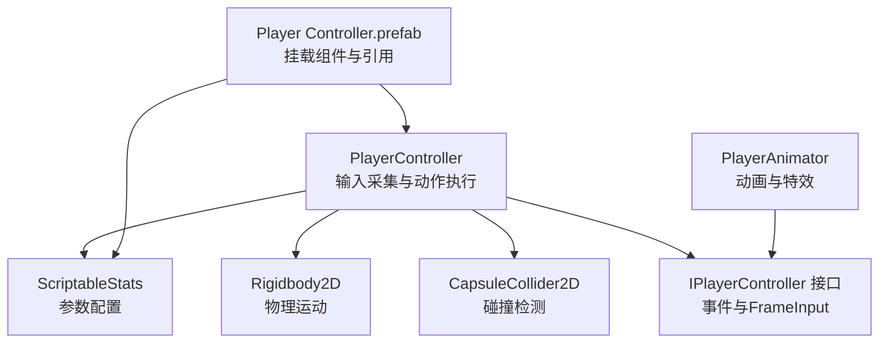
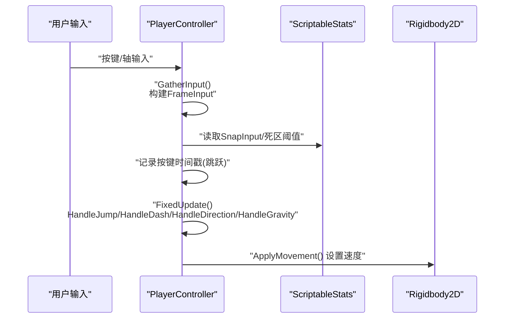
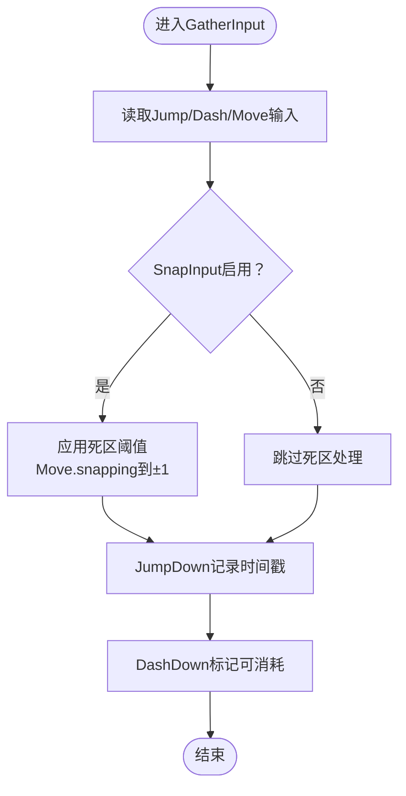
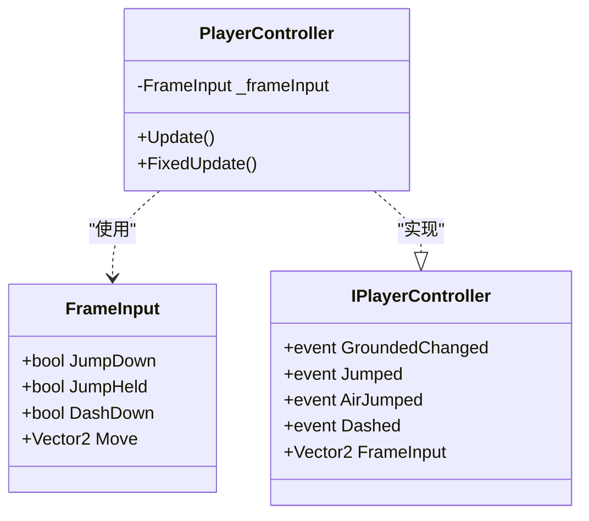
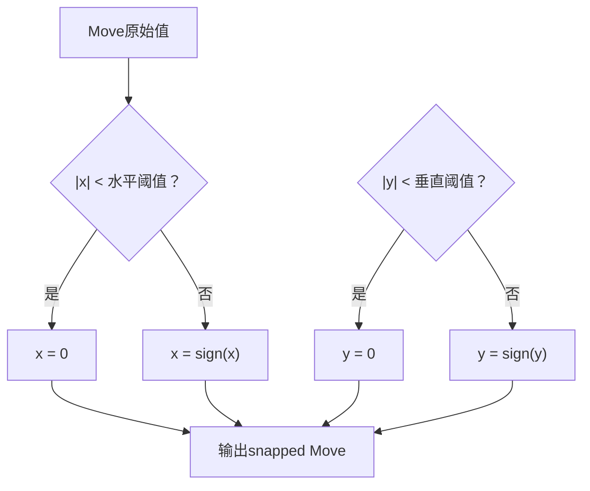
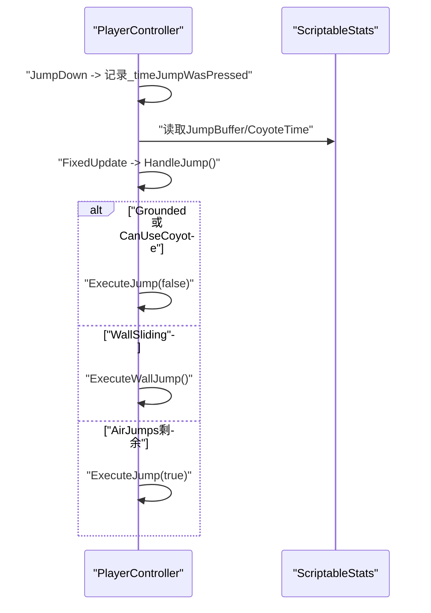
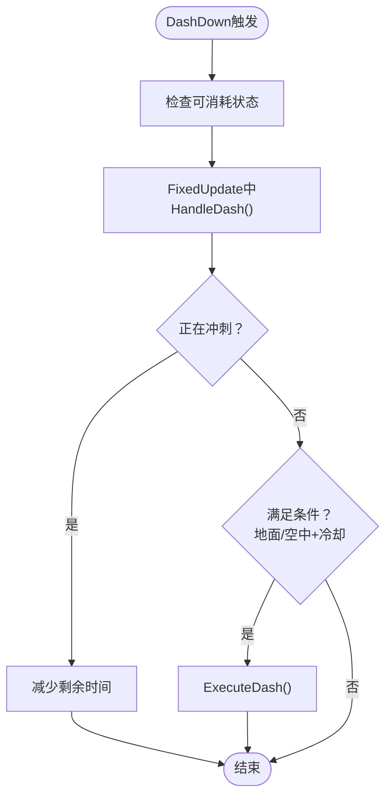
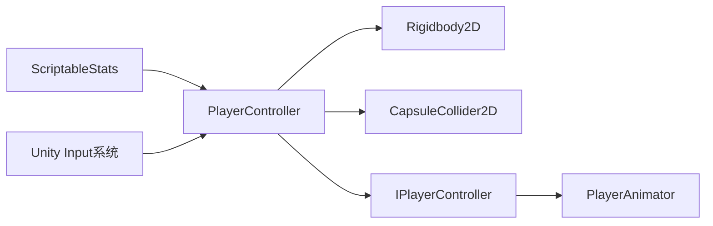

# 输入管理系统

<cite>
**本文引用的文件**
- [PlayerController.cs](file://Tarodev 2D Controller/_Scripts/PlayerController.cs)
- [ScriptableStats.cs](file://Tarodev 2D Controller/_Scripts/ScriptableStats.cs)
- [PlayerAnimator.cs](file://Tarodev 2D Controller/_Scripts/PlayerAnimator.cs)
- [Player Controller.prefab](file://Tarodev 2D Controller/Prefabs/Player Controller.prefab)
- [Player Controller.asset](file://Tarodev 2D Controller/Stat Presets/Player Controller.asset)
</cite>

## 目录
1. [简介](#简介)
2. [项目结构](#项目结构)
3. [核心组件](#核心组件)
4. [架构总览](#架构总览)
5. [详细组件分析](#详细组件分析)
6. [依赖关系分析](#依赖关系分析)
7. [性能考量](#性能考量)
8. [故障排查指南](#故障排查指南)
9. [结论](#结论)
10. [附录](#附录)

## 简介
本技术文档聚焦于PlayerController的输入管理系统，深入解析GatherInput方法的实现原理，包括输入收集、按键状态跟踪与输入缓冲机制；详解FrameInput结构体的设计与字段作用；解释SnapInput功能与死区阈值处理逻辑；分析JumpBuffer与DashDown的实现机制及其对输入延迟与响应性的平衡；并提供输入系统的配置选项与自定义按键绑定方法，帮助开发者在不同平台与设备上获得一致且顺滑的操控体验。

## 项目结构
输入系统位于Tarodev 2D Controller模块中，主要由以下文件构成：
- PlayerController：负责输入采集、帧内状态管理与动作执行
- ScriptableStats：集中管理所有可调参数（含输入相关）
- PlayerAnimator：消费IPlayerController接口事件与FrameInput进行动画与特效驱动
- Player Controller.prefab：挂载PlayerController与Rigidbody2D/CapsuleCollider2D等组件
- Player Controller.asset：默认参数预设

图表来源
- [PlayerController.cs:14-374](file://Tarodev 2D Controller/_Scripts/PlayerController.cs#L14-L374)
- [ScriptableStats.cs:6-97](file://Tarodev 2D Controller/_Scripts/ScriptableStats.cs#L6-L97)
- [PlayerAnimator.cs:8-178](file://Tarodev 2D Controller/_Scripts/PlayerAnimator.cs#L8-L178)
- [Player Controller.prefab:39-50](file://Tarodev 2D Controller/Prefabs/Player Controller.prefab#L39-L50)

章节来源
- [PlayerController.cs:14-374](file://Tarodev 2D Controller/_Scripts/PlayerController.cs#L14-L374)
- [ScriptableStats.cs:6-97](file://Tarodev 2D Controller/_Scripts/ScriptableStats.cs#L6-L97)
- [PlayerAnimator.cs:8-178](file://Tarodev 2D Controller/_Scripts/PlayerAnimator.cs#L8-L178)
- [Player Controller.prefab:39-50](file://Tarodev 2D Controller/Prefabs/Player Controller.prefab#L39-L50)

## 核心组件
- 输入采集与帧内状态
  - 在每帧Update中调用GatherInput，构建FrameInput并记录按键状态
  - 使用时间戳记录按键按下时刻，支撑JumpBuffer与Coyote机制
- 帧内输入结构体FrameInput
  - 包含JumpDown/JumpHeld/DashDown与Move向量，作为后续动作判定的依据
- 死区与SnapInput
  - 可选的输入snapping与死区阈值，消除手柄漂移与微小输入
- 跳跃与缓冲
  - JumpBuffer与CoyoteTime通过时间窗口判断是否允许起跳
- 冲刺与冷却
  - DashDown触发后进入可消耗状态，结合冷却时间与地面/空中条件决定是否执行

章节来源
- [PlayerController.cs:53-76](file://Tarodev 2D Controller/_Scripts/PlayerController.cs#L53-L76)
- [PlayerController.cs:356-362](file://Tarodev 2D Controller/_Scripts/PlayerController.cs#L356-L362)
- [PlayerController.cs:195-196](file://Tarodev 2D Controller/_Scripts/PlayerController.cs#L195-L196)
- [PlayerController.cs:278-296](file://Tarodev 2D Controller/_Scripts/PlayerController.cs#L278-L296)

## 架构总览
输入系统采用“采集-判定-执行”的分层设计：
- 采集层：GatherInput在Update中完成
- 判定层：FixedUpdate中根据FrameInput与状态机判定动作
- 执行层：ApplyMovement应用最终速度，驱动Rigidbody2D

图表来源
- [PlayerController.cs:47-97](file://Tarodev 2D Controller/_Scripts/PlayerController.cs#L47-L97)
- [PlayerController.cs:195-241](file://Tarodev 2D Controller/_Scripts/PlayerController.cs#L195-L241)
- [PlayerController.cs:278-346](file://Tarodev 2D Controller/_Scripts/PlayerController.cs#L278-L346)

## 详细组件分析

### GatherInput输入采集与按键状态跟踪
- 输入采集
  - 读取Jump、Dash与Move输入，分别记录按下/按住状态
  - Move使用Raw输入，避免平滑过渡影响判定
- SnapInput与死区阈值
  - 当启用SnapInput时，对Move向量进行snapping，仅保留-1/0/1
  - 水平与垂直死区阈值分别控制最小输入强度
- 按键时间戳
  - JumpDown时记录当前时间，用于JumpBuffer判定
  - DashDown直接标记_dashToConsume，等待FixedUpdate处理

图表来源
- [PlayerController.cs:53-76](file://Tarodev 2D Controller/_Scripts/PlayerController.cs#L53-L76)
- [ScriptableStats.cs:14-20](file://Tarodev 2D Controller/_Scripts/ScriptableStats.cs#L14-L20)

章节来源
- [PlayerController.cs:53-76](file://Tarodev 2D Controller/_Scripts/PlayerController.cs#L53-L76)
- [ScriptableStats.cs:14-20](file://Tarodev 2D Controller/_Scripts/ScriptableStats.cs#L14-L20)

### FrameInput结构体设计与字段说明
- 字段
  - JumpDown：跳跃按键按下（单帧有效）
  - JumpHeld：跳跃按键按住（持续有效）
  - DashDown：冲刺按键按下（单帧有效）
  - Move：水平/垂直输入向量（已snapped或原始）
- 用途
  - 作为后续动作判定的唯一输入源
  - 通过事件通知外部组件（如PlayerAnimator）进行动画与特效

图表来源
- [PlayerController.cs:356-372](file://Tarodev 2D Controller/_Scripts/PlayerController.cs#L356-L372)

章节来源
- [PlayerController.cs:356-362](file://Tarodev 2D Controller/_Scripts/PlayerController.cs#L356-L362)
- [PlayerController.cs:364-372](file://Tarodev 2D Controller/_Scripts/PlayerController.cs#L364-L372)

### SnapInput与死区阈值处理逻辑
- SnapInput
  - 将Move.x/y映射到-1/0/1，消除手柄慢走与微小漂移
- 死区阈值
  - 水平与垂直阈值分别独立配置，避免误触与漂移
- 应用时机
  - 在GatherInput中对Move进行处理，随后在FixedUpdate中基于Move执行移动与冲刺

图表来源
- [PlayerController.cs:63-67](file://Tarodev 2D Controller/_Scripts/PlayerController.cs#L63-L67)
- [ScriptableStats.cs:16-20](file://Tarodev 2D Controller/_Scripts/ScriptableStats.cs#L16-L20)

章节来源
- [PlayerController.cs:63-67](file://Tarodev 2D Controller/_Scripts/PlayerController.cs#L63-L67)
- [ScriptableStats.cs:16-20](file://Tarodev 2D Controller/_Scripts/ScriptableStats.cs#L16-L20)

### JumpBuffer与CoyoteTime机制
- JumpBuffer
  - 在JumpDown时记录时间戳，允许在设定时间内（例如落地前）起跳
  - 通过HasBufferedJump判断是否在时间窗内
- CoyoteTime
  - 角色离地后仍可在短暂时间内视为可跳，提升操作宽容度
  - 通过CanUseCoyote判断是否允许在空中使用一次起跳
- 跳跃执行顺序
  - 先检查Grounded或Coyote，再检查墙面滑行（墙跳），最后考虑AirJumps

图表来源
- [PlayerController.cs:69-73](file://Tarodev 2D Controller/_Scripts/PlayerController.cs#L69-L73)
- [PlayerController.cs:195-196](file://Tarodev 2D Controller/_Scripts/PlayerController.cs#L195-L196)
- [PlayerController.cs:198-241](file://Tarodev 2D Controller/_Scripts/PlayerController.cs#L198-L241)
- [ScriptableStats.cs:54-58](file://Tarodev 2D Controller/_Scripts/ScriptableStats.cs#L54-L58)

章节来源
- [PlayerController.cs:69-73](file://Tarodev 2D Controller/_Scripts/PlayerController.cs#L69-L73)
- [PlayerController.cs:195-196](file://Tarodev 2D Controller/_Scripts/PlayerController.cs#L195-L196)
- [PlayerController.cs:198-241](file://Tarodev 2D Controller/_Scripts/PlayerController.cs#L198-L241)
- [ScriptableStats.cs:54-58](file://Tarodev 2D Controller/_Scripts/ScriptableStats.cs#L54-L58)

### DashDown与冲刺冷却
- DashDown
  - DashDown触发后标记_dashToConsume，等待FixedUpdate处理
- 冷却与条件
  - 需满足：当前状态允许（地面/空中）、上次冲刺冷却时间已过
  - 执行后进入_dashing状态，持续DashDuration
- 方向与速度
  - 若Move为零则朝当前朝向发射；否则朝Move方向发射
  - 速度为DashSpeed，持续时间由DashDuration控制

图表来源
- [PlayerController.cs:278-296](file://Tarodev 2D Controller/_Scripts/PlayerController.cs#L278-L296)
- [PlayerController.cs:298-313](file://Tarodev 2D Controller/_Scripts/PlayerController.cs#L298-L313)
- [ScriptableStats.cs:83-94](file://Tarodev 2D Controller/_Scripts/ScriptableStats.cs#L83-L94)

章节来源
- [PlayerController.cs:278-296](file://Tarodev 2D Controller/_Scripts/PlayerController.cs#L278-L296)
- [PlayerController.cs:298-313](file://Tarodev 2D Controller/_Scripts/PlayerController.cs#L298-L313)
- [ScriptableStats.cs:83-94](file://Tarodev 2D Controller/_Scripts/ScriptableStats.cs#L83-L94)

### 输入系统配置与自定义按键绑定
- 参数配置
  - 通过ScriptableStats集中管理：SnapInput、死区阈值、JumpBuffer、CoyoteTime、DashCooldown等
  - 默认预设位于Player Controller.asset，可直接修改或创建新预设
- 自定义按键绑定
  - PlayerController内部使用Unity Input系统按键名与键位，可通过Unity的Input Manager进行全局绑定
  - 示例：跳跃键名“Jump”、冲刺键“LeftShift”、“X”，以及水平/垂直轴“Horizontal”/“Vertical”
- 组件挂载与引用
  - Player Controller.prefab中引用ScriptableStats实例，运行时由PlayerController使用

章节来源
- [ScriptableStats.cs:12-20](file://Tarodev 2D Controller/_Scripts/ScriptableStats.cs#L12-L20)
- [PlayerController.cs:55-61](file://Tarodev 2D Controller/_Scripts/PlayerController.cs#L55-L61)
- [Player Controller.prefab:40-50](file://Tarodev 2D Controller/Prefabs/Player Controller.prefab#L40-L50)
- [Player Controller.asset:18-43](file://Tarodev 2D Controller/Stat Presets/Player Controller.asset#L18-L43)

## 依赖关系分析
- PlayerController依赖
  - ScriptableStats：读取所有输入与物理参数
  - Unity Input系统：按键与轴输入
  - Rigidbody2D/CapsuleCollider2D：物理与碰撞
- PlayerAnimator依赖
  - IPlayerController：接收事件与FrameInput
  - 外部粒子与音效资源：配合事件播放

图表来源
- [PlayerController.cs:16](file://Tarodev 2D Controller/_Scripts/PlayerController.cs#L16)
- [PlayerController.cs:29](file://Tarodev 2D Controller/_Scripts/PlayerController.cs#L29)
- [PlayerAnimator.cs:33-40](file://Tarodev 2D Controller/_Scripts/PlayerAnimator.cs#L33-L40)

章节来源
- [PlayerController.cs:16](file://Tarodev 2D Controller/_Scripts/PlayerController.cs#L16)
- [PlayerController.cs:29](file://Tarodev 2D Controller/_Scripts/PlayerController.cs#L29)
- [PlayerAnimator.cs:33-40](file://Tarodev 2D Controller/_Scripts/PlayerAnimator.cs#L33-L40)

## 性能考量
- 输入采集频率
  - GatherInput在Update中执行，保证与渲染帧同步；若需要更高精度，可考虑在FixedUpdate中采集并缓存
- 死区与snapping
  - SnapInput与阈值计算为O(1)，开销极低；建议在手柄环境下开启以避免漂移
- 时间窗口判定
  - JumpBuffer与CoyoteTime基于时间差比较，无额外复杂运算；注意不要设置过大以免影响响应性
- 物理更新
  - 移动、跳跃、冲刺均在FixedUpdate中处理，确保物理稳定性与一致性

## 故障排查指南
- 输入不响应或延迟明显
  - 检查Unity Input Manager中的按键绑定是否正确
  - 确认PlayerController引用了有效的ScriptableStats实例
- 手柄漂移导致误触发
  - 启用SnapInput并调整死区阈值
  - 在脚本中确认使用Input.GetAxisRaw而非GetAxis
- 跳跃判定异常
  - 检查JumpBuffer与CoyoteTime设置是否合理
  - 确认Grounded状态与碰撞器设置
- 冲刺无法使用
  - 检查AllowGroundDash、DashCooldown与上次冲刺时间
  - 确认DashDown触发路径与FixedUpdate处理逻辑

章节来源
- [PlayerController.cs:55-61](file://Tarodev 2D Controller/_Scripts/PlayerController.cs#L55-L61)
- [PlayerController.cs:278-296](file://Tarodev 2D Controller/_Scripts/PlayerController.cs#L278-L296)
- [ScriptableStats.cs:14-20](file://Tarodev 2D Controller/_Scripts/ScriptableStats.cs#L14-L20)
- [Player Controller.prefab:40-50](file://Tarodev 2D Controller/Prefabs/Player Controller.prefab#L40-L50)

## 结论
该输入管理系统通过清晰的分层设计实现了稳定的输入采集、精确的按键状态跟踪与高效的输入缓冲机制。FrameInput作为统一输入源，配合SnapInput与死区阈值消除了手柄漂移问题；JumpBuffer与CoyoteTime提升了跳跃的宽容度与连贯性；DashDown与冷却机制提供了明确的冲刺节奏。通过ScriptableStats集中配置与Player Controller.prefab的组件挂载，开发者可以灵活定制按键绑定与参数，从而在不同平台与设备上获得一致且顺滑的操控体验。

## 附录
- 关键参数速览
  - SnapInput：启用后对Move进行snapping
  - HorizontalDeadZoneThreshold/VerticalDeadZoneThreshold：水平与垂直死区阈值
  - JumpBuffer：跳跃缓冲时间
  - CoyoteTime：Coyote时间
  - DashCooldown/DashDuration/DashSpeed：冲刺冷却、持续时间与速度
- 建议实践
  - 在手柄环境下启用SnapInput并适当提高死区阈值
  - 根据游戏风格调整JumpBuffer与CoyoteTime，平衡响应性与宽容度
  - 冲刺冷却时间应与游戏节奏匹配，避免过于频繁或稀少