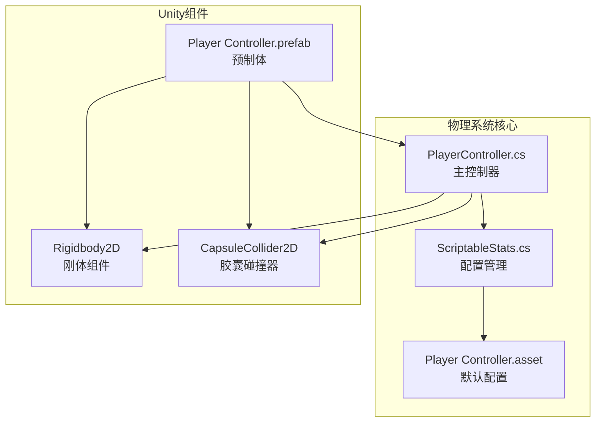
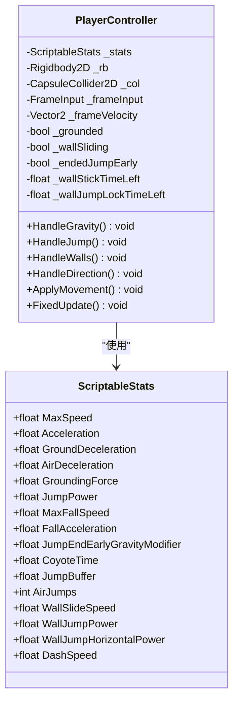
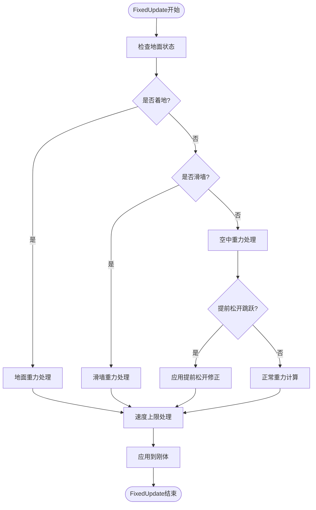
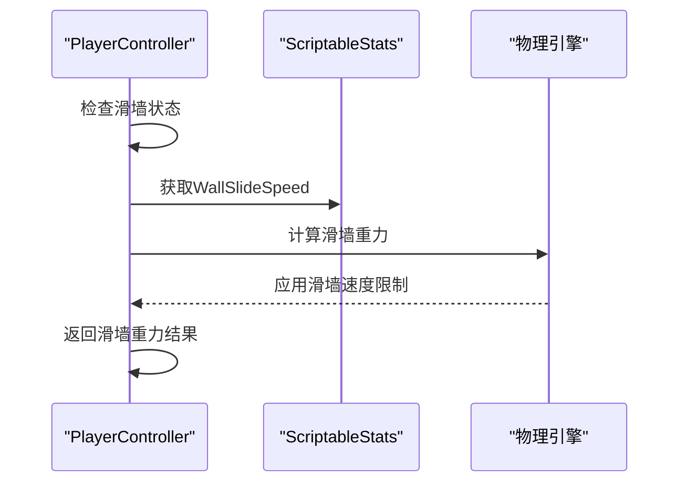
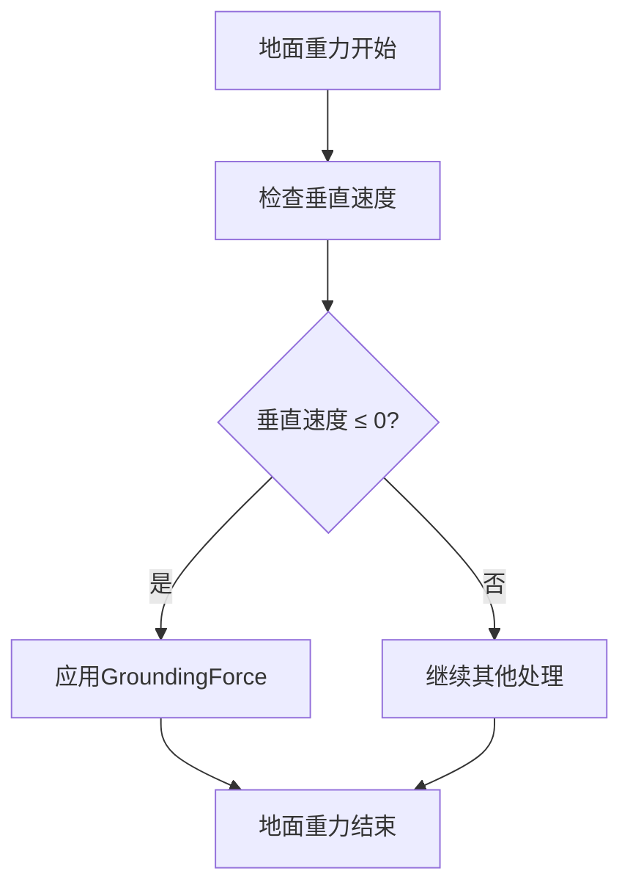
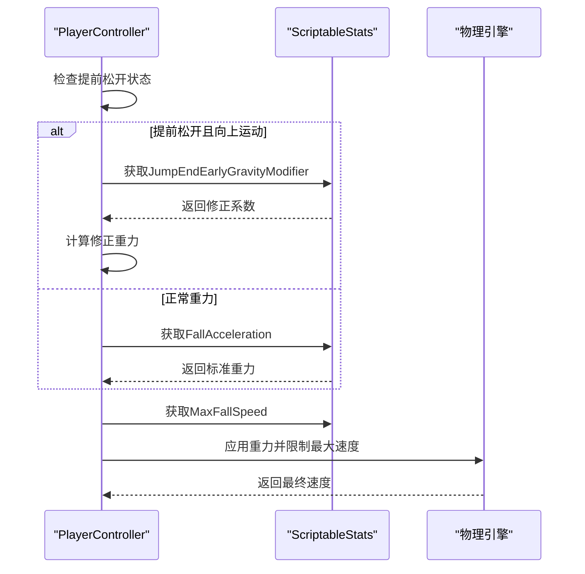
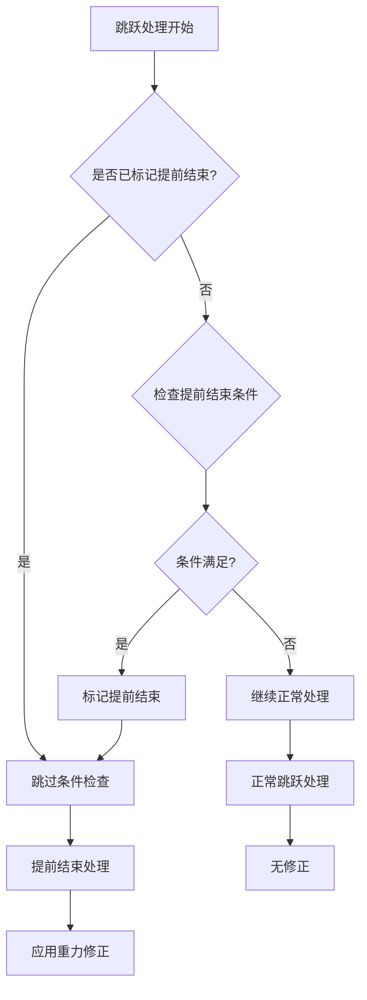
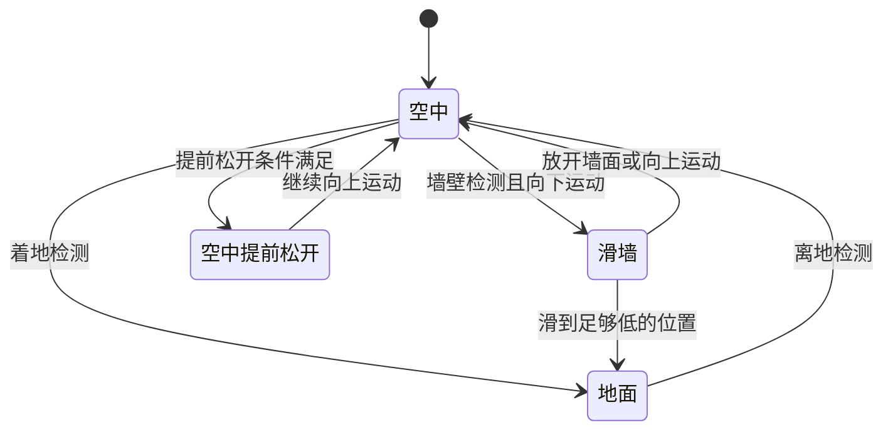
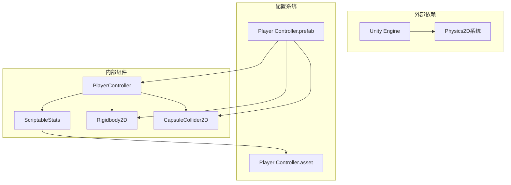
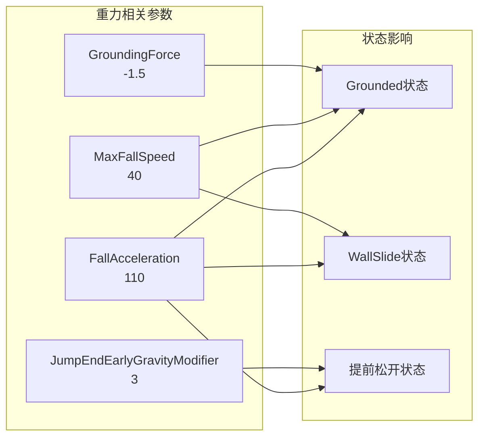

# 重力和物理系统

<cite>
**本文档引用的文件**
- [PlayerController.cs](file://Tarodev 2D Controller/_Scripts/PlayerController.cs)
- [ScriptableStats.cs](file://Tarodev 2D Controller/_Scripts/ScriptableStats.cs)
- [Player Controller.asset](file://Tarodev 2D Controller/Stat Presets/Player Controller.asset)
- [Player Controller.prefab](file://Tarodev 2D Controller/Prefabs/Player Controller.prefab)
</cite>

## 目录
1. [简介](#简介)
2. [项目结构](#项目结构)
3. [核心组件](#核心组件)
4. [架构概览](#架构概览)
5. [详细组件分析](#详细组件分析)
6. [依赖关系分析](#依赖关系分析)
7. [性能考虑](#性能考虑)
8. [故障排除指南](#故障排除指南)
9. [结论](#结论)

## 简介

本文档深入分析了Tarodev 2D Controller中的重力和物理系统，重点解析HandleGravity方法的实现原理。该系统提供了完整的2D平台游戏物理体验，包括地面、空中、滑墙和墙跳状态下的重力处理机制，以及提前结束跳跃的优化处理。

系统采用基于固定时间步长的物理计算，通过ScriptableObject配置管理所有物理参数，确保了高度的可定制性和可调试性。

## 项目结构

重力和物理系统主要分布在以下文件中：



**图表来源**
- [PlayerController.cs:14-45](file://Tarodev 2D Controller/_Scripts/PlayerController.cs#L14-L45)
- [ScriptableStats.cs:6-96](file://Tarodev 2D Controller/_Scripts/ScriptableStats.cs#L6-L96)

**章节来源**
- [PlayerController.cs:14-45](file://Tarodev 2D Controller/_Scripts/PlayerController.cs#L14-L45)
- [ScriptableStats.cs:6-96](file://Tarodev 2D Controller/_Scripts/ScriptableStats.cs#L6-L96)

## 核心组件

### PlayerController类结构

PlayerController是整个物理系统的核心控制器，负责协调所有物理相关的处理逻辑：



**图表来源**
- [PlayerController.cs:14-374](file://Tarodev 2D Controller/_Scripts/PlayerController.cs#L14-L374)
- [ScriptableStats.cs:6-96](file://Tarodev 2D Controller/_Scripts/ScriptableStats.cs#L6-L96)

### 物理参数配置

系统通过ScriptableObject提供全面的物理参数配置：

| 参数类别 | 关键参数 | 默认值 | 描述 |
|---------|---------|--------|------|
| 基础移动 | MaxSpeed, Acceleration | 14, 120 | 最大速度和加速度 |
| 地面摩擦 | GroundDeceleration, GroundingForce | 60, -1.5 | 地面减速和吸附力 |
| 空中控制 | AirDeceleration, FallAcceleration | 30, 110 | 空中减速和重力加速度 |
| 跳跃系统 | JumpPower, JumpEndEarlyGravityModifier | 36, 3 | 跳跃高度和提前松开修正 |
| 极限速度 | MaxFallSpeed | 40 | 下落最大速度限制 |
| 缓冲时间 | CoyoteTime, JumpBuffer | 0.15, 0.2 | 着陆宽容时间和跳跃缓冲 |

**章节来源**
- [ScriptableStats.cs:22-96](file://Tarodev 2D Controller/_Scripts/ScriptableStats.cs#L22-L96)
- [Player Controller.asset:21-44](file://Tarodev 2D Controller/Stat Presets/Player Controller.asset#L21-L44)

## 架构概览

重力系统采用分层架构设计，每个物理状态都有专门的处理逻辑：



**图表来源**
- [PlayerController.cs:78-97](file://Tarodev 2D Controller/_Scripts/PlayerController.cs#L78-L97)
- [PlayerController.cs:324-342](file://Tarodev 2D Controller/_Scripts/PlayerController.cs#L324-L342)

## 详细组件分析

### HandleGravity方法深度解析

HandleGravity是重力系统的核心方法，实现了三种不同的重力处理模式：

#### 滑墙状态重力处理



**图表来源**
- [PlayerController.cs:326-329](file://Tarodev 2D Controller/_Scripts/PlayerController.cs#L326-L329)

滑墙状态下的重力处理具有特殊性：
- 使用WallSlideSpeed作为目标下落速度
- 仍然应用FallAcceleration进行平滑过渡
- 不受JumpEndEarlyGravityModifier影响

#### 地面状态重力处理

地面状态的重力处理相对简单直接：



**图表来源**
- [PlayerController.cs:332-335](file://Tarodev 2D Controller/_Scripts/PlayerController.cs#L332-L335)

地面重力的特点：
- 当垂直速度小于等于0时，直接应用GroundingForce
- 这种恒定的向下力帮助角色稳定贴附在地面或斜坡上
- 防止角色在斜坡上滑动

#### 空中状态重力处理

空中状态是最复杂的重力处理逻辑：



**图表来源**
- [PlayerController.cs:338-341](file://Tarodev 2D Controller/_Scripts/PlayerController.cs#L338-L341)

### 提前结束跳跃机制

提前结束跳跃（JumpEndEarly）是本系统的重要特性，提供了更精确的跳跃控制：

#### 状态检测逻辑



**图表来源**
- [PlayerController.cs:200](file://Tarodev 2D Controller/_Scripts/PlayerController.cs#L200)

提前结束的触发条件：
- 非地面状态
- 未按住跳跃键
- 垂直速度大于0（向上运动）

#### 物理公式推导

重力计算基于匀加速直线运动公式：

**基础重力公式：**
```
v(t) = v₀ + a × t
```

其中：
- v(t) = 当前垂直速度
- v₀ = 初始垂直速度  
- a = 重力加速度（FallAcceleration）
- t = 固定时间步长（Time.fixedDeltaTime）

**提前松开修正：**
```
a_effective = a × JumpEndEarlyGravityModifier
```

当玩家在上升过程中提前松开跳跃键时，系统将重力加速度乘以JumpEndEarlyGravityModifier，实现更快的下落效果，创造更精确的跳跃控制体验。

**章节来源**
- [PlayerController.cs:324-342](file://Tarodev 2D Controller/_Scripts/PlayerController.cs#L324-L342)
- [PlayerController.cs:198-213](file://Tarodev 2D Controller/_Scripts/PlayerController.cs#L198-L213)

### 状态转换机制

系统支持四种主要状态的重力处理：

#### 状态对比表

| 状态 | 条件 | 重力处理方式 | 特殊属性 |
|------|------|-------------|----------|
| 地面 | grounded = true | 直接应用GroundingForce | 无 |
| 滑墙 | wallSliding = true | 限制下落速度至WallSlideSpeed | 受重力修正影响 |
| 空中正常 | grounded = false | 标准重力加速，受MaxFallSpeed限制 | 可被提前松开修正 |
| 空中提前松开 | _endedJumpEarly = true | 重力×JumpEndEarlyGravityModifier | 更快下落 |

#### 状态转换流程



**图表来源**
- [PlayerController.cs:107-143](file://Tarodev 2D Controller/_Scripts/PlayerController.cs#L107-L143)
- [PlayerController.cs:324-342](file://Tarodev 2D Controller/_Scripts/PlayerController.cs#L324-L342)

**章节来源**
- [PlayerController.cs:107-143](file://Tarodev 2D Controller/_Scripts/PlayerController.cs#L107-L143)
- [PlayerController.cs:324-342](file://Tarodev 2D Controller/_Scripts/PlayerController.cs#L324-L342)

## 依赖关系分析

### 组件耦合关系



**图表来源**
- [PlayerController.cs:16-45](file://Tarodev 2D Controller/_Scripts/PlayerController.cs#L16-L45)
- [Player Controller.prefab:47-112](file://Tarodev 2D Controller/Prefabs/Player Controller.prefab#L47-L112)

### 物理参数依赖

重力系统的关键参数相互依赖关系：



**图表来源**
- [ScriptableStats.cs:48-52](file://Tarodev 2D Controller/_Scripts/ScriptableStats.cs#L48-L52)
- [Player Controller.asset:28-30](file://Tarodev 2D Controller/Stat Presets/Player Controller.asset#L28-L30)

**章节来源**
- [ScriptableStats.cs:48-52](file://Tarodev 2D Controller/_Scripts/ScriptableStats.cs#L48-L52)
- [Player Controller.asset:28-30](file://Tarodev 2D Controller/Stat Presets/Player Controller.asset#L28-L30)

## 性能考虑

### 时间步长优化

系统采用固定时间步长（Time.fixedDeltaTime）进行物理计算，确保了：

1. **确定性行为**：相同的物理参数在不同帧率下产生相同的结果
2. **稳定性**：避免了变量时间步长导致的物理不稳定
3. **可预测性**：玩家可以预期一致的物理反馈

### 内存访问优化

- 所有物理参数通过ScriptableObject集中管理，减少重复内存分配
- 使用局部变量缓存常用参数，避免频繁的属性访问
- 合理的状态标志位设计，减少不必要的条件检查

### 物理计算复杂度

重力计算的时间复杂度为O(1)，空间复杂度也为O(1)，具有优秀的性能表现。

## 故障排除指南

### 常见问题诊断

#### 问题1：角色无法正确着地
**症状**：角色在平台上方悬空或穿透平台
**可能原因**：
- GrounderDistance设置过小
- PlayerLayer配置错误
- Collider尺寸不匹配

**解决方案**：
1. 检查GrounderDistance参数（默认0.05）
2. 验证PlayerLayer设置
3. 确认CapsuleCollider尺寸与角色模型匹配

#### 问题2：跳跃高度不符合预期
**症状**：跳跃显得过高或过低
**可能原因**：
- JumpPower设置不当
- FallAcceleration过大或过小
- JumpEndEarlyGravityModifier影响跳跃感觉

**解决方案**：
1. 调整JumpPower参数
2. 适当调整FallAcceleration
3. 测试JumpEndEarlyGravityModifier对跳跃感觉的影响

#### 问题3：滑墙功能异常
**症状**：滑墙时速度过快或过慢
**可能原因**：
- WallSlideSpeed设置不合理
- FallAcceleration影响滑墙速度
- WallDetectionDistance过小

**解决方案**：
1. 调整WallSlideSpeed参数
2. 检查WallDetectionDistance设置
3. 验证滑墙状态检测逻辑

### 调试技巧

#### 实时监控工具
1. **Velocity监控**：观察垂直速度变化验证重力计算
2. **状态标志**：监控grounded、wallSliding等状态标志
3. **参数可视化**：在编辑器中实时查看ScriptableStats参数

#### 物理调试建议
1. **逐步调整**：每次只调整一个参数，观察效果
2. **对比测试**：在不同场景下测试重力效果
3. **性能测试**：确保物理更新不会影响帧率

**章节来源**
- [PlayerController.cs:348-353](file://Tarodev 2D Controller/_Scripts/PlayerController.cs#L348-L353)

## 结论

Tarodev 2D Controller的重力和物理系统展现了优秀的工程设计：

### 设计优势

1. **模块化架构**：清晰的状态分离和职责划分
2. **参数化配置**：通过ScriptableObject实现高度可定制
3. **性能优化**：固定时间步长和高效的算法实现
4. **用户体验**：提供精确的跳跃控制和流畅的物理反馈

### 技术亮点

- **提前松开机制**：通过JumpEndEarlyGravityModifier实现更精确的跳跃控制
- **多状态重力处理**：针对不同状态提供专门的物理处理
- **速度限制系统**：MaxFallSpeed确保物理稳定性
- **滑墙系统**：完整的墙面交互物理实现

### 应用建议

该系统适用于各种2D平台游戏，特别是需要精确控制和流畅物理体验的游戏类型。通过合理调整ScriptableStats中的参数，可以适应不同类型的游戏风格和玩家偏好。

系统的设计为后续扩展提供了良好的基础，如添加更多物理状态、实现更复杂的碰撞检测等。