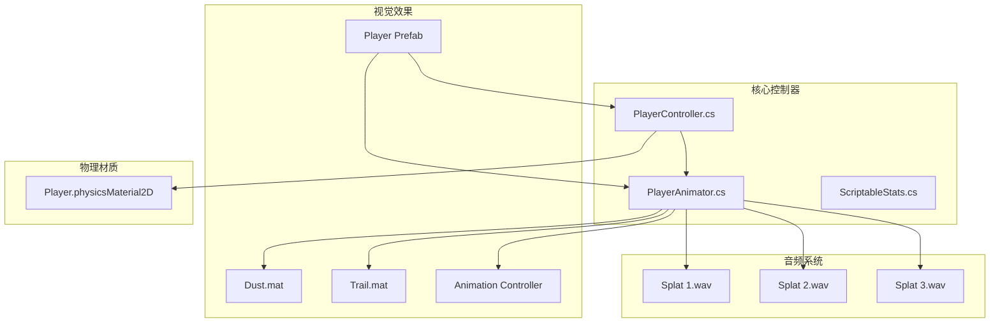
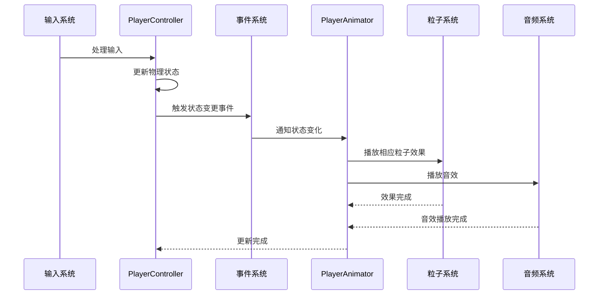
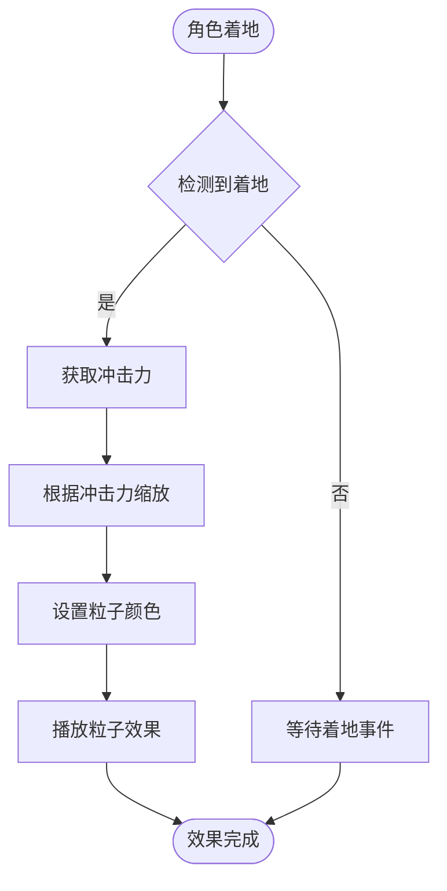
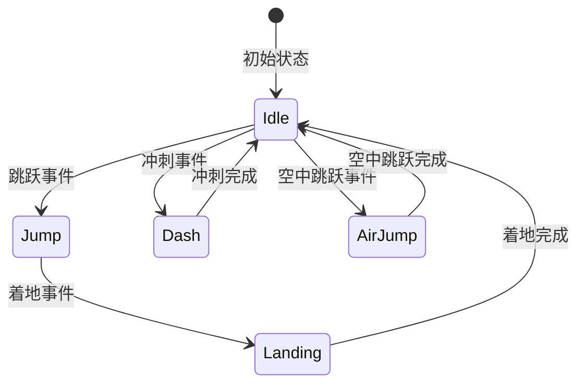
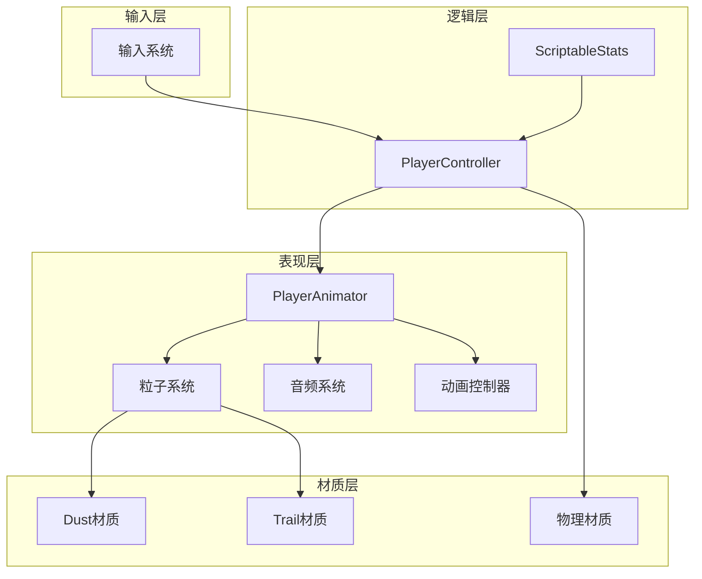

# 视觉效果系统

<cite>
**本文档引用的文件**
- [PlayerController.cs](file://Tarodev 2D Controller/_Scripts/PlayerController.cs)
- [PlayerAnimator.cs](file://Tarodev 2D Controller/_Scripts/PlayerAnimator.cs)
- [Dust.mat](file://Tarodev 2D Controller/Materials/Dust.mat)
- [Trail.mat](file://Tarodev 2D Controller/Materials/Trail.mat)
- [Player.physicsMaterial2D](file://Tarodev 2D Controller/Materials/Player.physicsMaterial2D)
- [Player Controller.asset](file://Tarodev 2D Controller/Stat Presets/Player Controller.asset)
- [Player Controller.prefab](file://Tarodev 2D Controller/Prefabs/Player Controller.prefab)
- [Visual.controller](file://Tarodev 2D Controller/Animation/Visual.controller)
- [Splat 1.wav.meta](file://Tarodev 2D Controller/Audio/Splat 1.wav.meta)
- [Splat 2.wav.meta](file://Tarodev 2D Controller/Audio/Splat 2.wav.meta)
- [Splat 3.wav.meta](file://Tarodev 2D Controller/Audio/Splat 3.wav.meta)
</cite>

## 目录
1. [简介](#简介)
2. [项目结构](#项目结构)
3. [核心组件](#核心组件)
4. [架构概览](#架构概览)
5. [详细组件分析](#详细组件分析)
6. [依赖关系分析](#依赖关系分析)
7. [性能考虑](#性能考虑)
8. [故障排除指南](#故障排除指南)
9. [结论](#结论)

## 简介

本项目是一个完整的2D平台游戏控制器，专注于提供流畅的视觉反馈和音效体验。系统通过精心设计的粒子效果、材质系统和音频反馈，为玩家提供了丰富的触觉和听觉体验。

视觉效果系统主要包含三个核心部分：
- **粒子效果系统**：实现地面灰尘、移动轨迹、跳跃和冲刺等视觉反馈
- **材质系统**：管理物理材质、渲染材质和特殊效果材质
- **音效集成**：提供跳跃落地音效、冲刺音效等音频反馈

## 项目结构

项目采用模块化组织方式，将功能相关的文件按类别分组：

**图表来源**
- [PlayerController.cs:1-374](file://Tarodev 2D Controller/_Scripts/PlayerController.cs#L1-L374)
- [PlayerAnimator.cs:1-178](file://Tarodev 2D Controller/_Scripts/PlayerAnimator.cs#L1-L178)
- [Dust.mat:1-111](file://Tarodev 2D Controller/Materials/Dust.mat#L1-L111)
- [Trail.mat:1-92](file://Tarodev 2D Controller/Materials/Trail.mat#L1-L92)

**章节来源**
- [PlayerController.cs:1-374](file://Tarodev 2D Controller/_Scripts/PlayerController.cs#L1-L374)
- [PlayerAnimator.cs:1-178](file://Tarodev 2D Controller/_Scripts/PlayerAnimator.cs#L1-L178)

## 核心组件

### 控制器组件

系统的核心是PlayerController类，它负责处理所有玩家输入和物理交互：

- **输入处理**：支持键盘和手柄输入，提供死区设置和按键缓冲
- **物理模拟**：实现精确的2D物理运动，包括跳跃、冲刺、墙面滑动等功能
- **状态管理**：跟踪玩家状态（着地、空中、冲刺等）并触发相应的事件

### 动画组件

PlayerAnimator类专门负责视觉效果的呈现：

- **粒子系统管理**：协调多个粒子系统的播放和颜色匹配
- **音频播放**：根据游戏状态播放相应的音效
- **动画控制**：与Animator控制器配合实现流畅的角色动画

**章节来源**
- [PlayerController.cs:14-374](file://Tarodev 2D Controller/_Scripts/PlayerController.cs#L14-L374)
- [PlayerAnimator.cs:8-178](file://Tarodev 2D Controller/_Scripts/PlayerAnimator.cs#L8-L178)

## 架构概览

视觉效果系统的整体架构采用事件驱动模式，通过接口在控制器和动画组件之间传递状态变化：

**图表来源**
- [PlayerController.cs:29-37](file://Tarodev 2D Controller/_Scripts/PlayerController.cs#L29-L37)
- [PlayerAnimator.cs:43-61](file://Tarodev 2D Controller/_Scripts/PlayerAnimator.cs#L43-L61)

## 详细组件分析

### 粒子效果系统

#### 地面灰尘效果

地面灰尘效果通过Dust材质实现，该材质使用透明混合渲染模式：

**图表来源**
- [PlayerAnimator.cs:108-128](file://Tarodev 2D Controller/_Scripts/PlayerAnimator.cs#L108-L128)
- [Dust.mat:10-21](file://Tarodev 2D Controller/Materials/Dust.mat#L10-L21)

#### 移动轨迹效果

移动轨迹通过Trail材质实现，支持动态颜色匹配：

- **颜色检测**：使用射线检测地面颜色
- **渐变生成**：创建颜色渐变范围
- **实时更新**：根据地面材质动态调整粒子颜色

#### 跳跃和冲刺效果

系统为不同动作提供专门的粒子效果：

- **跳跃粒子**：在起跳时播放
- **冲刺粒子**：在冲刺开始时播放
- **双跳粒子**：在空中二次跳跃时播放
- **冲刺环形效果**：提供视觉引导

**章节来源**
- [PlayerAnimator.cs:21-27](file://Tarodev 2D Controller/_Scripts/PlayerAnimator.cs#L21-L27)
- [PlayerAnimator.cs:94-154](file://Tarodev 2D Controller/_Scripts/PlayerAnimator.cs#L94-L154)

### 材质系统

#### 物理材质

Player.physicsMaterial2D配置为零摩擦零弹性，确保玩家可以自由滑动：

- **摩擦系数**：0（无摩擦）
- **弹性系数**：0（完全非弹性）
- **适用场景**：提供真实的滑行动作

#### 渲染材质

Dust.mat和Trail.mat分别服务于不同的视觉效果：

**Dust.mat特性**：
- 使用透明混合渲染（_ALPHABLEND_ON）
- 自定义着色器（Shader: 211）
- 支持粒子透明度控制
- 适用于地面灰尘效果

**Trail.mat特性**：
- 使用特殊着色器（Shader: 10755）
- 支持轨迹渲染
- 提供视觉引导效果

**章节来源**
- [Player.physicsMaterial2D:1-12](file://Tarodev 2D Controller/Materials/Player.physicsMaterial2D#L1-L12)
- [Dust.mat:10-111](file://Tarodev 2D Controller/Materials/Dust.mat#L10-L111)
- [Trail.mat:10-92](file://Tarodev 2D Controller/Materials/Trail.mat#L10-L92)

### 音效集成机制

#### 音效触发时机

音效系统通过事件驱动的方式工作：

**图表来源**
- [PlayerController.cs:30-34](file://Tarodev 2D Controller/_Scripts/PlayerController.cs#L30-L34)
- [PlayerAnimator.cs:45-58](file://Tarodev 2D Controller/_Scripts/PlayerAnimator.cs#L45-L58)

#### 音效播放控制

系统集成了三个不同的着陆音效，随机播放以增加多样性：

- **Splat 1.wav**：基础着陆音效
- **Splat 2.wav**：变体音效
- **Splat 3.wav**：变体音效

音效播放具有以下特性：
- 使用PlayOneShot()方法避免音频冲突
- 随机选择音效文件
- 支持3D音频定位

**章节来源**
- [PlayerAnimator.cs:29-32](file://Tarodev 2D Controller/_Scripts/PlayerAnimator.cs#L29-L32)
- [PlayerAnimator.cs:118](file://Tarodev 2D Controller/_Scripts/PlayerAnimator.cs#L118)

### 动画系统

#### 动画控制器

Visual.controller管理角色动画状态转换：

- **Idle状态**：基础站立动画
- **Jump状态**：跳跃动画
- **Land状态**：着陆动画
- **参数控制**：IdleSpeed、Grounded、Jump等参数

#### 动画参数

系统使用以下关键参数控制动画行为：

- **IdleSpeed**：控制闲置动画速度
- **Grounded**：着地状态触发器
- **Jump**：跳跃状态触发器

**章节来源**
- [Visual.controller:136-154](file://Tarodev 2D Controller/Animation/Visual.controller#L136-L154)
- [PlayerAnimator.cs:81-92](file://Tarodev 2D Controller/_Scripts/PlayerAnimator.cs#L81-L92)

## 依赖关系分析

视觉效果系统的依赖关系清晰明确：

**图表来源**
- [PlayerController.cs:16](file://Tarodev 2D Controller/_Scripts/PlayerController.cs#L16)
- [PlayerAnimator.cs:10-13](file://Tarodev 2D Controller/_Scripts/PlayerAnimator.cs#L10-L13)

**章节来源**
- [PlayerController.cs:16-21](file://Tarodev 2D Controller/_Scripts/PlayerController.cs#L16-L21)
- [PlayerAnimator.cs:32-40](file://Tarodev 2D Controller/_Scripts/PlayerAnimator.cs#L32-L40)

## 性能考虑

### 粒子系统优化

1. **生命周期管理**：所有粒子系统都有明确的生命周期，避免内存泄漏
2. **批量播放**：使用统一的播放和停止方法管理粒子系统
3. **颜色缓存**：缓存当前地面颜色，减少重复计算

### 材质优化

1. **渲染队列**：Dust材质使用透明渲染队列（3000），确保正确的渲染顺序
2. **着色器选择**：根据效果需求选择合适的着色器类型
3. **纹理管理**：合理配置纹理属性，避免不必要的GPU开销

### 音频优化

1. **一次性播放**：使用PlayOneShot()避免音频重叠
2. **预加载音频**：所有音频文件都设置为预加载
3. **3D音频**：启用3D音频定位提高空间感

## 故障排除指南

### 常见问题及解决方案

#### 粒子效果不显示

**可能原因**：
- 粒子系统未正确挂载到对象上
- 材质设置错误
- 粒子系统被意外停止

**解决步骤**：
1. 检查PlayerAnimator中的粒子系统引用
2. 验证材质是否正确应用
3. 确认粒子系统在着地事件时被正确播放

#### 音效不播放

**可能原因**：
- 音频源组件缺失
- 音频剪辑未正确导入
- 音量设置过低

**解决步骤**：
1. 确保对象上有AudioSource组件
2. 检查音频文件格式和导入设置
3. 验证音频源的音量和音效开关

#### 动画不流畅

**可能原因**：
- 动画控制器配置错误
- 参数值设置不当
- 动画帧率问题

**解决步骤**：
1. 检查动画控制器的状态转换
2. 验证关键参数的数值范围
3. 确认动画文件的导入设置

**章节来源**
- [PlayerAnimator.cs:43-61](file://Tarodev 2D Controller/_Scripts/PlayerAnimator.cs#L43-L61)
- [PlayerAnimator.cs:156-164](file://Tarodev 2D Controller/_Scripts/PlayerAnimator.cs#L156-L164)

## 结论

本视觉效果系统通过精心设计的粒子效果、材质管理和音效集成，为2D平台游戏提供了丰富而流畅的视觉体验。系统采用事件驱动架构，确保各个组件之间的松耦合和高内聚。

### 主要优势

1. **模块化设计**：各组件职责明确，易于维护和扩展
2. **事件驱动**：通过事件系统实现组件间的解耦
3. **性能优化**：合理的资源管理和生命周期控制
4. **可定制性强**：支持材质和音效的灵活替换

### 扩展建议

1. **添加更多粒子效果**：如滑铲、抓墙等特殊动作效果
2. **增强音效系统**：添加环境音效和动态音量控制
3. **材质系统增强**：支持更多材质类型和动态效果
4. **性能监控**：添加性能统计和优化建议

该系统为2D平台游戏开发提供了优秀的视觉效果基础，开发者可以根据具体需求进行进一步的定制和扩展。