# 配置系统详解

<cite>
**本文档引用的文件**
- [ScriptableStats.cs](file://Tarodev 2D Controller/_Scripts/ScriptableStats.cs)
- [PlayerController.cs](file://Tarodev 2D Controller/_Scripts/PlayerController.cs)
- [Player Controller.asset](file://Tarodev 2D Controller/Stat Presets/Player Controller.asset)
- [PlayerAnimator.cs](file://Tarodev 2D Controller/_Scripts/PlayerAnimator.cs)
- [Player Controller.prefab](file://Tarodev 2D Controller/Prefabs/Player Controller.prefab)
- [Player.physicsMaterial2D](file://Tarodev 2D Controller/Materials/Player.physicsMaterial2D)
</cite>

## 目录
1. [简介](#简介)
2. [项目结构](#项目结构)
3. [核心组件](#核心组件)
4. [架构概览](#架构概览)
5. [详细组件分析](#详细组件分析)
6. [依赖关系分析](#依赖关系分析)
7. [性能考量](#性能考量)
8. [故障排除指南](#故障排除指南)
9. [结论](#结论)
10. [附录](#附录)

## 简介

ScriptableStats是Tarodev 2D Controller中一个关键的配置系统组件，它基于Unity的ScriptableObject机制来管理游戏参数。这个系统提供了灵活且可重用的游戏配置管理方式，使得开发者能够轻松调整角色行为而不必修改代码。

ScriptableObject的优势在于：
- **持久化存储**：配置数据保存在独立的资源文件中
- **版本控制友好**：每个配置集都是独立的资产文件
- **运行时可切换**：可以在不重启场景的情况下切换不同的配置
- **团队协作**：多个开发者可以同时编辑不同的配置集
- **可视化编辑**：通过Unity Inspector直观地调整参数

## 项目结构

该项目采用模块化的文件组织方式，主要包含以下目录结构：

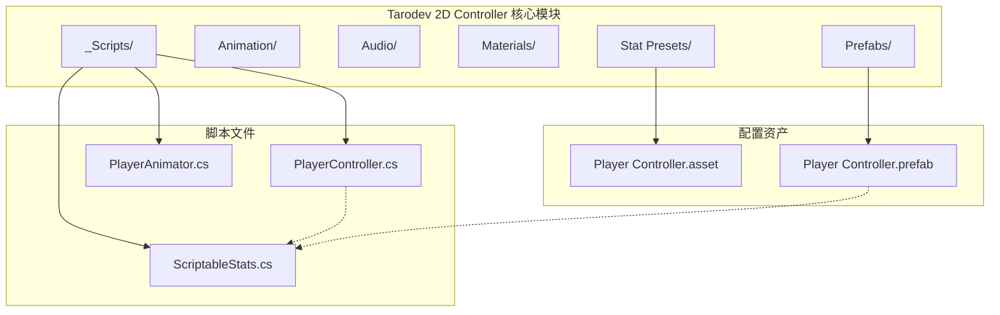

**图表来源**
- [ScriptableStats.cs:1-97](file://Tarodev 2D Controller/_Scripts/ScriptableStats.cs#L1-L97)
- [PlayerController.cs:1-374](file://Tarodev 2D Controller/_Scripts/PlayerController.cs#L1-L374)
- [Player Controller.asset:1-44](file://Tarodev 2D Controller/Stat Presets/Player Controller.asset#L1-L44)

**章节来源**
- [ScriptableStats.cs:1-97](file://Tarodev 2D Controller/_Scripts/ScriptableStats.cs#L1-L97)
- [PlayerController.cs:1-374](file://Tarodev 2D Controller/_Scripts/PlayerController.cs#L1-L374)

## 核心组件

### ScriptableStats配置系统

ScriptableStats类是整个配置系统的核心，它继承自ScriptableObject并定义了所有游戏参数的配置项。该类采用了分组注解来组织参数，使其具有良好的可读性和维护性。

#### 主要特性
- **分组管理**：使用Header属性将相关参数组织成逻辑分组
- **可视化提示**：每个参数都有详细的Tooltips说明
- **范围限制**：使用Range属性限制参数的有效范围
- **默认值**：为每个参数提供了合理的默认值

#### 参数分类
系统将配置参数分为以下几个主要类别：

1. **层级设置**：管理玩家角色的物理层
2. **输入设置**：处理输入设备的死区和灵敏度
3. **移动设置**：控制角色的移动行为
4. **跳跃设置**：管理跳跃相关的物理参数
5. **空中选项**：处理二段跳和其他空中能力
6. **墙壁交互**：管理墙壁攀爬和滑行
7. **冲刺设置**：控制冲刺功能的行为

**章节来源**
- [ScriptableStats.cs:5-97](file://Tarodev 2D Controller/_Scripts/ScriptableStats.cs#L5-L97)

## 架构概览

ScriptableStats配置系统采用典型的MVC架构模式，其中ScriptableStats作为模型层，PlayerController作为控制器层，PlayerAnimator作为视图层。

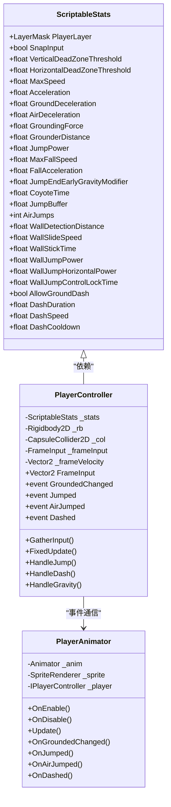

**图表来源**
- [ScriptableStats.cs:6-97](file://Tarodev 2D Controller/_Scripts/ScriptableStats.cs#L6-L97)
- [PlayerController.cs:14-374](file://Tarodev 2D Controller/_Scripts/PlayerController.cs#L14-L374)
- [PlayerAnimator.cs:8-178](file://Tarodev 2D Controller/_Scripts/PlayerAnimator.cs#L8-L178)

### 数据流架构

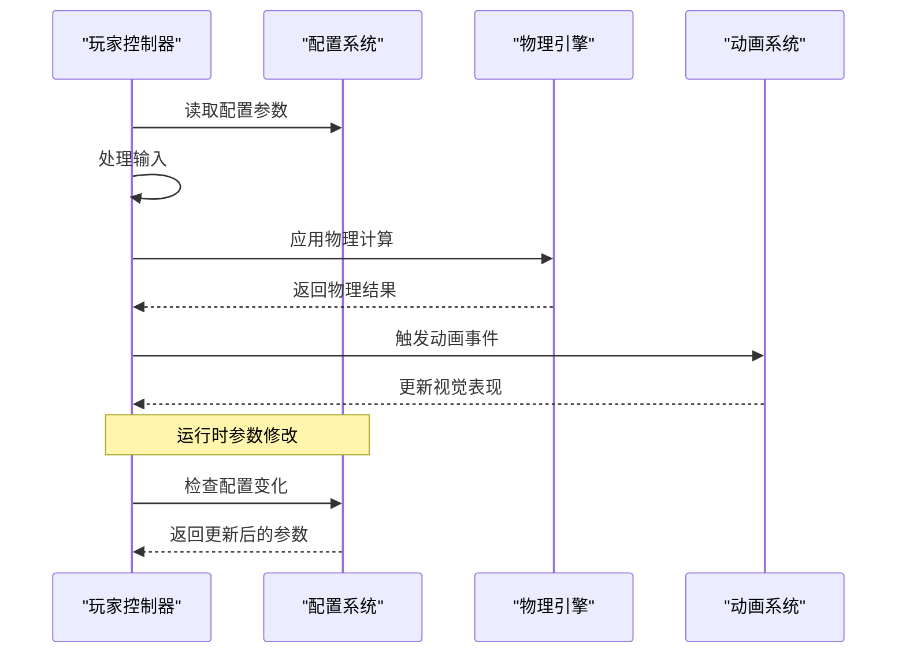

**图表来源**
- [PlayerController.cs:47-97](file://Tarodev 2D Controller/_Scripts/PlayerController.cs#L47-L97)
- [PlayerAnimator.cs:43-61](file://Tarodev 2D Controller/_Scripts/PlayerAnimator.cs#L43-L61)

## 详细组件分析

### 输入处理系统

#### 死区阈值设置

输入系统采用了死区阈值机制来处理手柄和键盘输入的一致性问题：

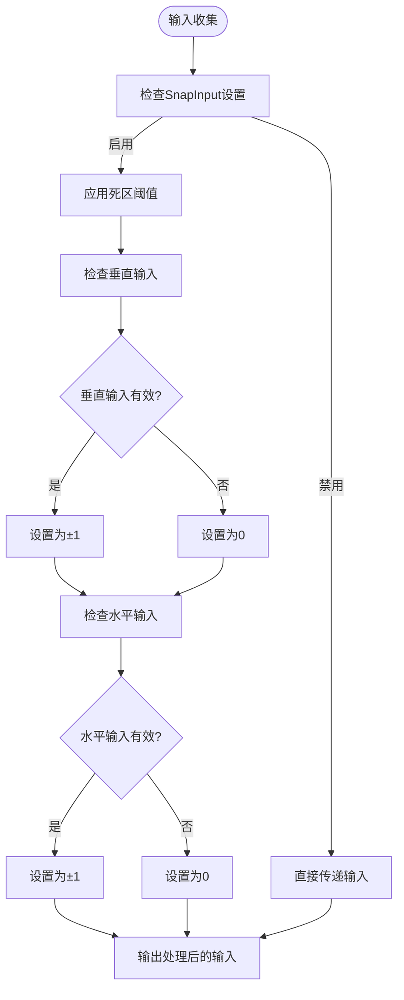

**图表来源**
- [PlayerController.cs:53-76](file://Tarodev 2D Controller/_Scripts/PlayerController.cs#L53-L76)

#### 参数说明

| 参数名称 | 默认值 | 范围 | 描述 |
|---------|--------|------|------|
| SnapInput | true | 布尔值 | 是否将输入值四舍五入到整数 |
| VerticalDeadZoneThreshold | 0.3f | 0.01-0.99 | 竖直方向死区阈值 |
| HorizontalDeadZoneThreshold | 0.1f | 0.01-0.99 | 水平方向死区阈值 |

**章节来源**
- [ScriptableStats.cs:13-20](file://Tarodev 2D Controller/_Scripts/ScriptableStats.cs#L13-L20)
- [PlayerController.cs:63-67](file://Tarodev 2D Controller/_Scripts/PlayerController.cs#L63-L67)

### 移动控制系统

#### 加速和减速机制

移动系统实现了基于物理的加速和减速算法：

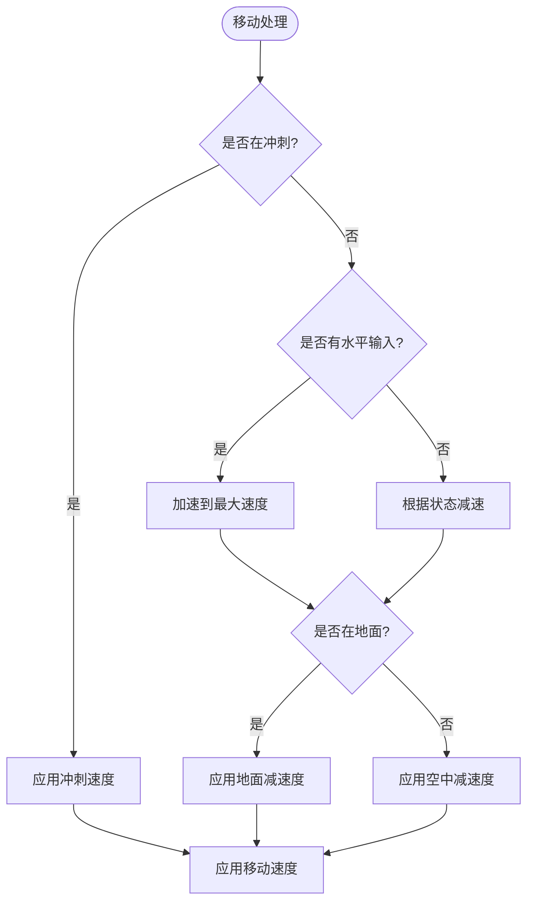

**图表来源**
- [PlayerController.cs:247-266](file://Tarodev 2D Controller/_Scripts/PlayerController.cs#L247-L266)

#### 移动参数配置

| 参数名称 | 默认值 | 单位 | 描述 |
|---------|--------|------|------|
| MaxSpeed | 14 | 单位/秒 | 最大移动速度 |
| Acceleration | 120 | 单位/秒² | 加速度 |
| GroundDeceleration | 60 | 单位/秒² | 地面减速度 |
| AirDeceleration | 30 | 单位/秒² | 空中减速度 |
| GroundingForce | -1.5 | 单位/秒 | 地面吸附力 |
| GrounderDistance | 0.05 | 单位 | 地面检测距离 |

**章节来源**
- [ScriptableStats.cs:22-40](file://Tarodev 2D Controller/_Scripts/ScriptableStats.cs#L22-L40)
- [PlayerController.cs:259-265](file://Tarodev 2D Controller/_Scripts/PlayerController.cs#L259-L265)

### 跳跃系统

#### 跳跃物理模型

跳跃系统实现了复杂的物理模拟，包括预跳缓冲、Coyote时间等高级特性：

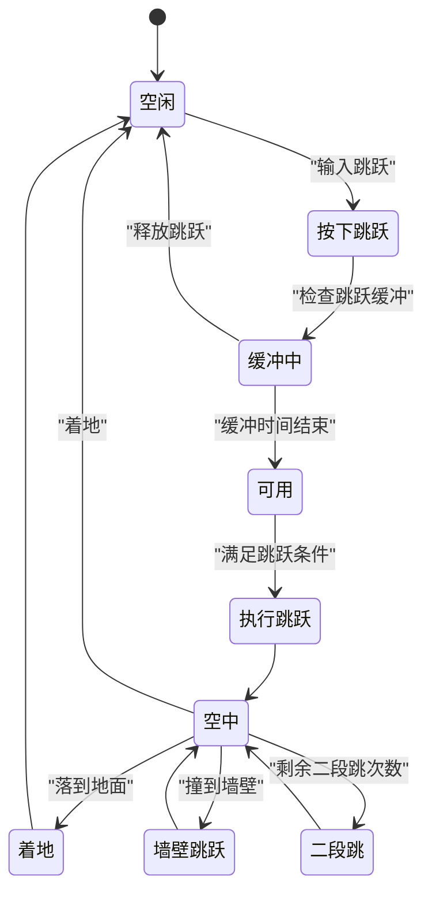

**图表来源**
- [PlayerController.cs:195-213](file://Tarodev 2D Controller/_Scripts/PlayerController.cs#L195-L213)

#### 跳跃参数配置

| 参数名称 | 默认值 | 单位 | 描述 |
|---------|--------|------|------|
| JumpPower | 36 | 单位/秒 | 跳跃初始速度 |
| MaxFallSpeed | 40 | 单位/秒 | 最大下落速度 |
| FallAcceleration | 110 | 单位/秒² | 下落加速度 |
| JumpEndEarlyGravityModifier | 3 | 倍数 | 提前松开重力倍数 |
| CoyoteTime | 0.15 | 秒 | 离地宽容时间 |
| JumpBuffer | 0.2 | 秒 | 跳跃缓冲时间 |
| AirJumps | 1 | 次数 | 空中跳跃次数 |

**章节来源**
- [ScriptableStats.cs:41-59](file://Tarodev 2D Controller/_Scripts/ScriptableStats.cs#L41-L59)
- [PlayerController.cs:195-213](file://Tarodev 2D Controller/_Scripts/PlayerController.cs#L195-L213)

### 墙壁交互系统

#### 墙壁检测和滑行机制

墙壁系统提供了完整的墙壁攀爬、滑行和跳跃功能：

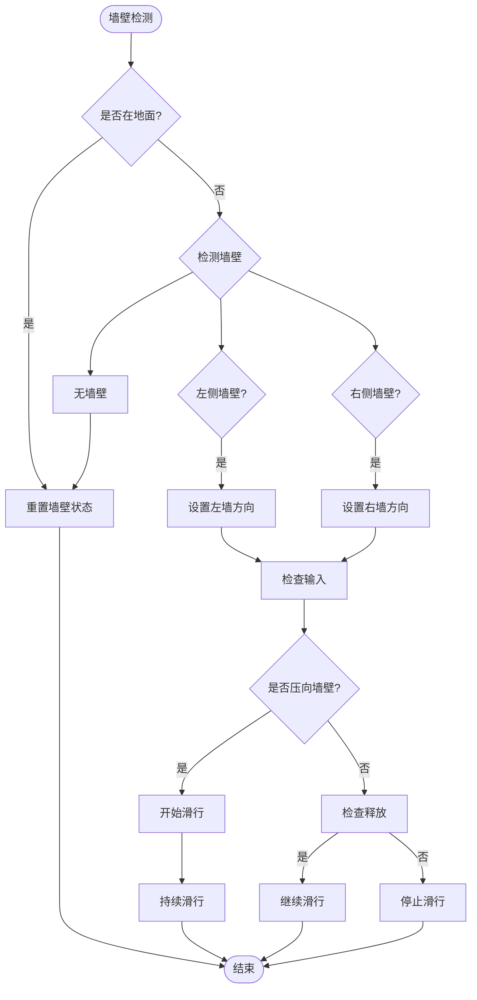

**图表来源**
- [PlayerController.cs:149-182](file://Tarodev 2D Controller/_Scripts/PlayerController.cs#L149-L182)

#### 墙壁参数配置

| 参数名称 | 默认值 | 单位 | 描述 |
|---------|--------|------|------|
| WallDetectionDistance | 0.05 | 单位 | 墙壁检测距离 |
| WallSlideSpeed | 5 | 单位/秒 | 墙壁滑行速度 |
| WallStickTime | 0.15 | 秒 | 墙壁抓取保持时间 |
| WallJumpPower | 30 | 单位/秒 | 墙壁跳跃垂直速度 |
| WallJumpHorizontalPower | 18 | 单位/秒 | 墙壁跳跃水平速度 |
| WallJumpControlLockTime | 0.12 | 秒 | 墙壁跳跃控制锁定时间 |

**章节来源**
- [ScriptableStats.cs:64-82](file://Tarodev 2D Controller/_Scripts/ScriptableStats.cs#L64-L82)
- [PlayerController.cs:164-181](file://Tarodev 2D Controller/_Scripts/PlayerController.cs#L164-L181)

### 冲刺系统

#### 冲刺物理实现

冲刺系统提供了基于时间的瞬时加速机制：

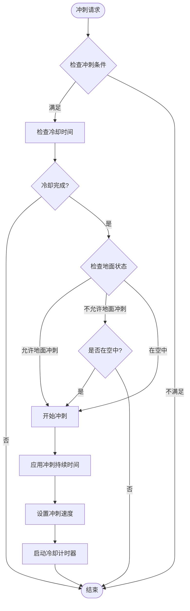

**图表来源**
- [PlayerController.cs:278-296](file://Tarodev 2D Controller/_Scripts/PlayerController.cs#L278-L296)

#### 冲刺参数配置

| 参数名称 | 默认值 | 单位 | 描述 |
|---------|--------|------|------|
| AllowGroundDash | false | 布尔值 | 是否允许地面冲刺 |
| DashDuration | 0.12 | 秒 | 冲刺持续时间 |
| DashSpeed | 24 | 单位/秒 | 冲刺速度 |
| DashCooldown | 0.2 | 秒 | 冲刺冷却时间 |

**章节来源**
- [ScriptableStats.cs:83-95](file://Tarodev 2D Controller/_Scripts/ScriptableStats.cs#L83-L95)
- [PlayerController.cs:298-318](file://Tarodev 2D Controller/_Scripts/PlayerController.cs#L298-L318)

## 依赖关系分析

### 组件间依赖关系

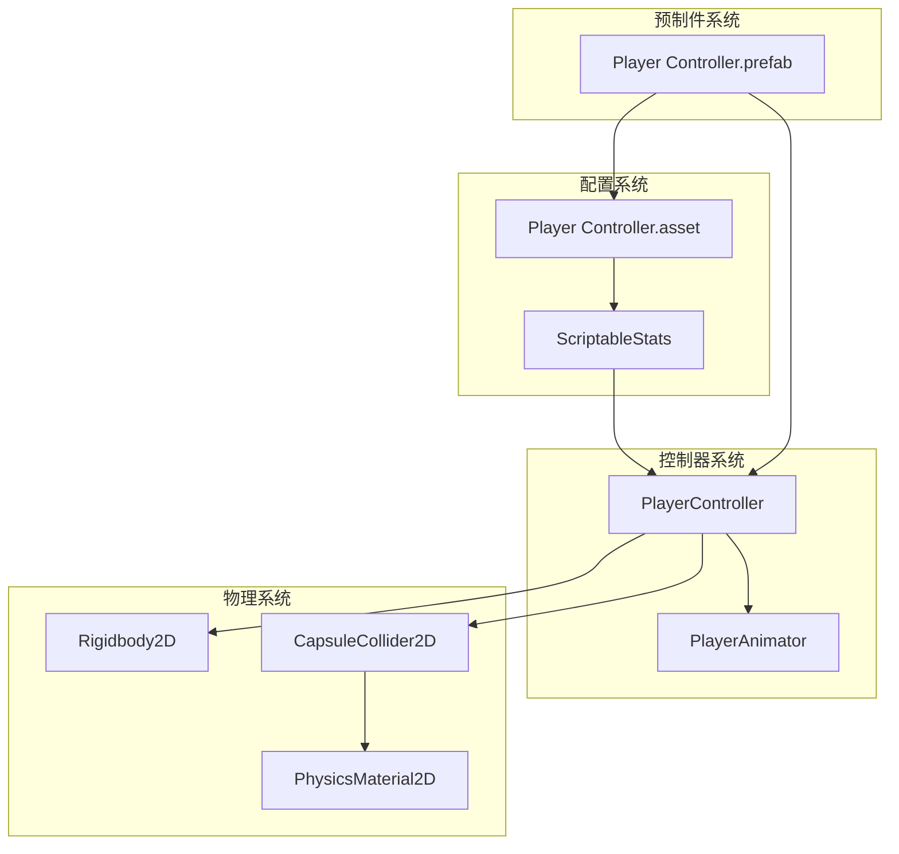

**图表来源**
- [PlayerController.cs:16-45](file://Tarodev 2D Controller/_Scripts/PlayerController.cs#L16-L45)
- [Player Controller.prefab:47-50](file://Tarodev 2D Controller/Prefabs/Player Controller.prefab#L47-L50)

### 参数相互影响关系

#### 移动参数平衡

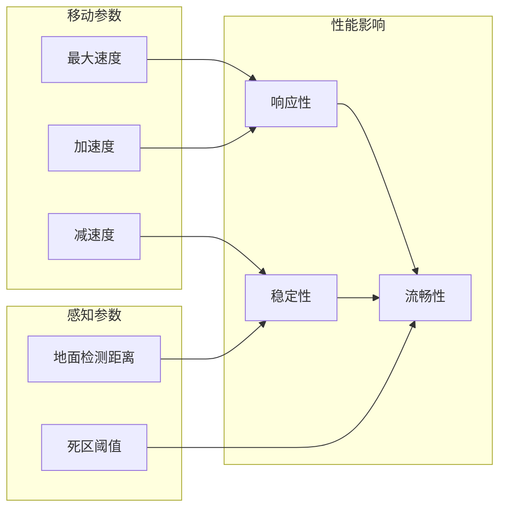

#### 跳跃参数平衡

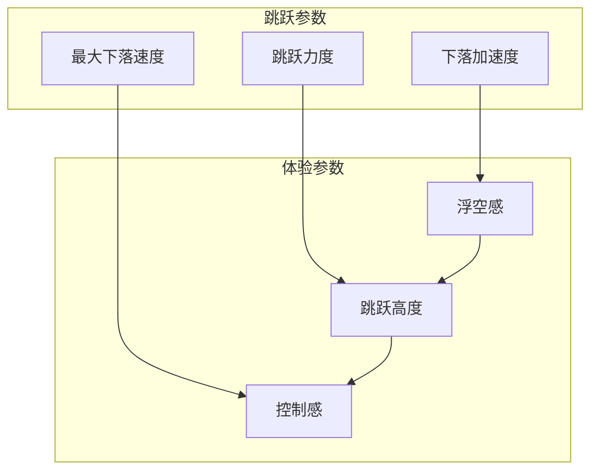

**章节来源**
- [ScriptableStats.cs:22-59](file://Tarodev 2D Controller/_Scripts/ScriptableStats.cs#L22-L59)
- [PlayerController.cs:324-342](file://Tarodev 2D Controller/_Scripts/PlayerController.cs#L324-L342)

## 性能考量

### 内存优化策略

1. **ScriptableObject共享**：多个控制器实例可以共享同一个配置资产
2. **延迟初始化**：物理组件在Awake阶段初始化，避免重复查询
3. **缓存机制**：查询开始位置的设置被缓存以提高性能

### 运行时性能

1. **固定时间步长**：所有物理计算都在FixedUpdate中进行
2. **批量检测**：使用CapsuleCast进行高效的碰撞检测
3. **事件驱动**：通过事件系统减少不必要的回调调用

### 内存使用分析

| 组件 | 内存占用 | 优化建议 |
|------|----------|----------|
| ScriptableStats | 小型配置对象 | 共享实例，避免重复创建 |
| PlayerController | 中等 | 合理的组件数量，避免过度组件 |
| PlayerAnimator | 小型 | 使用事件驱动，减少轮询 |

## 故障排除指南

### 常见配置问题

#### 输入问题
- **症状**：手柄输入不稳定或键盘输入异常
- **解决方案**：调整DeadZone阈值，启用SnapInput功能

#### 移动问题
- **症状**：角色移动过于滑溜或过于生硬
- **解决方案**：调整Acceleration和Deceleration参数

#### 跳跃问题
- **症状**：跳跃高度不符合预期或感觉太轻/太重
- **解决方案**：调整JumpPower和FallAcceleration参数

#### 墙壁交互问题
- **症状**：无法正常抓墙或滑行
- **解决方案**：调整WallDetectionDistance和WallSlideSpeed

### 调试技巧

1. **日志输出**：使用OnValidate方法检查配置有效性
2. **可视化调试**：在场景中添加调试几何体
3. **参数监控**：实时监控关键参数的变化

**章节来源**
- [PlayerController.cs:348-353](file://Tarodev 2D Controller/_Scripts/PlayerController.cs#L348-L353)

## 结论

ScriptableStats配置系统为2D平台游戏提供了强大而灵活的参数管理方案。通过使用Unity的ScriptableObject机制，该系统实现了以下优势：

1. **灵活性**：参数可以在不修改代码的情况下进行调整
2. **可维护性**：清晰的参数组织和文档化
3. **可扩展性**：易于添加新的配置参数和功能
4. **团队协作**：支持多开发者同时工作于不同的配置集

对于不同游戏风格的配置建议：

- **动作平台游戏**：高加速度、低死区阈值、短冲刺冷却
- **休闲平台游戏**：适中参数、高稳定性、简单控制
- **竞技平台游戏**：精确控制参数、可调的响应性、平衡的跳跃高度

## 附录

### 参数调优最佳实践

#### 渐进式调优方法
1. **确定目标风格**：明确游戏的控制感受
2. **基准测试**：记录当前参数的效果
3. **小步调整**：每次只调整一个参数
4. **用户反馈**：收集玩家的体验反馈
5. **迭代优化**：基于反馈进行微调

#### 参数调优检查清单
- [ ] 移动响应性：是否符合预期
- [ ] 跳跃高度：是否适合关卡设计
- [ ] 控制精度：是否容易掌握
- [ ] 稳定性：是否会出现意外行为
- [ ] 性能：是否影响帧率

### 动态修改参数指南

#### 运行时参数修改
1. **创建多个配置集**：为不同场景准备配置
2. **使用事件系统**：监听配置变化事件
3. **平滑过渡**：避免参数突变造成不适
4. **回滚机制**：提供参数恢复功能

#### 配置管理建议
- 定期备份重要配置
- 使用版本控制跟踪配置变更
- 为不同平台准备专门的配置
- 建立配置验证流程