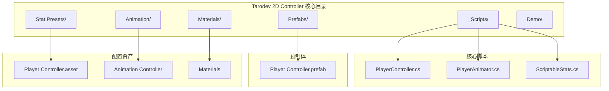
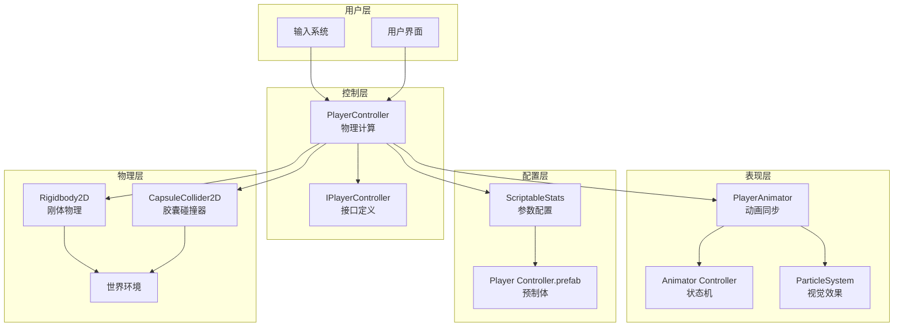
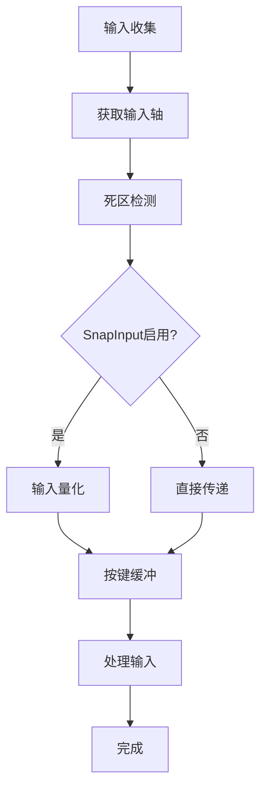
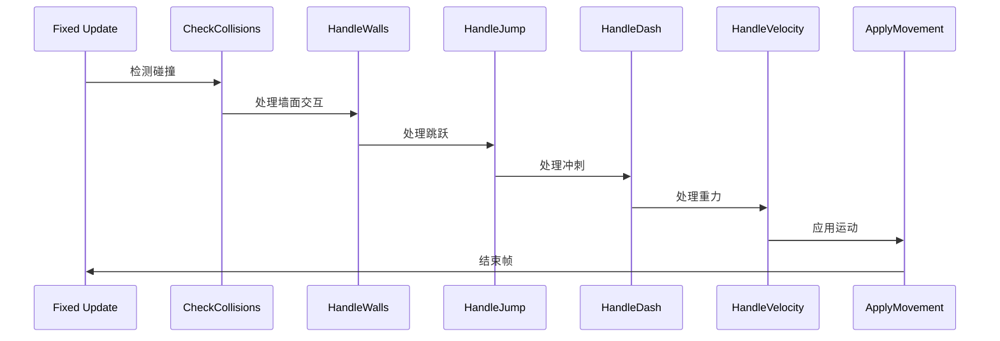
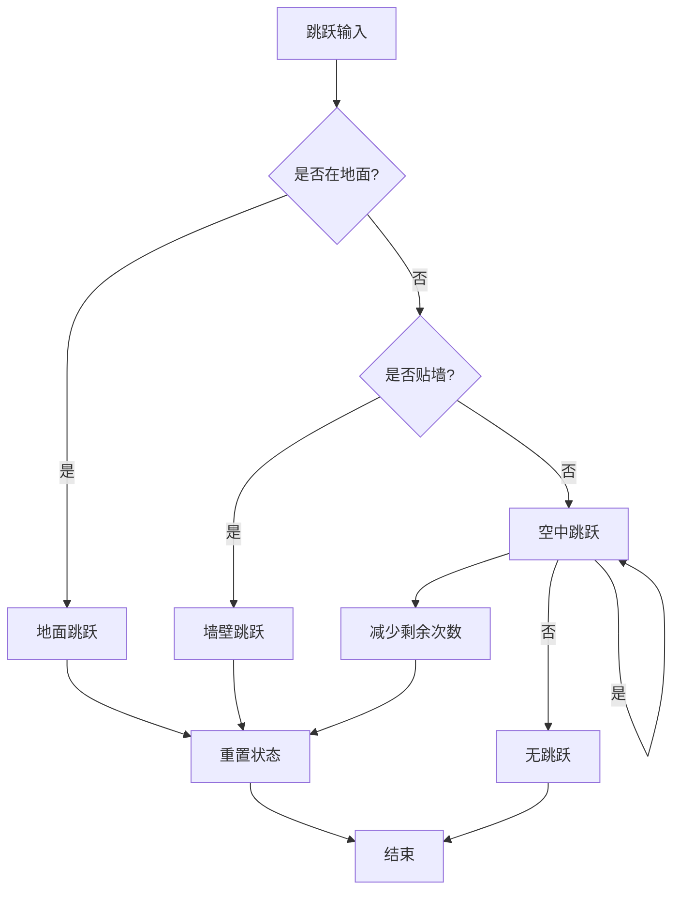
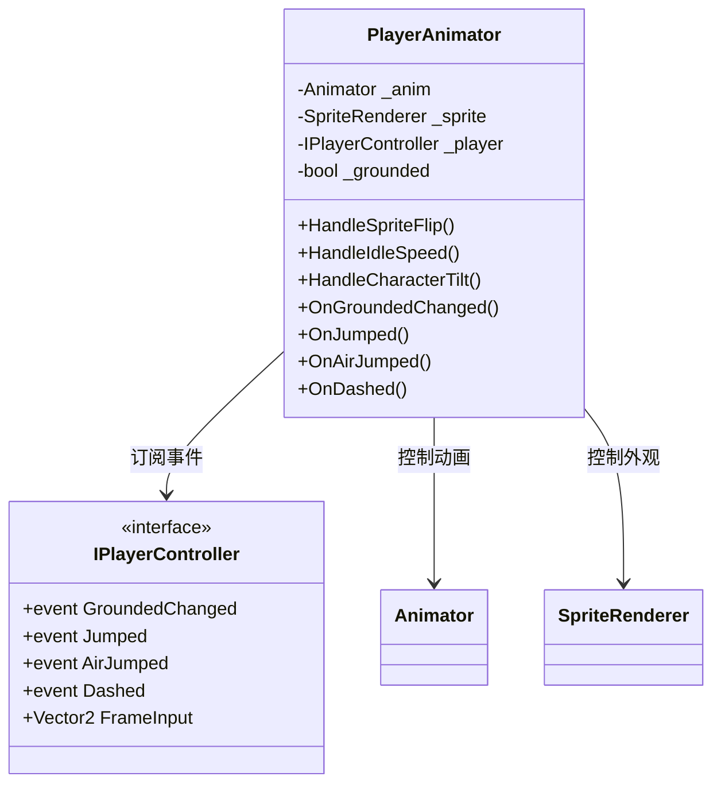
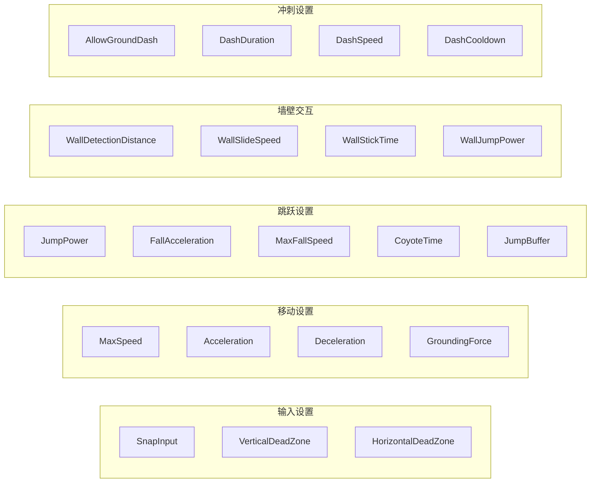
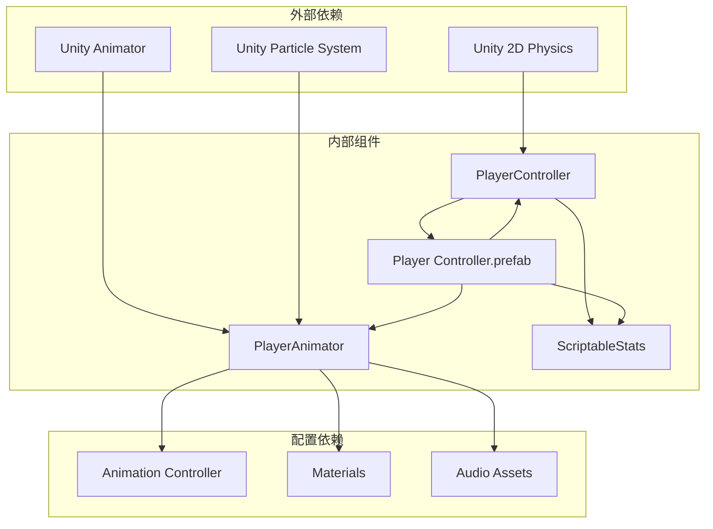

# 集成与使用指南

<cite>
**本文档引用的文件**
- [PlayerController.cs](file://Tarodev%202D%20Controller/_Scripts/PlayerController.cs)
- [PlayerAnimator.cs](file://Tarodev%202D%20Controller/_Scripts/PlayerAnimator.cs)
- [ScriptableStats.cs](file://Tarodev%202D%20Controller/_Scripts/ScriptableStats.cs)
- [Player Controller.prefab](file://Tarodev%202D%20Controller/Prefabs/Player%20Controller.prefab)
- [Player Controller.asset](file://Tarodev%202D%20Controller/Stat%20Presets/Player%20Controller.asset)
- [Visual.controller](file://Tarodev%202D%20Controller/Animation/Visual.controller)
- [Dust.mat](file://Tarodev%202D%20Controller/Materials/Dust.mat)
- [SampleScene.unity](file://Scenes/SampleScene.unity)
- [Scene.unity](file://Tarodev%202D%20Controller/Demo/Scene.unity)
</cite>

## 目录
1. [简介](#简介)
2. [项目结构](#项目结构)
3. [核心组件](#核心组件)
4. [架构概览](#架构概览)
5. [详细组件分析](#详细组件分析)
6. [依赖关系分析](#依赖关系分析)
7. [性能考虑](#性能考虑)
8. [故障排除指南](#故障排除指南)
9. [结论](#结论)
10. [附录](#附录)

## 简介

Tarodev 2D控制器是一个功能完整、高度可定制的2D平台游戏控制器，专为Unity引擎设计。该控制器提供了流畅的物理模拟、丰富的动画支持和直观的配置系统，适用于从简单的平台游戏到复杂的动作游戏等各种应用场景。

本控制器的核心特性包括：
- 基于物理的精确移动控制
- 支持多段跳跃和墙壁交互
- 冲刺机制和连击系统
- 实时动画同步和视觉反馈
- 完全可配置的参数系统
- 与Unity标准2D物理系统的无缝集成

## 项目结构

Tarodev 2D控制器采用模块化架构，主要包含以下核心目录：



**图表来源**
- [PlayerController.cs:1-374](file://Tarodev%202D%20Controller/_Scripts/PlayerController.cs#L1-L374)
- [PlayerAnimator.cs:1-178](file://Tarodev%202D%20Controller/_Scripts/PlayerAnimator.cs#L1-L178)
- [ScriptableStats.cs:1-97](file://Tarodev%202D%20Controller/_Scripts/ScriptableStats.cs#L1-L97)

**章节来源**
- [PlayerController.cs:1-374](file://Tarodev%202D%20Controller/_Scripts/PlayerController.cs#L1-L374)
- [PlayerAnimator.cs:1-178](file://Tarodev%202D%20Controller/_Scripts/PlayerAnimator.cs#L1-L178)
- [ScriptableStats.cs:1-97](file://Tarodev%202D%20Controller/_Scripts/ScriptableStats.cs#L1-L97)

## 核心组件

### 主控制器组件

主控制器组件是整个系统的核心，负责处理玩家输入、物理计算和状态管理。它实现了IPlayerController接口，提供统一的事件系统和状态查询能力。

**章节来源**
- [PlayerController.cs:14-374](file://Tarodev%202D%20Controller/_Scripts/PlayerController.cs#L14-L374)

### 动画控制器组件

动画控制器负责将物理状态转换为视觉表现，包括精灵翻转、倾斜效果、粒子系统和音效播放。它通过事件系统与主控制器紧密集成。

**章节来源**
- [PlayerAnimator.cs:8-178](file://Tarodev%202D%20Controller/_Scripts/PlayerAnimator.cs#L8-L178)

### 可配置统计系统

统计系统基于ScriptableObject设计，提供完全可编辑的游戏参数配置。所有物理参数都可以通过Inspector界面进行调整。

**章节来源**
- [ScriptableStats.cs:6-97](file://Tarodev%202D%20Controller/_Scripts/ScriptableStats.cs#L6-L97)

## 架构概览

控制器采用分层架构设计，确保了良好的模块化和可扩展性：



**图表来源**
- [PlayerController.cs:13-45](file://Tarodev%202D%20Controller/_Scripts/PlayerController.cs#L13-L45)
- [PlayerAnimator.cs:8-41](file://Tarodev%202D%20Controller/_Scripts/PlayerAnimator.cs#L8-L41)
- [ScriptableStats.cs:5-6](file://Tarodev%202D%20Controller/_Scripts/ScriptableStats.cs#L5-L6)

## 详细组件分析

### PlayerController 组件详解

PlayerController是整个系统的核心，实现了完整的2D平台游戏物理控制逻辑。

#### 输入处理系统

控制器支持多种输入方式，包括键盘、鼠标和手柄。输入处理具有死区检测和按键缓冲功能：



**图表来源**
- [PlayerController.cs:53-76](file://Tarodev%202D%20Controller/_Scripts/PlayerController.cs#L53-L76)

#### 物理计算流程

固定更新循环中的物理计算遵循严格的顺序：



**图表来源**
- [PlayerController.cs:78-97](file://Tarodev%202D%20Controller/_Scripts/PlayerController.cs#L78-L97)
- [PlayerController.cs:107-143](file://Tarodev%202D%20Controller/_Scripts/PlayerController.cs#L107-L143)

#### 跳跃机制实现

控制器支持多种跳跃类型，包括地面跳跃、空中跳跃和墙壁跳跃：



**图表来源**
- [PlayerController.cs:198-242](file://Tarodev%202D%20Controller/_Scripts/PlayerController.cs#L198-L242)

**章节来源**
- [PlayerController.cs:14-374](file://Tarodev%202D%20Controller/_Scripts/PlayerController.cs#L14-L374)

### PlayerAnimator 组件详解

PlayerAnimator负责将物理状态转换为视觉表现，提供丰富的动画和特效支持。

#### 动画同步机制

动画系统通过事件驱动的方式与物理控制器同步：



**图表来源**
- [PlayerAnimator.cs:8-41](file://Tarodev%202D%20Controller/_Scripts/PlayerAnimator.cs#L8-L41)
- [PlayerController.cs:364-372](file://Tarodev%202D%20Controller/_Scripts/PlayerController.cs#L364-L372)

#### 视觉效果系统

动画控制器集成了多种视觉效果，包括粒子系统和音效：

**章节来源**
- [PlayerAnimator.cs:8-178](file://Tarodev%202D%20Controller/_Scripts/PlayerAnimator.cs#L8-L178)

### ScriptableStats 配置系统

ScriptableStats提供了完整的参数配置系统，所有物理参数都可以通过Inspector界面进行调整。

#### 参数分类体系

系统参数按照功能分为多个类别：



**图表来源**
- [ScriptableStats.cs:8-95](file://Tarodev%202D%20Controller/_Scripts/ScriptableStats.cs#L8-L95)

**章节来源**
- [ScriptableStats.cs:6-97](file://Tarodev%202D%20Controller/_Scripts/ScriptableStats.cs#L6-L97)

## 依赖关系分析

控制器的依赖关系设计体现了良好的解耦原则：



**图表来源**
- [PlayerController.cs:13-14](file://Tarodev%202D%20Controller/_Scripts/PlayerController.cs#L13-L14)
- [PlayerAnimator.cs:1-1](file://Tarodev%202D%20Controller/_Scripts/PlayerAnimator.cs#L1-L1)

**章节来源**
- [PlayerController.cs:1-374](file://Tarodev%202D%20Controller/_Scripts/PlayerController.cs#L1-L374)
- [PlayerAnimator.cs:1-178](file://Tarodev%202D%20Controller/_Scripts/PlayerAnimator.cs#L1-L178)

## 性能考虑

### 物理计算优化

控制器在性能方面采用了多项优化策略：

1. **固定时间步长**：使用FixedUpdate进行物理计算，确保跨平台一致性
2. **碰撞检测优化**：使用CapsuleCast进行精确的胶囊碰撞检测
3. **事件驱动**：通过事件系统减少不必要的状态检查

### 内存管理

- 使用ScriptableObject存储配置数据，避免重复实例化
- 事件订阅在组件启用时自动管理
- 粒子系统按需播放和停止

### 渲染优化

- 材质使用透明渲染队列，确保正确的渲染顺序
- 动画状态机优化，减少状态切换开销
- 精灵翻转通过修改flip属性实现，避免额外的变换计算

## 故障排除指南

### 常见集成问题

#### 1. 碰撞检测问题

**症状**：角色无法正确检测地面或墙壁
**解决方案**：
- 确保CapsuleCollider2D的尺寸与精灵匹配
- 检查PlayerLayer设置是否正确
- 验证GrounderDistance参数是否合适

#### 2. 动画不同步问题

**症状**：动画与物理动作不一致
**解决方案**：
- 确保Animator组件使用正确的Animation Controller
- 检查事件订阅是否正常工作
- 验证FrameInput访问是否正确

#### 3. 输入响应异常

**症状**：输入延迟或响应不准确
**解决方案**：
- 检查SnapInput设置
- 验证死区阈值配置
- 确认输入轴映射正确

### 调试技巧

#### 1. 日志记录

在PlayerController中添加适当的日志输出：
- 碰撞检测结果
- 输入状态变化
- 事件触发情况

#### 2. 可视化调试

- 在Scene视图中显示碰撞检测范围
- 使用Gizmos绘制胶囊碰撞器边界
- 可视化输入轴值

#### 3. 性能监控

- 使用Unity Profiler监控物理更新频率
- 检查粒子系统性能影响
- 监控内存分配情况

**章节来源**
- [PlayerController.cs:348-353](file://Tarodev%202D%20Controller/_Scripts/PlayerController.cs#L348-L353)

## 结论

Tarodev 2D控制器提供了一个完整、高性能且高度可定制的2D平台游戏解决方案。其模块化设计使得集成变得简单，而丰富的配置选项则满足了各种游戏类型的需求。

### 主要优势

1. **完整的功能集**：支持多段跳跃、墙壁交互、冲刺等多种高级功能
2. **易于集成**：预制体和清晰的组件结构简化了集成过程
3. **高度可配置**：基于ScriptableObject的参数系统提供了灵活的调优能力
4. **性能优化**：经过优化的物理计算和渲染系统确保了良好的性能表现
5. **扩展性强**：模块化设计便于添加自定义功能

### 最佳实践

1. **合理配置参数**：根据游戏风格调整物理参数
2. **优化碰撞器**：确保碰撞器尺寸与精灵完美匹配
3. **事件系统利用**：充分利用事件系统实现功能扩展
4. **性能监控**：定期检查性能指标并进行优化

## 附录

### 预制体使用指南

#### 基本设置步骤

1. **导入预制体**：将Player Controller.prefab拖入场景
2. **配置碰撞器**：调整CapsuleCollider2D的尺寸和位置
3. **设置材质**：应用合适的物理材质
4. **连接动画**：将Animation Controller连接到Animator组件
5. **配置粒子**：设置各种粒子效果的材质

#### 场景设置要求

- **相机设置**：使用正交投影，确保角色在屏幕范围内可见
- **层级配置**：正确设置碰撞层级，避免不必要的碰撞
- **光照设置**：根据需要调整光照和阴影设置

### 兼容性说明

#### 第三方插件兼容性

- **Input Manager**：与Unity标准输入系统完全兼容
- **Animation Rigging**：可通过事件系统进行集成
- **TextMeshPro**：UI元素与控制器无冲突
- **DOTween**：动画补间与控制器动画系统可共存

#### 已知限制

- 不支持3D物理特性
- 需要2D刚体和碰撞器配合使用
- 某些高级物理效果可能需要额外配置

### 高级配置示例

#### 简单平台游戏配置

```csharp
// 基础参数设置
MaxSpeed = 8f
Acceleration = 80f
JumpPower = 25f
AirJumps = 0
```

#### 复杂动作游戏配置

```csharp
// 高级参数设置
MaxSpeed = 12f
Acceleration = 150f
JumpPower = 30f
AirJumps = 2
DashSpeed = 30f
DashCooldown = 0.5f
```