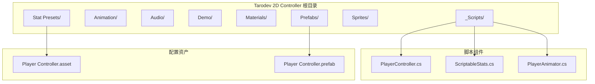
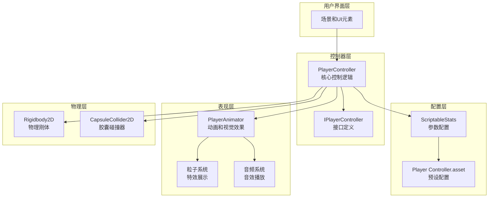
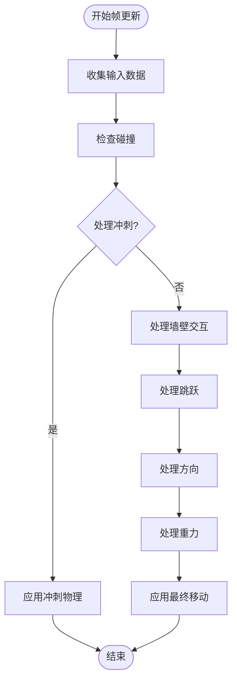
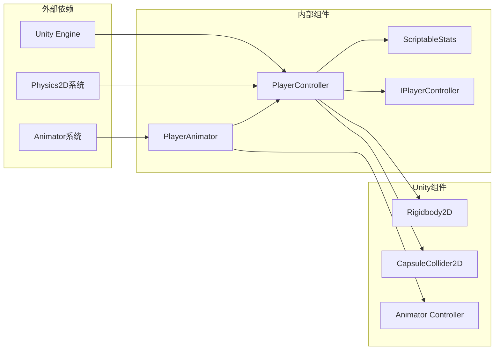
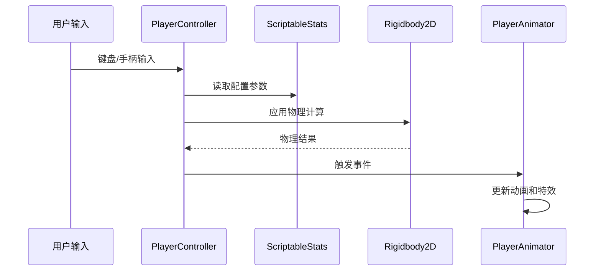

# 项目概述

<cite>
**本文档引用的文件**
- [PlayerController.cs](file://Tarodev 2D Controller/_Scripts/PlayerController.cs)
- [ScriptableStats.cs](file://Tarodev 2D Controller/_Scripts/ScriptableStats.cs)
- [PlayerAnimator.cs](file://Tarodev 2D Controller/_Scripts/PlayerAnimator.cs)
- [Player Controller.asset](file://Tarodev 2D Controller/Stat Presets/Player Controller.asset)
- [Player Controller.prefab](file://Tarodev 2D Controller/Prefabs/Player Controller.prefab)
- [SampleScene.unity](file://Scenes/SampleScene.unity)
- [Scene.unity](file://Tarodev 2D Controller/Demo/Scene.unity)
</cite>

## 目录
1. [项目简介](#项目简介)
2. [项目结构](#项目结构)
3. [核心组件](#核心组件)
4. [架构概览](#架构概览)
5. [详细组件分析](#详细组件分析)
6. [依赖关系分析](#依赖关系分析)
7. [性能考虑](#性能考虑)
8. [故障排除指南](#故障排除指南)
9. [结论](#结论)

## 项目简介

Tarodev 2D 平台控制器是一个专为 Unity 2D 游戏设计的高质量角色控制器解决方案。该项目旨在解决 2D 平台游戏中常见的控制问题，提供流畅、响应迅速且可定制的角色移动体验。

### 主要目标
- 提供专业级的 2D 平台游戏控制体验
- 解决传统 2D 控制器的常见问题和不足
- 支持多种高级控制特性，包括跳跃、冲刺、墙壁交互等
- 提供灵活的配置系统，便于调整游戏手感

### 核心功能特性
- **基础移动控制**：精确的水平移动和重力系统
- **高级跳跃机制**：支持二段跳、提前松开跳跃、Coyote 时间等
- **墙壁交互**：墙壁滑行、墙壁跳跃和控制锁定
- **冲刺系统**：可配置的冲刺能力，支持地面和空中冲刺
- **事件驱动架构**：通过事件系统实现松耦合的组件通信
- **可视化反馈**：粒子效果、音效和动画集成

## 项目结构

该项目采用模块化组织方式，将不同功能的组件分离到独立的目录中：

**图表来源**
- [PlayerController.cs:1-50](file://Tarodev 2D Controller/_Scripts/PlayerController.cs#L1-L50)
- [ScriptableStats.cs:1-20](file://Tarodev 2D Controller/_Scripts/ScriptableStats.cs#L1-L20)
- [PlayerAnimator.cs:1-20](file://Tarodev 2D Controller/_Scripts/PlayerAnimator.cs#L1-L20)

**章节来源**
- [PlayerController.cs:1-50](file://Tarodev 2D Controller/_Scripts/PlayerController.cs#L1-L50)
- [ScriptableStats.cs:1-20](file://Tarodev 2D Controller/_Scripts/ScriptableStats.cs#L1-L20)
- [PlayerAnimator.cs:1-20](file://Tarodev 2D Controller/_Scripts/PlayerAnimator.cs#L1-L20)

## 核心组件

### PlayerController 组件
PlayerController 是整个控制器的核心，负责处理所有物理计算和游戏逻辑。它实现了 IPlayerController 接口，提供统一的控制接口。

### ScriptableStats 配置系统
ScriptableStats 使用 Unity 的 ScriptableObject 系统，提供可编辑的游戏参数配置。这种设计允许在不修改代码的情况下调整游戏平衡。

### PlayerAnimator 动画系统
PlayerAnimator 负责处理角色的视觉表现，包括动画播放、粒子效果、音效和视觉反馈。

**章节来源**
- [PlayerController.cs:14-373](file://Tarodev 2D Controller/_Scripts/PlayerController.cs#L14-L373)
- [ScriptableStats.cs:6-97](file://Tarodev 2D Controller/_Scripts/ScriptableStats.cs#L6-L97)
- [PlayerAnimator.cs:8-178](file://Tarodev 2D Controller/_Scripts/PlayerAnimator.cs#L8-L178)

## 架构概览

该项目采用了清晰的分层架构，将不同的关注点分离到独立的组件中：

**图表来源**
- [PlayerController.cs:14-45](file://Tarodev 2D Controller/_Scripts/PlayerController.cs#L14-L45)
- [ScriptableStats.cs:6-10](file://Tarodev 2D Controller/_Scripts/ScriptableStats.cs#L6-L10)
- [PlayerAnimator.cs:8-41](file://Tarodev 2D Controller/_Scripts/PlayerAnimator.cs#L8-L41)

### 设计模式应用

#### 1. 事件驱动架构
控制器通过事件系统实现松耦合的组件通信：
- `GroundedChanged`：地面状态变化事件
- `Jumped`：跳跃事件
- `AirJumped`：二段跳事件
- `Dashed`：冲刺事件

#### 2. ScriptableObject 配置系统
使用 Unity 的 ScriptableObject 模式实现参数化配置：
- 可视化的参数编辑界面
- 运行时动态调整
- 资产版本管理

#### 3. 接口抽象
通过 IPlayerController 接口提供统一的控制接口，便于扩展和测试。

**章节来源**
- [PlayerController.cs:27-35](file://Tarodev 2D Controller/_Scripts/PlayerController.cs#L27-L35)
- [PlayerController.cs:364-372](file://Tarodev 2D Controller/_Scripts/PlayerController.cs#L364-L372)

## 详细组件分析

### PlayerController 核心控制逻辑

#### 输入处理系统
控制器支持多种输入方式，包括键盘和手柄：
- 基础移动：`Input.GetAxisRaw("Horizontal")`
- 跳跃：`Input.GetButtonDown("Jump")` 或 `Input.GetKeyDown(KeyCode.C)`
- 冲刺：`Input.GetKeyDown(KeyCode.LeftShift)` 或 `Input.GetKeyDown(KeyCode.X)`

#### 物理计算流程

**图表来源**
- [PlayerController.cs:47-97](file://Tarodev 2D Controller/_Scripts/PlayerController.cs#L47-L97)
- [PlayerController.cs:107-143](file://Tarodev 2D Controller/_Scripts/PlayerController.cs#L107-L143)

#### 高级跳跃机制
项目实现了多个高级跳跃特性：

1. **Coyote Time（地面宽容时间）**：允许角色在离开平台边缘后短暂时间内跳跃
2. **跳跃缓冲**：在接触地面之前输入的跳跃指令会被缓存
3. **提前松开跳跃**：松开跳跃键后角色会快速下落
4. **墙壁跳跃**：支持墙壁滑行和墙壁跳跃

**章节来源**
- [PlayerController.cs:186-243](file://Tarodev 2D Controller/_Scripts/PlayerController.cs#L186-L243)
- [PlayerController.cs:195-196](file://Tarodev 2D Controller/_Scripts/PlayerController.cs#L195-L196)

### ScriptableStats 参数配置

#### 移动参数配置
- **MaxSpeed**：最大移动速度（单位：单位/秒）
- **Acceleration**：水平加速度（单位：单位/秒²）
- **GroundDeceleration**：地面减速度
- **AirDeceleration**：空中减速度

#### 跳跃参数配置
- **JumpPower**：初始跳跃速度
- **MaxFallSpeed**：最大下落速度
- **FallAcceleration**：重力加速度
- **JumpEndEarlyGravityModifier**：提前松开跳跃的重力倍数

#### 墙壁交互配置
- **WallDetectionDistance**：墙壁检测距离
- **WallSlideSpeed**：墙壁滑行速度
- **WallJumpPower**：墙壁跳跃垂直速度
- **WallJumpHorizontalPower**：墙壁跳跃水平速度

**章节来源**
- [ScriptableStats.cs:22-95](file://Tarodev 2D Controller/_Scripts/ScriptableStats.cs#L22-L95)

### PlayerAnimator 视觉反馈系统

#### 动画控制
PlayerAnimator 通过事件系统监听控制器的状态变化：
- 地面状态变化触发着陆动画
- 跳跃事件触发跳跃动画
- 冲刺事件触发冲刺特效

#### 粒子效果系统
集成了多种粒子效果：
- **移动粒子**：跟随角色移动的轨迹效果
- **跳跃粒子**：跳跃时的特效
- **着陆粒子**：着陆时的冲击效果
- **冲刺粒子**：冲刺时的拖尾效果

**章节来源**
- [PlayerAnimator.cs:43-61](file://Tarodev 2D Controller/_Scripts/PlayerAnimator.cs#L43-L61)
- [PlayerAnimator.cs:94-154](file://Tarodev 2D Controller/_Scripts/PlayerAnimator.cs#L94-L154)

## 依赖关系分析

### 组件间依赖关系

**图表来源**
- [PlayerController.cs:13-14](file://Tarodev 2D Controller/_Scripts/PlayerController.cs#L13-L14)
- [PlayerAnimator.cs:10-13](file://Tarodev 2D Controller/_Scripts/PlayerAnimator.cs#L10-L13)

### 数据流分析

#### 输入到输出的数据流

**图表来源**
- [PlayerController.cs:53-76](file://Tarodev 2D Controller/_Scripts/PlayerController.cs#L53-L76)
- [PlayerAnimator.cs:43-61](file://Tarodev 2D Controller/_Scripts/PlayerAnimator.cs#L43-L61)

**章节来源**
- [PlayerController.cs:16-25](file://Tarodev 2D Controller/_Scripts/PlayerController.cs#L16-L25)
- [PlayerAnimator.cs:32-41](file://Tarodev 2D Controller/_Scripts/PlayerAnimator.cs#L32-L41)

## 性能考虑

### 物理计算优化
- 使用 `FixedUpdate` 处理物理相关的移动计算，确保帧率无关的稳定性
- 通过 `Physics2D.queriesStartInColliders` 优化射线检测性能
- 合理的碰撞检测距离设置，避免过度的射线投射

### 内存管理
- ScriptableObject 配置系统减少运行时内存分配
- 事件系统的弱引用绑定，避免内存泄漏
- 粒子系统的生命周期管理

### 渲染优化
- 条件化的粒子系统启用/禁用
- 动画状态机的合理状态转换
- 材质和纹理的共享使用

## 故障排除指南

### 常见问题诊断

#### 控制器未响应
1. **检查组件完整性**：确保 GameObject 包含 Rigidbody2D 和 CapsuleCollider2D
2. **验证 ScriptableStats 资产**：确认已正确分配到控制器的 Stats 字段
3. **检查输入映射**：验证 Unity 的 Input Manager 中的按键映射

#### 物理行为异常
1. **重力设置检查**：确认 Rigidbody2D 的重力缩放设置
2. **碰撞器配置**：验证 CapsuleCollider2D 的尺寸和偏移
3. **层碰撞矩阵**：检查物理层的碰撞设置

#### 动画不匹配
1. **Animator Controller**：确认正确的动画控制器已分配
2. **事件绑定**：验证 PlayerAnimator 正确订阅了控制器事件
3. **粒子系统**：检查所有粒子系统的引用完整性

**章节来源**
- [PlayerController.cs:348-353](file://Tarodev 2D Controller/_Scripts/PlayerController.cs#L348-L353)
- [PlayerAnimator.cs:43-61](file://Tarodev 2D Controller/_Scripts/PlayerAnimator.cs#L43-L61)

## 结论

Tarodev 2D 平台控制器项目展现了优秀的软件工程实践，通过以下关键特性提供了高质量的 2D 平台游戏控制体验：

### 技术优势
- **模块化设计**：清晰的组件分离和职责划分
- **配置驱动**：基于 ScriptableObject 的参数化配置系统
- **事件驱动**：松耦合的组件通信机制
- **性能优化**：合理的物理计算和渲染优化策略

### 适用场景
- 2D 平台游戏开发
- 移动端平台游戏
- 独立游戏项目
- 教育和学习目的

### 差异化优势
- 专业的 2D 控制器解决方案
- 完善的高级控制特性（二段跳、墙壁交互、冲刺等）
- 灵活的配置系统，无需修改代码即可调整游戏平衡
- 丰富的视觉反馈和音效集成

该项目为 Unity 2D 开发者提供了一个成熟、可扩展且易于使用的角色控制器解决方案，特别适合需要高质量平台控制体验的游戏项目。